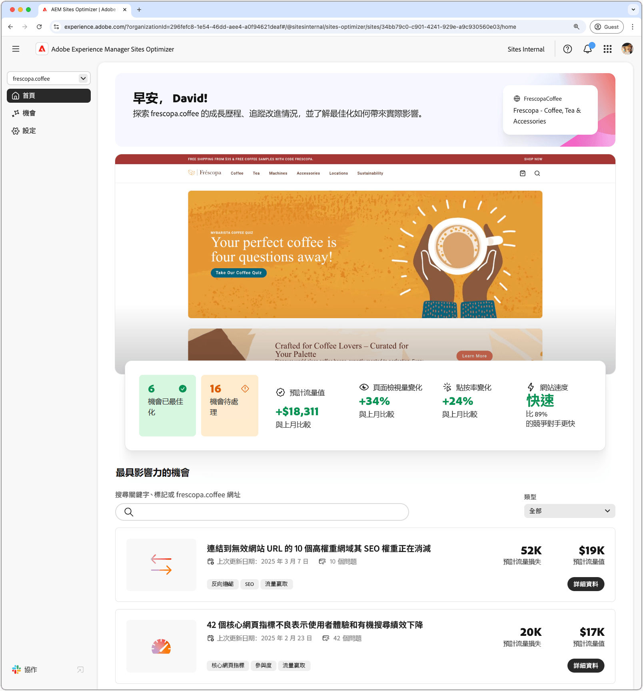
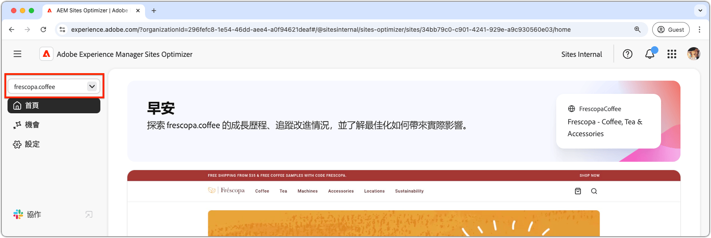
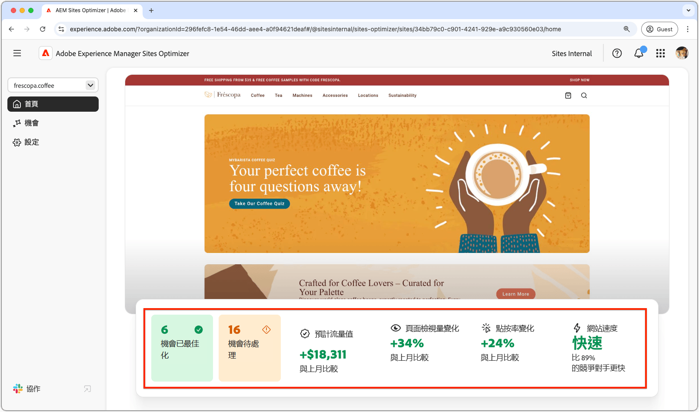
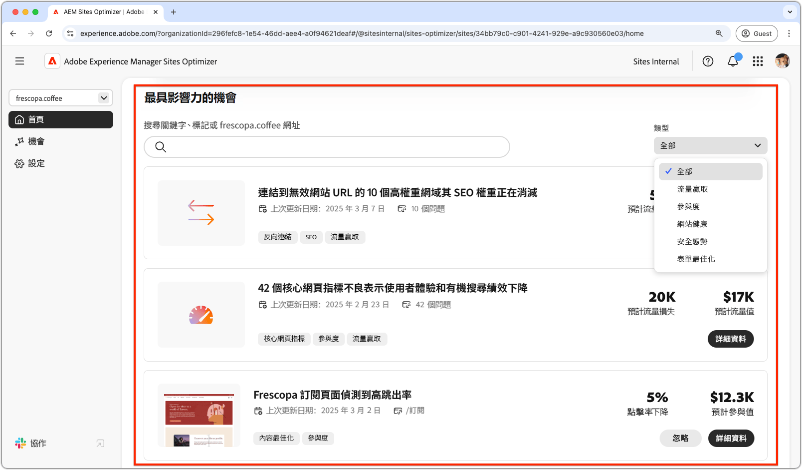
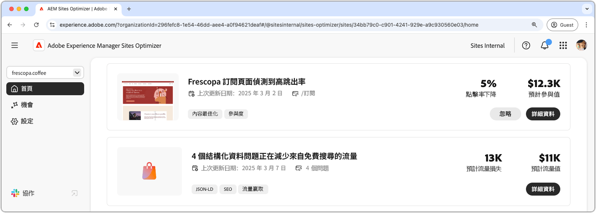

# Sites Optimizer 基本資訊

{align="center"}

Sites Optimizer 儀表板會提供您網站的績效和改進機會的高層次概觀。

## 網域管理員

{align="center"}

網域管理員內容選單可讓您按網域選擇想要評估和最佳化的 AEM 網站。Sites Optimizer 會提供已在 [Cloud Manager](https://experienceleague.adobe.com/zh-hant/docs/experience-manager-cloud-service/content/implementing/using-cloud-manager/edge-delivery-sites/add-edge-delivery-site) 中註冊之所有生產 AEM 網站的清單。

## 導覽

{align="center"}

「導覽」區段可讓您從 Sites Optimizer 中的任何位置快速且持續地存取 Sites Optimizer 的關鍵區域，包括：

* **首頁** - 主儀表板，會提供您網站的績效和改進機會的高層次概觀。
* **商機** — 檢視和管理Sites Optimizer識別出的商機，包括已最佳化或保持未最佳化的商機。
* **設定**  - 可設定 Sites Optimizer 設定，包括您要監視的網站和您會收到的通知。

## 網站摘要

{align="center"}

「網站摘要」區段會提供您網站績效的快照、Sites Optimizer 隨著時間的推移對您網站的改進情況，以及改進的機會。關鍵量度包括：

* **已最佳化的機會** – 已識別並改進以提高業務績效的機會數量。
* **待處理的機會** – 尚未最佳化的潛在改進機會數量，代表可獲得業務收益的領域。
* **預計流量值** – 與上個月相比，您網站流量的預計變化量，這有助於衡量 Sites Optimizer 對業務目標的貢獻。
* **網頁瀏覽量變化** – 您網站瀏覽頻率的百分比變化，這會反映使用者對您網站的興趣和網頁內容的有效性。
* **點按率變化** – 使用者點按頻率的百分比變化，可指出參與度和轉換潛力的變化。
* **網站速度** – 網站速度和可用性的關鍵指標，這會影響使用者體驗和搜尋排名。

## 高影響力機會

{align="center"}

「高影響力機會」區段會根據待處理的機會對您網站績效的潛在影響，點出最重要的待處理機會。這些機會會按類型來組織，讓您可以輕鬆地確定最佳化工作的優先順序。

依關鍵字、標籤、URL或[機會型別](../opportunity-types/overview.md)篩選機會，以專注於最關鍵的改善領域。

### 機會詳細資料

{align="center"}

每個機會都會提供問題的簡短說明、其對您網站的潛在影響，以及完整詳細資料的連結。您也可以查看其狀態，這會指出其已進行最佳化還是仍處於待處理狀態。

* **機會標題** – 問題的簡短說明，及其對您網站績效的潛在影響。
* **上次更新時間** - Sites Optimizer上次於此日期以新資料更新商機。
* **問題計數** - 在您網站上發現的問題實例數。
* **機會型別** — 此機會所屬的[機會型別](../opportunity-types/overview.md) — 例如流量取得、參與或網站健康狀態。

每個機會的摘要資訊會隨類型而異，其中可能會包含有關收入影響、流量、使用者參與度或安全威脅的詳細資料。

若要檢視機會的詳細資料，請按一下「**詳細資料**」按鈕。

若要從 Sites Optimizer 儀表板和報告中排除某個機會，請按一下「**忽略**」按鈕。
