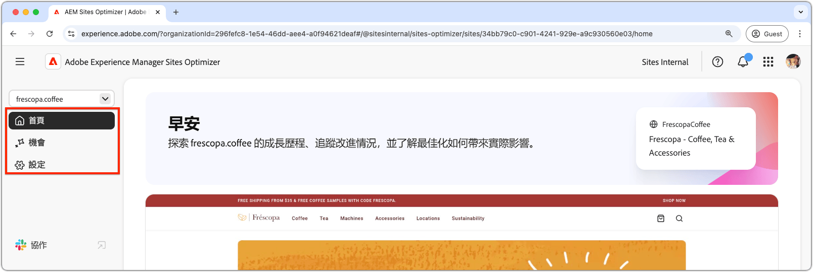

# Sites Optimizer基本需知

{align="center"}

Sites Optimizer儀表板提供網站績效的高層級概觀，以及改善的機會。

## 網域管理員

{align="center"}

領域管理員快顯功能表可讓您選擇要評估及最佳化的AEM網站（依領域）。 Sites Optimizer提供在[Cloud Manager](https://experienceleague.adobe.com/en/docs/experience-manager-cloud-service/content/implementing/using-cloud-manager/edge-delivery-sites/add-edge-delivery-site)中註冊的所有生產AEM網站清單。

## 導覽

{align="center"}

「導覽」區段提供從Sites Optimizer中任何位置快速、持續存取Sites Optimizer主要區域的功能，包括：

* **首頁** — 主要儀表板，提供您網站績效和改善機會的高層級概觀。
* **機會** — 檢視和管理Sites Optimizer所識別的機會，包括已最佳化的機會和未最佳化的機會。
* **設定** — 設定您的Sites Optimizer設定，包括您正在監控的網站以及您收到的通知。

## 網站摘要

{align="center"}

「網站摘要」區段提供您網站效能的快照、Sites Optimizer如何隨著時間改善您的網站，以及改善機會。 關鍵量度包括：

* **已最佳化的機會** — 已改善以提升業務績效的已識別機會數目。
* **擱置中的商機** — 仍未最佳化的潛在改善數量，代表可取得業務收益的領域。
* **專案流量值** — 網站流量的估計價值與上個月比較的變化，有助於衡量Site Optimizer對業務目標的貢獻。
* **頁面檢視變更** — 您網站的檢影片率百分比變化，反映使用者興趣和內容有效性。
* **點按率變更** — 使用者點按頻率的百分比變更，表示參與和轉換潛力的轉變。
* **網站速度** — 網站速度和可用性的關鍵指標，會影響使用者體驗和搜尋排名。

## 高影響力機會

{align="center"}

「高影響力機會」區段會根據對網站效能的潛在影響，強調最重要的擱置改善機會。 這些機會會依型別分組，讓您輕鬆排定最佳化工作的優先順序。

您可以依關鍵字、標籤或URL或依[機會型別](../opportunity-types/overview.md)篩選機會，協助您專注在改善的最關鍵領域。

### 機會詳細資料

{align="center"}

每個機會都會提供問題的簡短說明、其對您網站的潛在影響，以及完整詳細資料的連結。 您也可以檢視其狀態，指出其是否已最佳化或仍在擱置中。

* **機會標題** — 問題的簡短說明，及其對網站效能的潛在影響。
* **上次更新日期** - Sites Optimizer上次使用新資料更新商機的日期。
* **問題計數** — 您的網站上已識別問題的執行個體數目。
* **商機型別** — 商機的[型別](../opportunity-types/overview.md)此商機為其中一部分 — 例如流量贏取、參與或網站健康狀態。

每個商機的摘要資訊會依型別而異，可能包括收入影響、流量、使用者參與或安全性威脅的詳細資訊。

若要檢視商機的詳細資料，請按一下&#x200B;**詳細資料**&#x200B;按鈕。

若要從Sites Optimizer儀表板和報表中排除機會，請按一下&#x200B;**忽略**&#x200B;按鈕。
