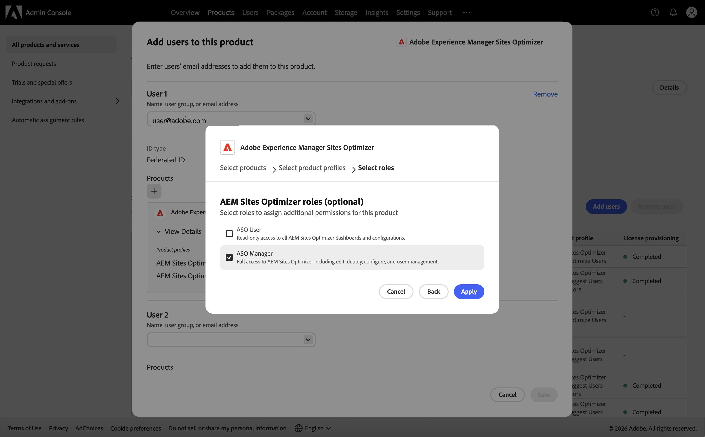

# 管理使用者許可權

控制誰可以存取Sites Optimizer中的網站，以及他們可以使用網站做什麼。 存取權是由您授予每個人的一組小型獨立&#x200B;*功能* （檢視、編輯、部署、設定及管理使用者）所建置。

存取權是&#x200B;**累加**：人員的許可權是已授予他們所有許可權的總和。 沒有「拒絕」，因此授與內容不會相互衝突或取消。 若要減少某人的存取權，請移除授權而非嘗試覆寫授權。

若要管理存取權，請開啟&#x200B;**許可權**&#x200B;標籤（左側導覽的鎖定圖示），然後選取您要管理的網站。

{align="center"}

## 存取權的授與方式

使用者有兩種存取許可權方式，而且這兩種方式可搭配使用：

- **全組織存取權** — 由您的Adobe組織管理員在[Adobe Admin Console](https://adminconsole.adobe.com/)中指派。 它適用於您組織中的每個網站。 適合所有地方都需要相同存取許可權的使用者。
- **網站層級存取** — 已在Sites Optimizer中指派給&#x200B;**許可權**&#x200B;索引標籤。 它適用於單一網站，可依需求隨意擴大或縮小。 不需要Admin Console存取權。

>[!NOTE]
>
>兩個圖層相加。 擁有組織範圍檢視存取許可權，且在一個網站上被授予編輯許可權的人可以檢視每個網站並編輯該網站。 若要將人員限制在單一網站，請確定他們不會同時擁有全組織的角色。

### 組織範圍角色(Admin Console)

全組織存取權來自[AEM Sites Optimizer](https://adminconsole.adobe.com/)中指派的兩個&#x200B;**Adobe Admin Console**&#x200B;產品角色之一：

- **ASO管理員** — 每個網站的完整存取權，包括&#x200B;**管理使用者**。 管理員可以開啟任何網站的&#x200B;**許可權**&#x200B;標籤，並將存取權指派給其他網站。
- **ASO使用者** — 每個網站的僅檢視存取權。 沒有變更，也沒有使用者管理。

若要指派角色，您必須是組織的&#x200B;**系統管理員**，或AEM Sites Optimizer的&#x200B;**產品管理員**。

1. 登入[Adobe Admin Console](https://adminconsole.adobe.com/)。
1. 移至&#x200B;**產品**&#x200B;並選取&#x200B;**AEM Sites Optimizer**。
1. 開啟&#x200B;**使用者**&#x200B;索引標籤，並透過電子郵件新增使用者（或選取現有使用者）。
1. 按一下&#x200B;**+** （新增）圖示以新增產品設定檔，然後選擇產品設定檔。

   {align="center"}

1. 按一下「**下一步**」。
1. 選擇角色 — **ASO管理員**&#x200B;以取得完整存取權，或&#x200B;**ASO使用者**&#x200B;以取得僅供檢視的存取權 — 然後按一下&#x200B;**套用**。

   {align="center"}

   {align="center"}

如需新增使用者的詳細資訊，請參閱[內建使用者](setup/onboard-users.md)。

>[!IMPORTANT]
>
>只有組織管理員可以授與整個組織的&#x200B;**管理使用者**。 在網站上具有&#x200B;**管理使用者**&#x200B;的成員可以指派該網站的存取權，但無法建立全組織的&#x200B;**ASO管理員**。

## 功能層級

每項功能都可控制一種動作。 它們是獨立的 — 例如，您可以授與部署而不使用編輯。

| 功能 | 它允許 | 不允許的內容 |
|---|---|---|
| 檢視 | 檢視網站資料 — 商機、建議、修正、報告和設定 — 而不變更任何專案。 | 任何變更。 |
| 編輯 | 建立並變更機會和建議（應該變更的內容）。 | 發佈變更、變更設定或管理使用者。 |
| 部署 | 將修正發佈到網站，然後復原這些修正。 | 管理使用者。 |
| 設定 | 變更網站的設定和連線。 | 發佈修正或管理使用者。 |
| 管理使用者 | 授予或撤銷其他成員對網站的存取權。 | 管理該人員尚無法存取的網站。 |

>[!NOTE]
>
>**檢視一律包括在內。** 每個授權都會自動包含檢視 — 您無法管理、設定、編輯或部署您無法看到的內容。 因此，無法自行移除檢視。 若要完全移除某人的存取權，請移除成員（請參閱下方的[編輯或移除成員](#edit-or-remove-a-member)），而非取消勾選每個權能。

## 機會型別的存取範圍

您可以在單一網站上授予&#x200B;**特定機會型別** （例如，Core Web Vitals或中斷的內部連結）的檢視、編輯和部署許可權，而非整個網站。 如此一來，使用者就能在編輯Core Web Vitals時只檢視其他專案。

- **檢視**、**編輯**&#x200B;和&#x200B;**部署**&#x200B;的範圍可以是一或多個機會型別，或是&#x200B;**所有**&#x200B;機會型別。
- **設定**&#x200B;和&#x200B;**管理使用者**&#x200B;一律套用至整個網站 — 他們不能僅限於機會型別。

每個範圍授權都會顯示為該成員自己的資料列，其中&#x200B;**套用至**&#x200B;欄會顯示機會型別、**全部**&#x200B;或&#x200B;**全網站**。

>[!CAUTION]
>
>範圍設定只會限制&#x200B;*授與的*&#x200B;內容 — 它永遠不會移除其他授與所提供的存取權。 如果個人也擁有組織範圍的存取權或&#x200B;**所有**&#x200B;型別的授權，則較廣泛的存取權仍適用。 因此，若要將某人真正限製為特定機會型別，請確定他們也沒有擁有更廣泛的角色或&#x200B;**所有**&#x200B;型別授權。

## 新增成員

1. 開啟&#x200B;**許可權**&#x200B;標籤（左側導覽中的鎖定圖示）並選取網站。
1. 按一下&#x200B;**新增成員**。
1. 依名稱或電子郵件搜尋，並選取一或多個人員。
1. 選擇存取權套用的&#x200B;**機會型別** （或&#x200B;**全部**），然後選取要授與的功能。
1. 按一下&#x200B;**「新增」**。

## 編輯或移除成員

在&#x200B;**成員**&#x200B;資料表中：

- 按一下成員列上的&#x200B;**編輯權能**&#x200B;以變更其功能。 編輯現有授權時，其機會型別會維持固定 — 您只會變更權能，而且至少必須維持選取一個權能。
- 按一下&#x200B;**移除**&#x200B;以完全撤銷該成員對網站的存取權。

>[!NOTE]
>
>變更權能和移除成員是不同的動作。 若要移除所有存取權，請使用&#x200B;**移除** — 您不可以取消核取權能來執行此操作，因為授權必須保留至少一個權能（且檢視一律保留）。

## 誰可以管理許可權

網站的&#x200B;**許可權**&#x200B;標籤可用於：

- 在該網站上具有&#x200B;**管理使用者**&#x200B;權能的成員，以及
- 組織管理員（ASO管理員）。

沒有&#x200B;**管理使用者**&#x200B;的成員會看到一則訊息，指出他們無權管理該網站的存取權。

## 開啟使用者和存取管理

使用者和存取權管理是由您組織的設定所控制。 您可以在開啟之前指派存取權，但設定開啟後只有&#x200B;**強制執行**。

如果尚未啟用，**許可權**&#x200B;標籤會顯示橫幅，要求您連絡帳戶團隊。 請聯絡您的Sites Optimizer客戶團隊以將其開啟。

>[!NOTE]
>
>開啟使用者與存取權管理之前，您指派的許可權會儲存但不強制執行。

## 執行前設定存取權

您不必等待強制執行，即可開始指派存取權。 即使使用者和存取管理仍為&#x200B;**off**，具有&#x200B;**ASO管理員**&#x200B;角色的使用者可以開啟&#x200B;**許可權**&#x200B;索引標籤，並將網站和功能指派給其他使用者。

這可讓您預先為每個人準備正確的存取權。 稍後啟用強制時，您的使用者已經擁有他們需要的存取權 — 因此沒有人會意外鎖定。

>[!IMPORTANT]
>
>執行關閉時，**許可權**&#x200B;索引標籤僅供&#x200B;**ASO管理員**&#x200B;使用者使用。 先設定所有使用者的存取權，然後開啟強制執行。

## 常見問題

**網站層級成員是否需要Admin Console角色？**

否。 網站層級存取權完全在Sites Optimizer中授與，位於&#x200B;**許可權**&#x200B;索引標籤上。 在Admin Console中只會指派組織範圍內的角色。

**如果有人同時擁有整個組織和網站層級的存取權，會發生什麼情況？**

兩者皆適用。 其有效存取權是兩者的組合。 授予不會發生衝突，因為沒有授予可以拒絕存取。

**為什麼具有「管理」使用者的成員無法建立全組織經理？**

建立組織範圍角色是Admin Console動作。 具有&#x200B;**管理使用者**&#x200B;的成員可以在自己的網站上指派存取權，但只有組織管理員可以授與整個組織的角色。

**我如何撤銷使用者對網站的存取權？**

移除&#x200B;**許可權**&#x200B;索引標籤上的授權。 這與編輯功能不同，編輯功能必須一律留下至少一個功能。

**我可以限制人員使用特定機會型別嗎？**

是 — 將「檢視」、「編輯」或「部署」範圍授與特定機會型別，而非&#x200B;**全部**。 由於存取權是可附加的，因此只有在使用者沒有全組織的存取權或&#x200B;**所有**&#x200B;型別的授權時，這才會生效。
