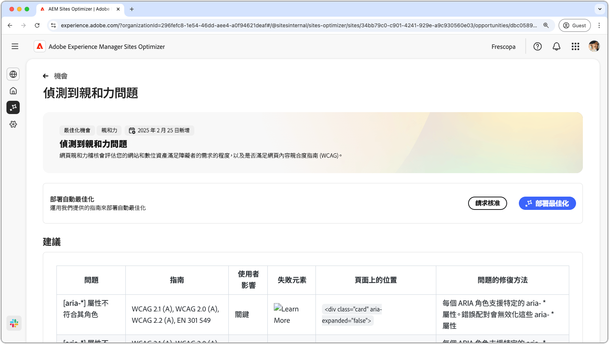
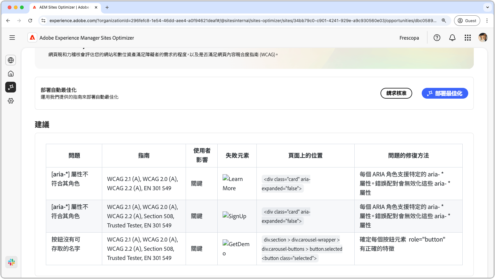

# 協助工具問題機會

{align="center"}

協助工具問題機會可識別您的網站符合身心障礙人士需求的程度，以及其是否有遵循[網頁內容無障礙指南 (WCAG)](https://www.w3.org/TR/WCAG21/)。透過評估您的網站符合WCAG的程度，您有助於建立包容性的線上體驗。 反過來，它也能讓視覺、聽覺、認知和運動障礙人士導覽、互動內容，並從中獲益。 此功能不僅出於道德考量是必要的，而且也促進對法律要求的合規性、改善SEO，並可增加您的受眾觸及率，同時增強使用者體驗和業務績效。

## 自動識別

{align="center"}

**協助工具問題機會**&#x200B;可識別您網站上的協助工具問題，其所含內容如下：

* **問題** – 所發現的具體協助工具問題。
* **指南** – 問題所違反的 [WCAG 指南 ID](https://www.w3.org/TR/WCAG21/)。
* **使用者影響** – 對身心障礙使用者的影響評估。
* **失敗元素** - 網頁上受問題影響的 HTML 元素。
* **在網頁上的位置** - 網頁上受問題影響之元素的 HTML 片段。

## 自動建議

{align="center"}

自動建議會在「**如何解決問題**」欄位中提供 AI 生成的建議，以提供有關如何解決問題的規範性指導。

## 自動最佳化

[!BADGE Ultimate]{type=Positive tooltip="Ultimate"}

{align="center"}

Sites Optimizer Ultimate 新增了針對所發現的漏洞部署自動最佳化功能的能力。

>[!BEGINTABS]

>[!TAB 部署最佳化]

{{auto-optimize-deploy-optimization-slack}}

>[!TAB 請求核准]

{{auto-optimize-request-approval}}

>[!ENDTABS]
