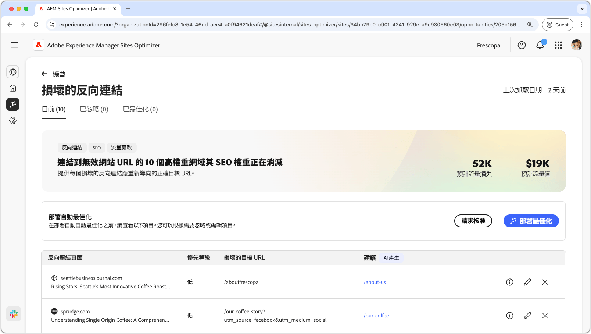
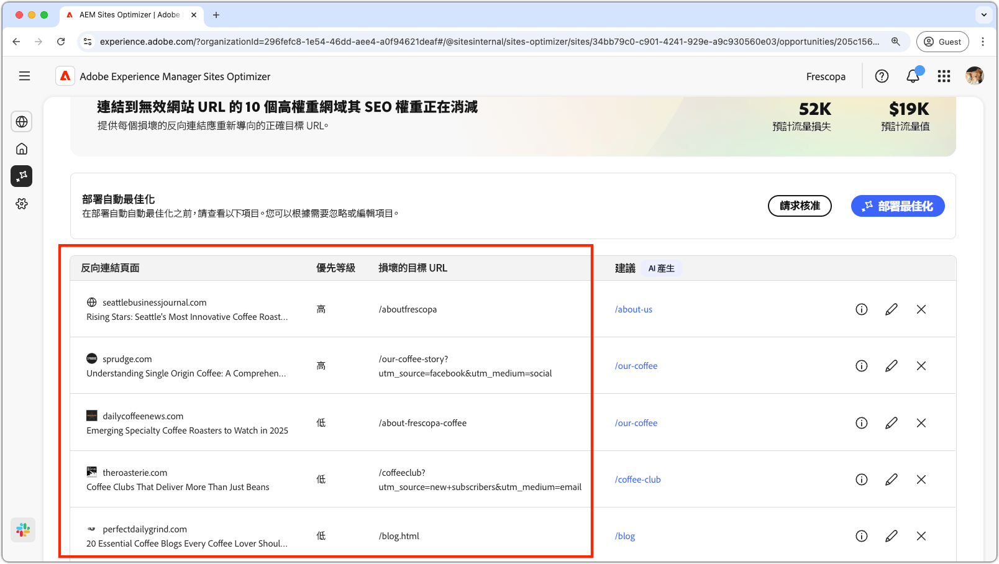
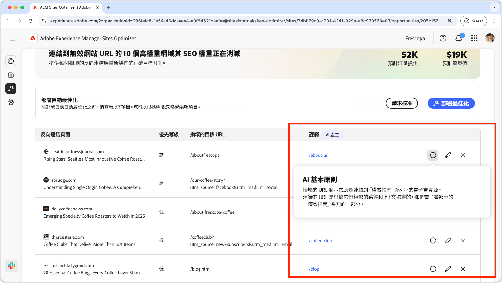
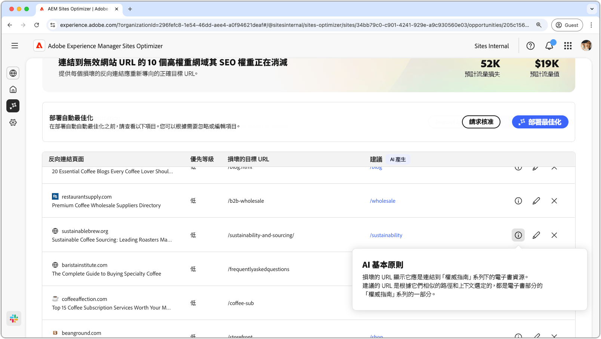
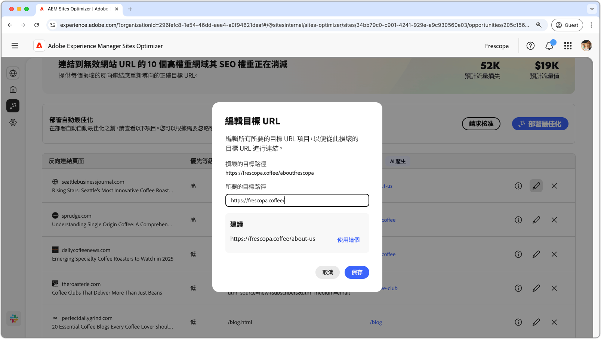
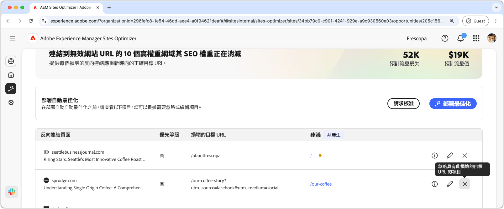
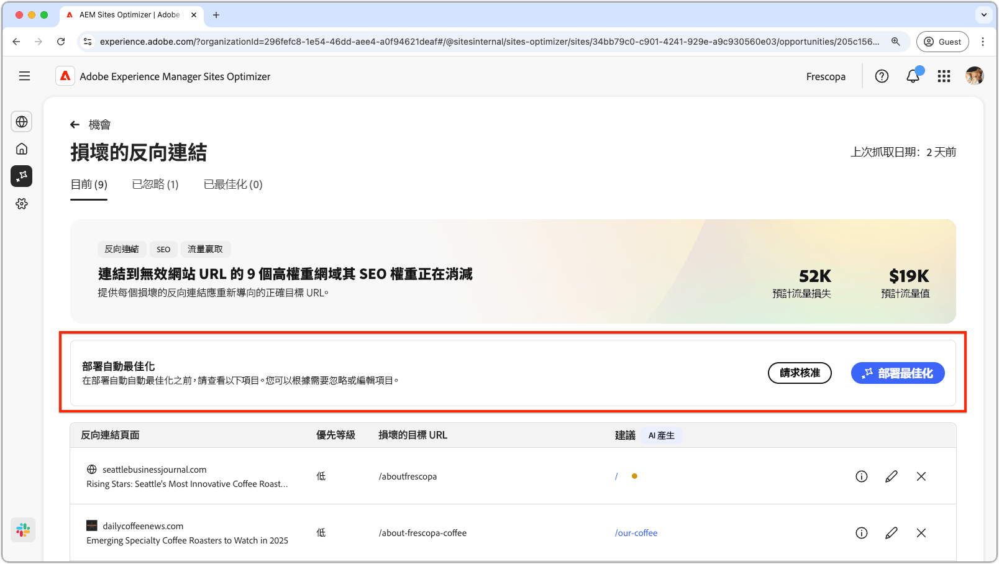
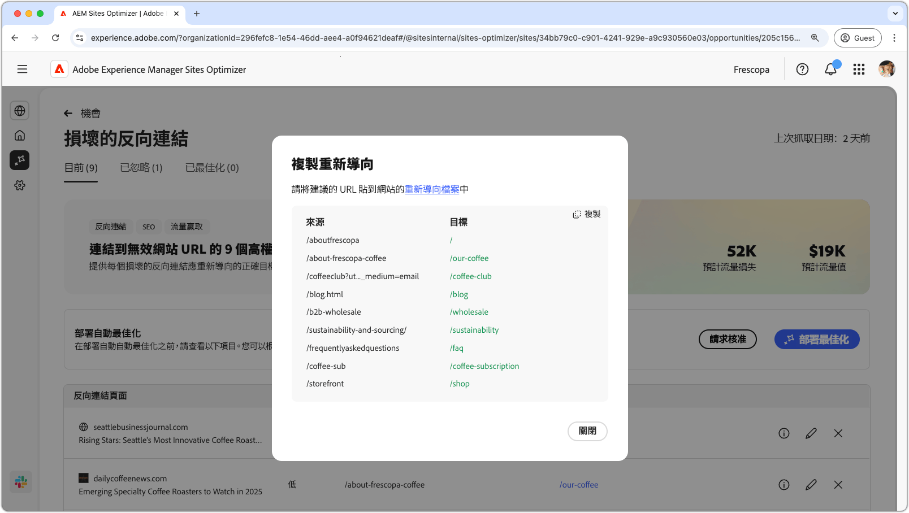
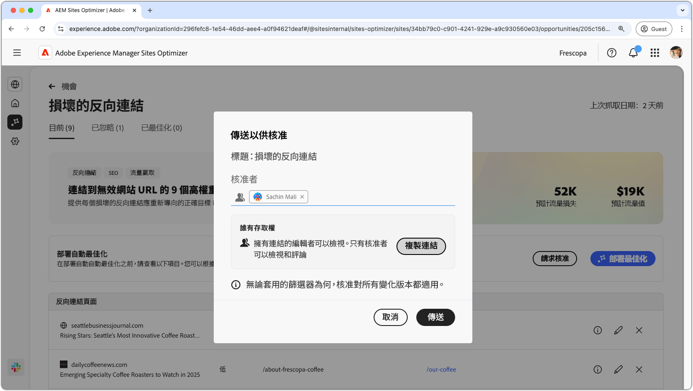

# 無效的反連結機會

{align="center"}

中斷的背景連結機會可識別從其他網站到您網站的連結，進而導致404錯誤。 由於搜尋引擎會使用反向連結來判斷搜尋關聯性，因此中斷的連結可能會對您網站的SEO和可發現性產生負面影響。 這些問題可能是由於URL變更或連結頁面的移除等因素所造成。

中斷的背景連結機會會在頁面頂端顯示摘要，包括問題及其對網站和業務影響的摘要。

* **專案流量遺失** — 因反向連結中斷而預估的流量遺失。
* **預計流量值** — 遺失流量的預估值。

## 自動識別

{align="center"}

中斷的背景連結機會會列出您網站上所有中斷的背景連結，包括：

* **反向連結頁面** — 包含中斷連結的網站網域。
* **優先順序** — 高、中或低，表示中斷的連結對TODO的SEO的影響。
* **目標URL已中斷** — 您網站上已連結的不存在URL。

## 自動建議

{align="center"}

中斷的背景連結機會也會提供AI產生的建議，讓您瞭解網站上的哪一個頁面應將中斷的URL重新導向至該頁面。 這些建議是根據包含中斷URL的文字以及建議頁面的內容所提出的。

>[!BEGINTABS]

>[!TAB AI基本原則]

{align="center"}

選取&#x200B;**資訊**&#x200B;圖示以檢視建議URL的AI原理。 該理由解釋了為什麼AI認為建議的URL最適合損壞的連結。 這可協助您瞭解AI的決策流程，並做出接受或拒絕建議的明智決定。

>[!TAB 編輯目標URL]

{align="center"}

如果您不同意AI產生的建議，可以選取&#x200B;**編輯圖示**&#x200B;來編輯建議的URL。 這可讓您手動輸入您認為最適合中斷連結的URL。 Sites Optimizer也會列出您網站上其認為可能非常適合中斷連結的任何其他URL。

>[!TAB 忽略專案]

{align="center"}

您可以選擇忽略目標URL損毀的專案。 選取&#x200B;**忽略圖示**&#x200B;會從機會清單中移除中斷的背景連結。 已忽略的已中斷後連結可從機會頁面頂端的&#x200B;**已忽略**&#x200B;索引標籤重新參與。

>[!ENDTABS]

## 自動最佳化[!BADGE Ultimate]{type=Positive tooltip="Ultimate"}

{align="center"}

Sites Optimizer Ultimate新增了針對中斷的背景連結部署自動最佳化的功能。 選取&#x200B;**自動最佳化**&#x200B;按鈕會自動更新AEM網站的重新導向規則，以便將&#x200B;**中斷的目標URL**&#x200B;對應到&#x200B;**建議的URL**。 這可確保&#x200B;**反向連結頁面**&#x200B;上連結中斷後的網站訪客和搜尋機器人會被重新導向至您網站上的正確頁面，進而改善SEO和使用者體驗。

>[!BEGINTABS]

>[!TAB 部署最佳化]

{align="center"}

選取&#x200B;**部署最佳化**&#x200B;將會更新AEM網站的重新導向規則，以便將&#x200B;**中斷的目標URL**&#x200B;對應到&#x200B;**建議的URL**。 這可確保&#x200B;**反向連結頁面**&#x200B;上連結中斷後的網站訪客和搜尋機器人會被重新導向至您網站上的正確頁面，進而改善SEO和使用者體驗。

>[!TAB 要求核准]

{align="center"}

{{auto-optimize-request-approval}}

>[!ENDTABS]
