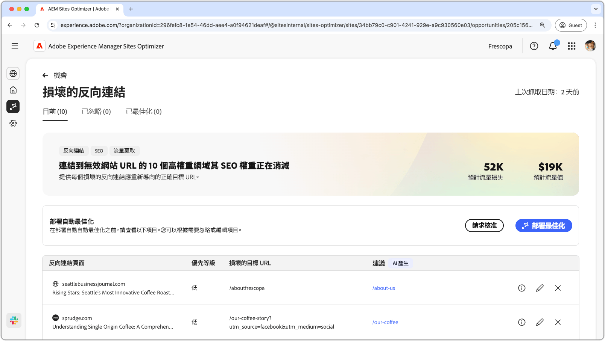
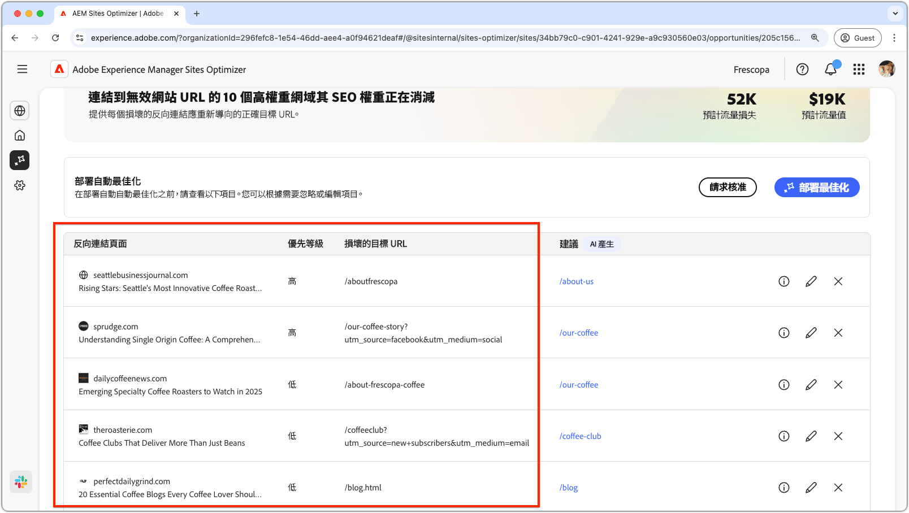
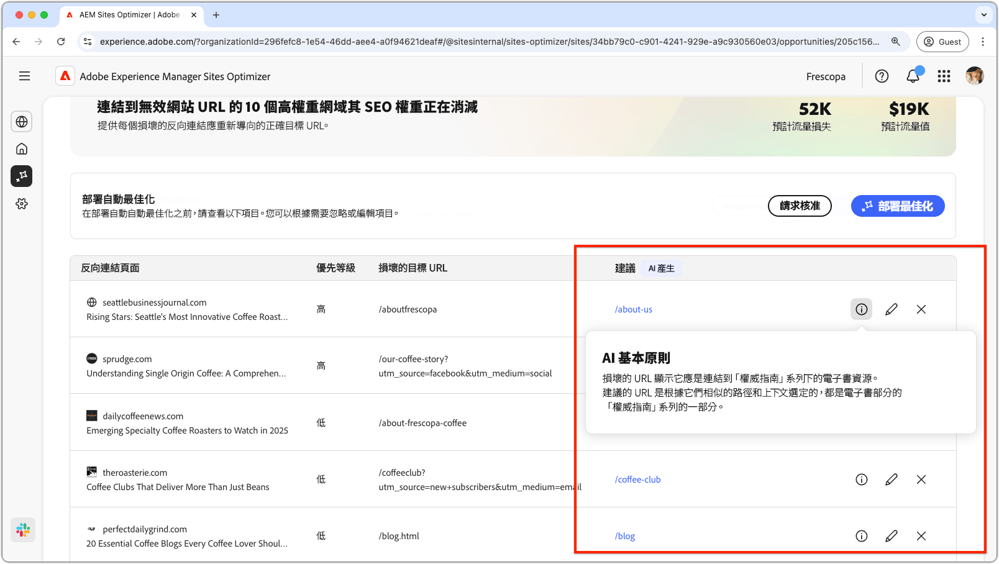
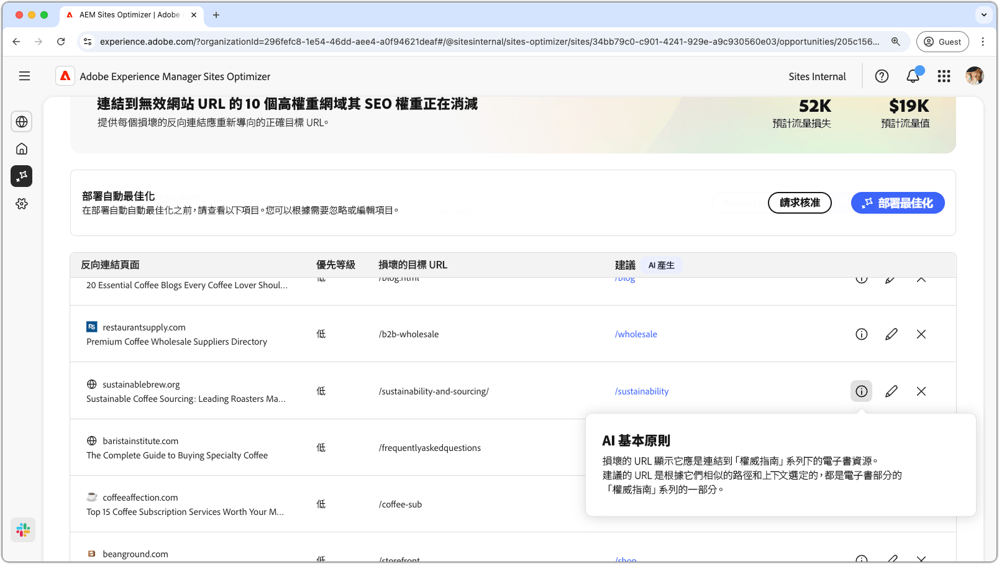
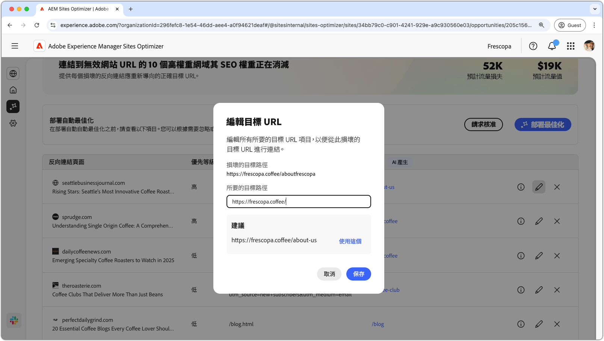
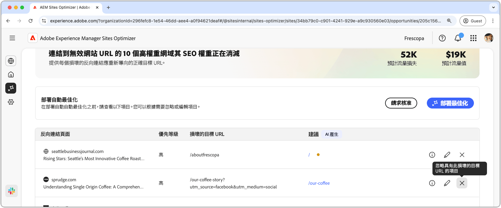

# 損壞的反向連結機會

<!--{align="center"}-->

>[!VIDEO](https://video.tv.adobe.com/v/3483250/?learn=on&enablevpops)

損壞的反向連結機會會識別指向網站上不存 (404) 頁面的外部連結。 這些連結會導致轉介流量流失並降低搜尋引擎最佳化價值，因為搜尋引擎會仰賴反向連結來評估相關性與權重。 若沒有適當的重新導向，或在 URL 變更、內容移除及頁面已無法使用的情況下，這些問題就會發生。 AEM Sites Optimizer 會識別所有損壞的反向連結、提供特定的 AI 建議，顯示在單一、集中的視圖中，並啟用一鍵式部署來修正所顯示的問題。

## 自動識別

<!--{align="center"}-->

AEM Sites Optimizer 會持續掃描外部資料來源，偵測指向網站上不存 404 頁面的反向連結。 資料會從多個來源彙總，包括 Google Search Console、[Operational Telemetry](https://experienceleague.adobe.com/zh-hant/docs/experience-manager-cloud-service/content/sites/operational-telemetry-for-aem-as-a-cloud-service) 以及第三方搜尋引擎最佳化平台。 自動識別機會會識別連結至失效 URL 的外部網域，並根據其影響進行優先順序，指標包括網域權重、預期流量及連結權重流失。

此機會列出所有已識別的問題，包括下列詳細資訊：

* **反向連結網域及頁面**：失效連結的外部頁面或網域。
* **優先順序**：高、中、低，會指出損壞的連結對搜尋引擎最佳化過程的影響。
* **損壞的目標 URL**：在您網站上所連結到的不存在 URL。

## 自動建議

<!--{align="center"}-->

對於每個已識別為損壞的反向連結，AEM Sites Optimizer 會建議最合適的目標頁面，以還原流量並提升搜尋引擎最佳化價值。 此功能會透過分析以下項目來決定反向連結的意圖：

* URL 結構與權杖
* 錨點文字
* 引用頁面的標題與內容

此意圖會與現有網站內容比對，以識別最相關的目標頁面。 每個損壞的 URL 都會對應至精確的取代頁面或最相關的頁面。 若無法確定合適的目標頁面，則會顯示問題以供手動審閱。

>[!BEGINTABS]

>[!TAB AI 原理]

<!--{align="center"}-->

選取&#x200B;**資訊**&#x200B;圖示可檢視所建議 URL 的 AI 原理。 該原理會解釋為何 AI 認為所建議的 URL 最適合已損壞的連結使用。 這可以協助您了解 AI 的決策過程，並做出接受或拒絕建議的明智決定。

>[!TAB 編輯目標 URL]

<!--{align="center"}-->

如果您不同意 AI 生成的建議，則可以透過選取&#x200B;**編輯圖示**&#x200B;來編輯建議的 URL。 您可以利用編輯功能手動輸入您認為最適合無效連結的 URL。 Sites Optimizer 也會列出其認為您網站上可能適合無效連結的任何其他 URL。

>[!TAB 忽略項目]

<!--{align="center"}-->

您可以選擇忽略具有損壞目標 URL 的項目。 選取可從機會清單中移除無效的反向連結。 使用機會頁面頂端的「**已忽略**」索引標籤，可以重新啟用已忽略的無效反向連結。

>[!ENDTABS]

## 自動最佳化

<!--[!BADGE Ultimate]{type=Positive tooltip="Ultimate"}-->

審閱並核准建議後，您可以按下「**部署最佳化**」。 接著 AEM Sites Optimizer 會根據實施中的重新導向的管理方式，將修正內容套用至製作環境。 AEM 作者可從內容管理系統 (CMS) 發佈修正內容。

根據設定，修正會在現有部署工作流程中以內容或程式碼變更的形式套用。 最佳化流程包含下列步驟：

* **驗證**：確保變更在部署之前如預期運作，且不會引入回歸。
* **部署**：在現有流程中套用變更，例如在 AEM 中更新內容或透過持續整合與部署管道部署程式碼。
* **權限驗證**：驗證使用者是否擁有部署變更的適當權限。 若沒有，則會提供其他輸出，例如可下載的重新導向清單或程式碼修補程式。

此流程會確保重新導向精確實施，發佈前經過驗證，並確保重新導向符合現有設定與治理流程。
