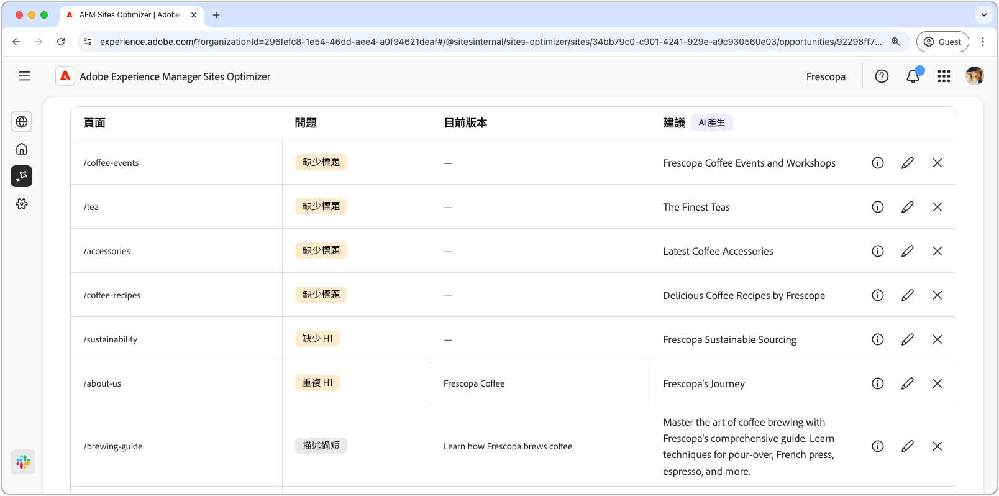

# 無效或遺失中繼資料機會

{align="center"}

內部連結中斷會影響搜尋引擎為您的網站建立索引的能力，且對使用者體驗和搜尋引擎最佳化都會造成負面影響。 為協助修正此問題，中斷的內部連結機會會指出中斷的URL，並提供有效連結更新的建議。 解決這些問題將改善使用者參與度，並確保順暢的導覽和協助工具。

中斷的內部連結機會會在頁面頂端顯示摘要，包括問題及其對網站和業務影響的摘要。

* **專案流量遺失** — 因內部連結中斷而預估的流量遺失。
* **預計流量值** — 遺失流量的預估值。

## 自動識別

<!---{align="center"}-->

中斷的內部連結機會會自動識別並列出頁面上所有中斷的內部連結，並包括下列專案：

* **反向連結頁面** — 包含中斷連結的頁面。
* **中斷的目標URL** — 中斷的內部連結。
* **建議** — 有關如何更新中斷連結的AI產生的建議。 如需詳細資訊，請參閱自動建議區段。

## 自動建議

<!--{align="center"}-->

斷開的內部連結機會提供如何更新斷開連結的AI產生建議。 這些建議是根據目標中斷的URL，並提供合適的替代方案。 選取&#x200B;**資訊圖示**&#x200B;會提供AI產生的建議更新理由。

>[!BEGINTABS]

>[!TAB AI基本原則]

<!--[AI rationale of broken internal links](./assets/broken-internal-links/auto-suggest-ai-rationale.png) -->

選取&#x200B;**資訊**&#x200B;圖示以檢視建議URL的AI原理。 該理由解釋了為什麼AI認為建議的URL最適合損壞的連結。 這可協助您瞭解AI的決策流程，並做出接受或拒絕建議的明智決定。

>[!TAB 編輯目標URL]

<!--{align="center"}-->

如果您不同意AI產生的建議，可以選取&#x200B;**編輯圖示**&#x200B;來編輯建議的連結值。 這可讓您手動輸入所需的連結。 編輯視窗包含連結的&#x200B;**已中斷目標路徑**、**您可在其中手動編輯連結的目標路徑**，以及具有Ai產生的建議的欄位。 完成編輯後，按一下[儲存]，更新中斷的連結專案。 ****&#x200B;專案欄位中將顯示一個黃色點，表示連結已編輯。

>[!TAB 忽略專案]

<!--{align="center"}-->

您可以選擇忽略具有目標中斷URL的專案。 選取&#x200B;**忽略圖示**&#x200B;會從機會清單移除專案。 可以從機會頁面頂端的&#x200B;**Ignored**&#x200B;標籤重新使用已忽略的專案。

>[!ENDTABS]

## 自動最佳化[!BADGE Ultimate]{type=Positive tooltip="Ultimate"}

<!---{align="center"}-->

Sites Optimizer Ultimate新增針對商機所找到的中斷連結部署自動最佳化的功能。<!--- TBD-need more in-depth and opportunity specific information here. What does the auto-optimization do?-->

>[!BEGINTABS]

>[!TAB 部署最佳化]

{{auto-optimize-deploy-optimization-slack}}

>[!TAB 要求核准]

{{auto-optimize-request-approval}}

>[!ENDTABS]

