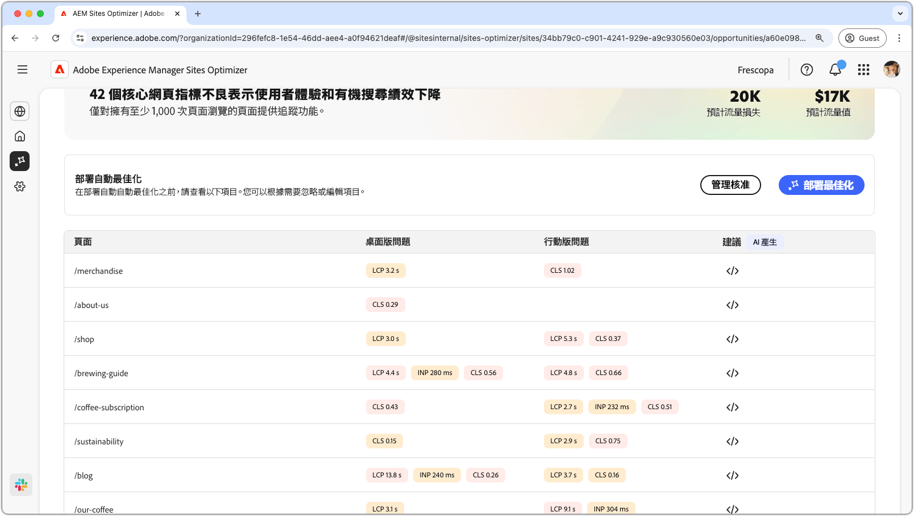
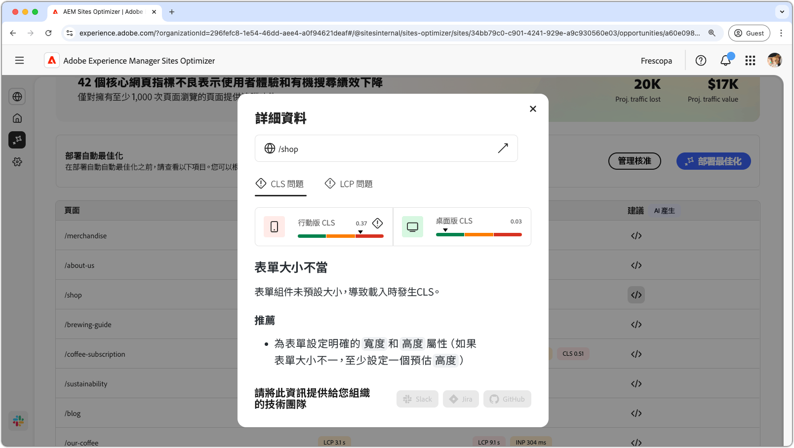
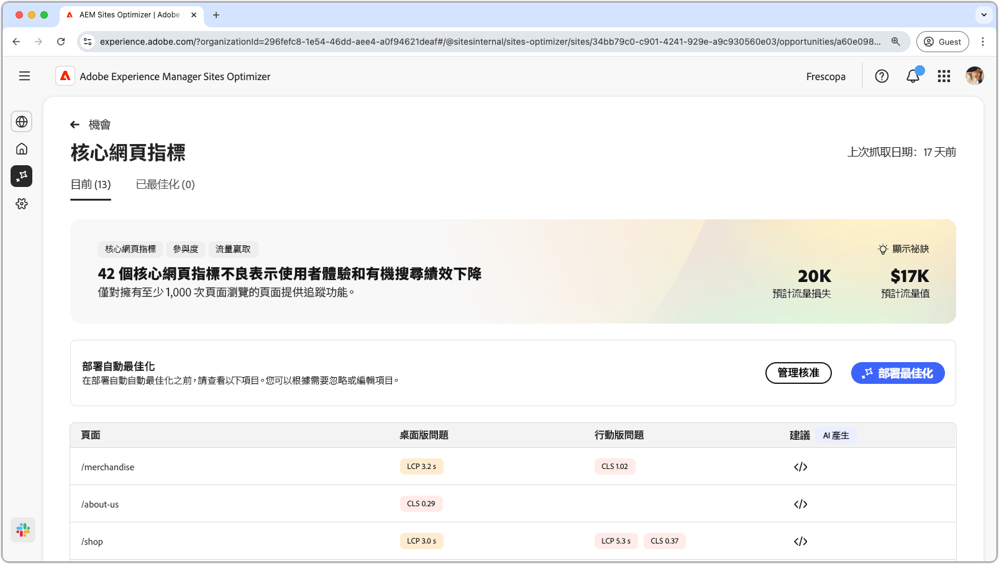

# 核心網路重要商機

{align="center"}

核心的Web Vitals機會可識別可能會降低網頁的使用者體驗和自然搜尋效能的問題。 這些問題源自於各種因素，例如：自訂字型、未最佳化的JavaScript相依性、第三方指令碼等。 核心網路生命機會會指出這些錯誤元素，並提出可提升網頁效能的修正建議。 請注意，只能分析至少具有1000個頁面檢視的頁面。

開始之前，核心Web Vitals機會會在頁面頂端顯示摘要，包括問題及其對網站和業務的影響的摘要。

* **預估流量遺失** — 由於核心Web重要專案低於效能臨界值，預估的流量遺失。
* **預計流量值** — 遺失流量的預估值。

## 自動識別

{align="center"}

在頁面的下方，您有一個所有目前問題的清單，這些問題已分組為：

* **行動問題** — 影響頁面行動版本的問題清單。
* **案頭問題** — 影響網頁案頭版本的問題清單。

每個問題都會顯示在表格中，**頁面**&#x200B;欄會識別受影響的頁面專案。

此外，這些問題也依核心Web虛擬報表的標準效能度量分組：最大內容繪製&#x200B;**LCP**、下一繪製&#x200B;**INP**&#x200B;的互動，以及累積版面配置位移&#x200B;**CLS**。

## 自動建議

{align="center"}

核心Web虛擬機器會可提供AI產生的修正建議。 當您按一下建議按鈕時，會出現新視窗，其中包含效能量度&#x200B;**LCP**、**INP**&#x200B;和&#x200B;**CLS**&#x200B;作為類別。 您可以在這些類別之間切換，以檢視特定問題的清單。

每個類別都可能包含數個問題，請務必向下捲動以檢視完整的問題和建議清單。  此外，每個量度都有兩個行動裝置和桌上型電腦效能計量器。

## 自動最佳化[!BADGE Ultimate]{type=Positive tooltip="Ultimate"}

{align="center"}

Sites Optimizer Ultimate新增針對核心web vitals商機發現的問題部署自動最佳化的功能。<!--- TBD-need more in-depth and opportunity specific information here. What does the auto-optimization do?-->

>[!BEGINTABS]

>[!TAB 部署最佳化]

{{auto-optimize-deploy-optimization-slack}}

>[!TAB 要求核准]

{{auto-optimize-request-approval}}

>[!ENDTABS]

