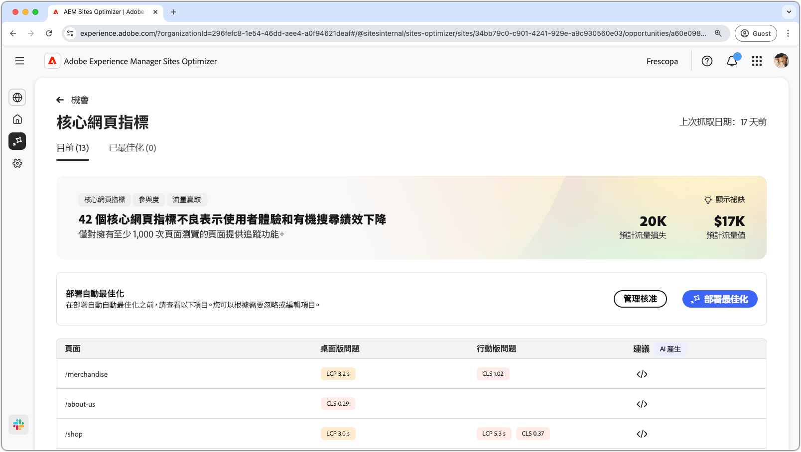
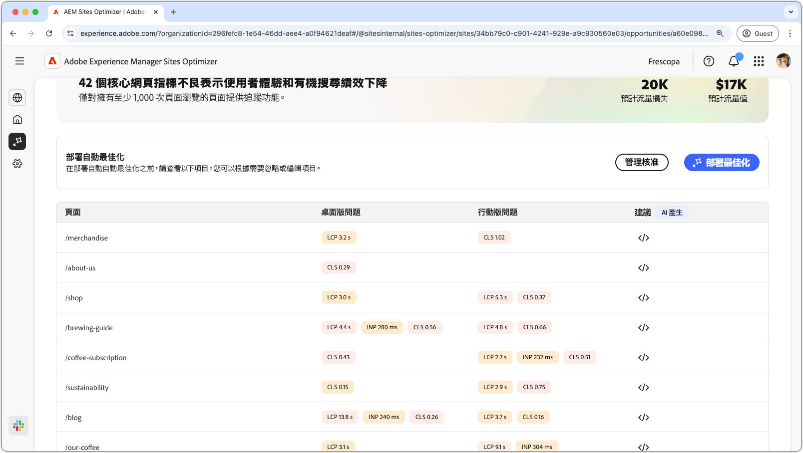
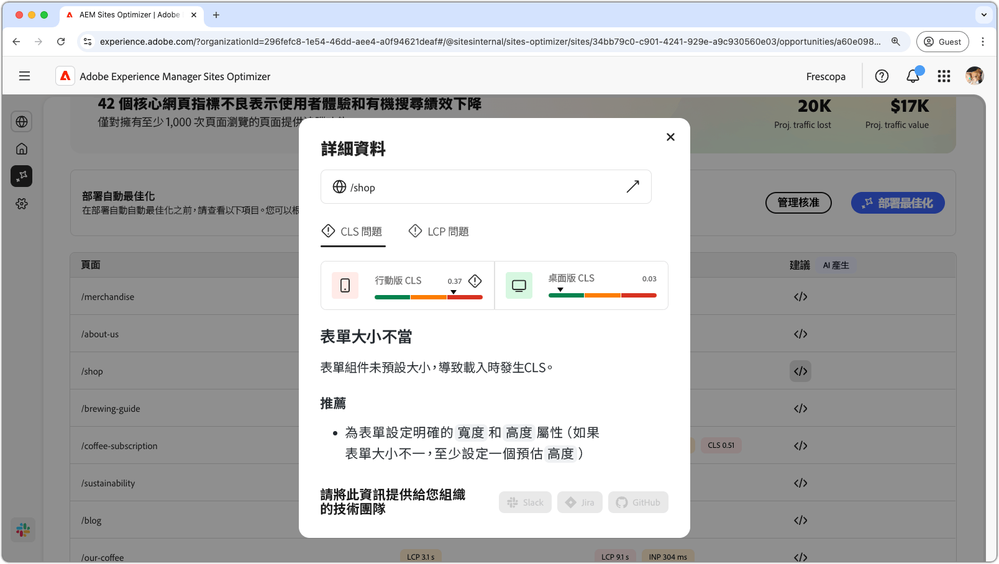

# 核心網頁指標機會

<!--{align="center"}-->

>[!VIDEO](https://video.tv.adobe.com/v/3483371/?learn=on&enablevpops)

Core Web Vitals機會可識別您網站上表現缺佳且影響使用者體驗和自然搜尋效能的頁面。 這些問題可能因自訂字型、未最佳化的JavaScript相依性和第三方指令碼等因素而產生。 Core Web Vitals會測量內容載入的速度、頁面配置的穩定性以及頁面對使用者互動的回應程度。

AEM Sites Optimizer會偵測受這些問題影響的頁面、在程式碼層級提供特定的AI建議，並透過您現有的開發工作流程套用修正。 請注意，只能分析至少具有1000次頁面檢視的頁面。

## 自動識別

<!--{align="center"}-->

AEM Sites Optimizer會使用[作業遙測](https://experienceleague.adobe.com/zh-hant/docs/experience-manager-cloud-service/content/sites/operational-telemetry-for-aem-as-a-cloud-service)來持續監視網站效能，以偵測Core Web Vitals量度(例如最大內容繪製(LCP)、累積版面配置位移(CLS)和互動到下一次繪製(INP))中的回歸。 它會使用真實的使用者資料，來識別效能回歸，並根據問題對使用者體驗的影響來安排問題的優先順序。

AEM Sites Optimizer會顯示所有目前問題的清單，並依行動裝置和案頭提供詳細資訊。 **頁面**&#x200B;欄指出受影響的頁面專案及問題，並依LCP、INP及CLS分類。

## 自動建議

<!--{align="center"}-->

AEM Sites Optimizer會針對每個已識別的問題，產生規範性程式碼層級建議，以改善Core Web Vitals效能。 它會透過存取您的程式碼存放庫來評估基礎實施。 這可讓系統分析元件、指令碼和樣式的實作方式，並找出效能問題的根本原因。 根據此分析，系統會提供目標建議，並產生程式碼修補程式，指定改善效能所需的變更。 每個建議都可在套用前進行稽核。

當您按一下建議按鈕時，會出現一個新視窗，其中包含效能測量結果LCP、INP和CLS作為類別。 您可以在這些類別之間切換以檢視特定問題的清單。 每個類別都可能包含數個問題，因此請務必向下捲動以檢視完整的問題和建議清單。 此外，每個量度都有兩個行動裝置和桌上型電腦效能計量器。

## 自動最佳化

<!--[!BADGE Ultimate]{type=Positive tooltip="Ultimate"}-->

在檢閱並核准建議後，您可以按一下&#x200B;**部署最佳化**。 AEM Sites Optimizer會根據發現的問題產生程式碼修補程式，並透過版本控制程式提供。 最佳化程式包含下列步驟：

* **問題建立** — 為每個修正建立標籤的GitHub問題，包括清楚的說明和受影響的可見度URL。
* **提取請求傳遞** — 自動開啟連結的提取請求，其中包含完整的程式碼修正，可供檢閱、測試和合併。
* **狀態追蹤** — 追蹤每個修正完成、標籤部分或失敗的後續嘗試。

在提供這些更新之前，AEM Sites Optimizer會執行驗證，以確保修正可解決基礎問題且不會引入回歸。 所有更新都遵循標準開發做法，在合併到生產環境之前需要稽核和核准。

這可確保效能最佳化是準確的、經過驗證並整合到現有的開發和治理流程中。
