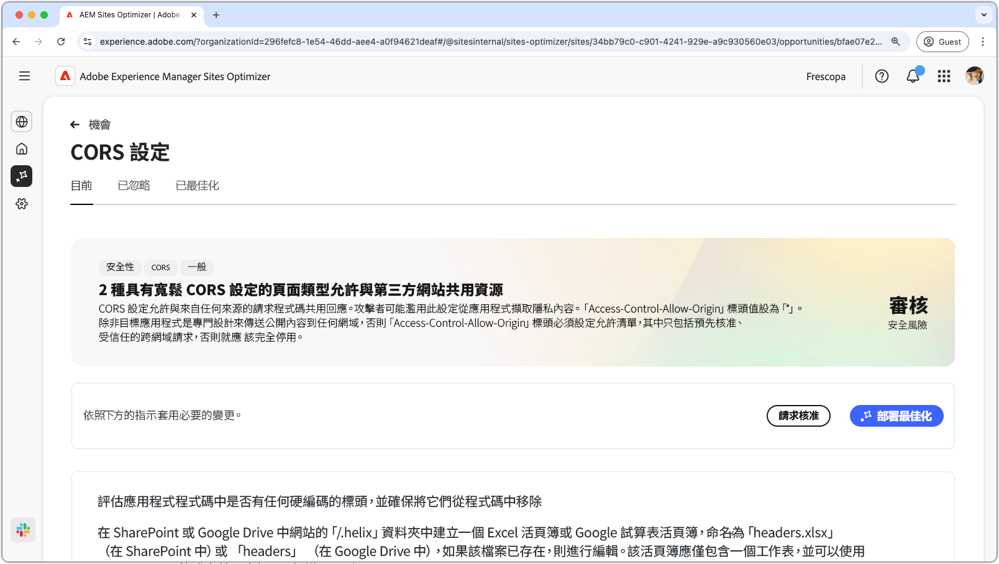
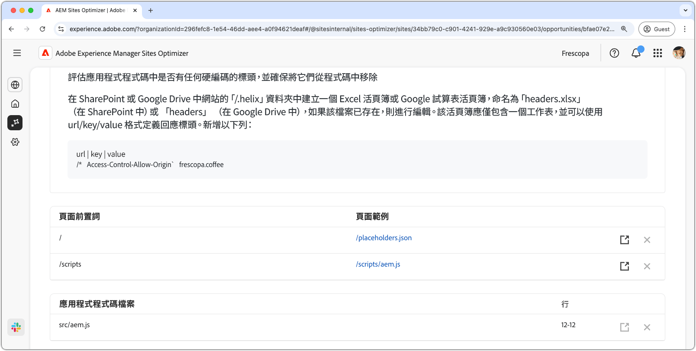

# CORS 設定機會

{align="center"}

正確設定跨原始資源共用 (CORS) 對於保護 Web 應用程式免受未經授權的資料存取至關重要。當 `Access-Control-Allow-Origin` 標頭設定為 `*` 時，任何網域都可以請求並接收回應，從而有可能向攻擊者公開敏感資訊。這提供了一個機會，讓您可以透過實施受信任網域的受控允許清單或在不需要 CORS 時加以停用來加強安全性。確保安全的 CORS 設定有助於保護私人內容，同時讓獲得授權的使用者可以保持無縫存取。

## 自動識別

{align="center"}

自動識別會掃描您的網站是否有 CORS 設定錯誤，並偵測容易受到未經授權存取的 URL。這些 URL 會列在上表中，並附有以下詳細資料：

* **頁面前置詞** - 容易發生 CORS 設定錯誤的 URL 路徑前置詞。
* **頁面範例** - 容易受到未經授權存取的範例 URL。

## 自動建議

{align="center"}

自動建議會提供&#x200B;**應用程式程式碼檔案**&#x200B;及其&#x200B;**行號**&#x200B;供您檢閱，這些檔案可能設定了鬆散的 CORS 原則。

## 自動最佳化

[!BADGE Ultimate]{type=Positive tooltip="Ultimate"}

>[!BEGINTABS]

>[!TAB 部署最佳化]

{{auto-optimize-deploy-optimization-slack}}

>[!TAB 請求核准]

{{auto-optimize-request-approval}}

>[!ENDTABS]
