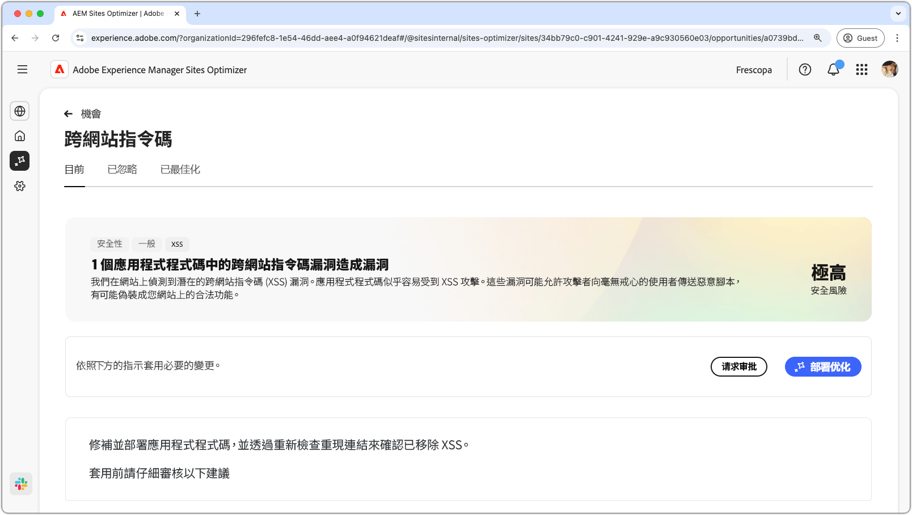
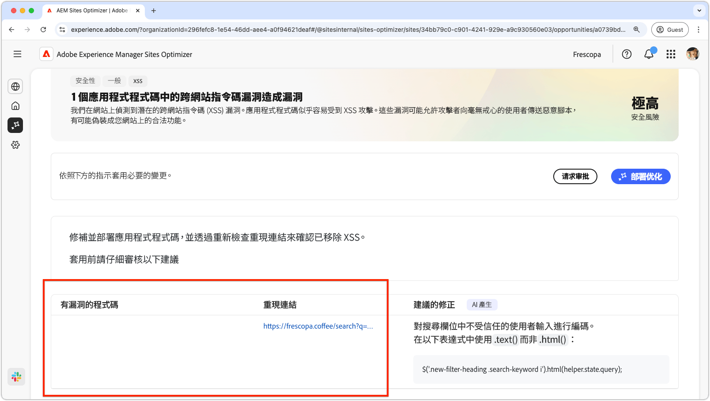
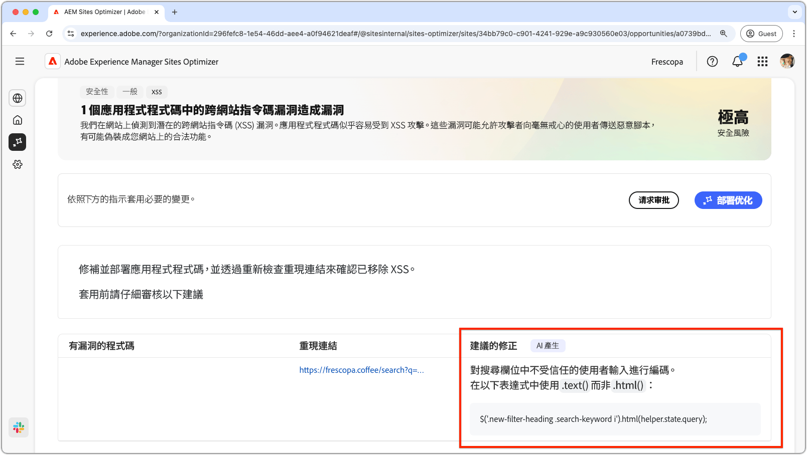

# 跨網站指令碼機會

{align="center"}

跨網站指令碼機會會識別並修正網站程式碼中的漏洞，攻擊者可能會利用這些漏洞將惡意指令碼插入其他使用者檢視的網頁中。 這些指令碼可能會竊取敏感資訊（例如工作階段Cookie），或代表使用者執行動作，例如變更使用者的密碼。

## 自動識別

{align="center"}

* **易受攻擊的程式碼** — 任何易受跨網站指令碼攻擊的程式碼。
* **要再現的連結** — 指向發現漏洞的頁面的連結。

## 自動建議

{align="center"}

* **建議的修正** — 有關如何修正漏洞的AI產生的建議。

## 自動最佳化[!BADGE Ultimate]{type=Positive tooltip="Ultimate"}

>[!BEGINTABS]

>[!TAB 部署最佳化]

{{auto-optimize-deploy-optimization-slack}}

>[!TAB 要求核准]

{{auto-optimize-request-approval}}

>[!ENDTABS]
