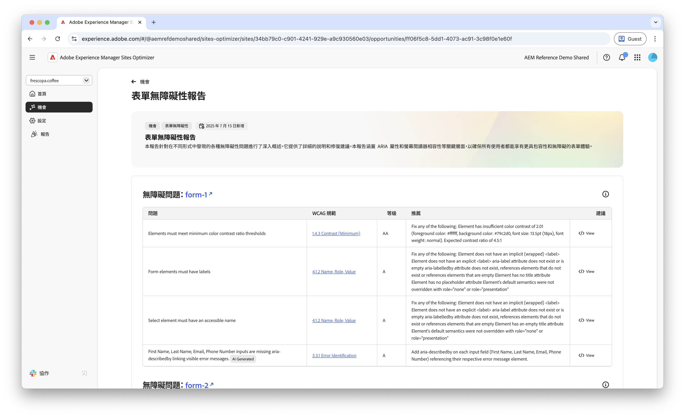
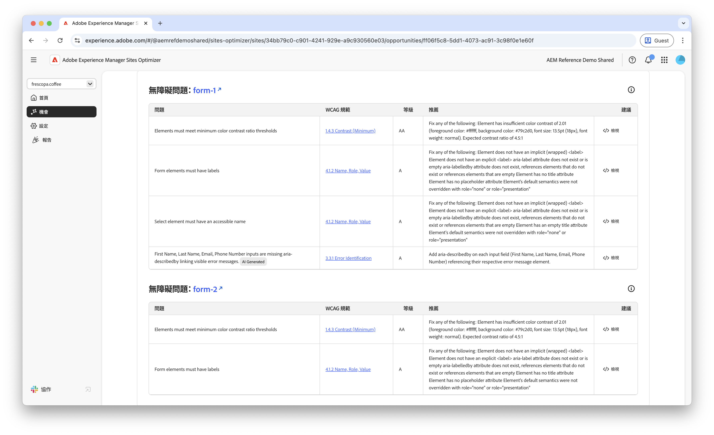
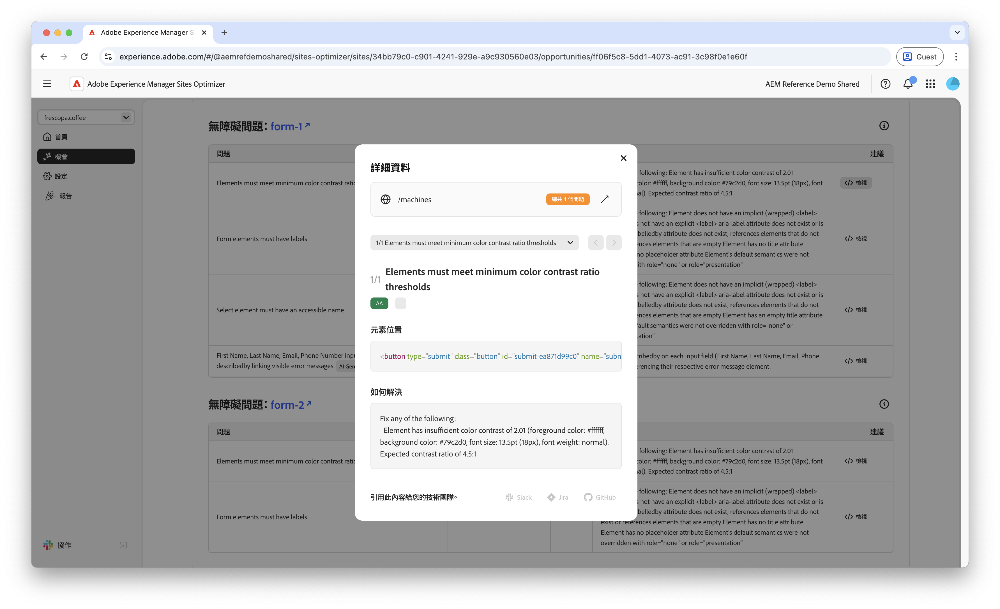
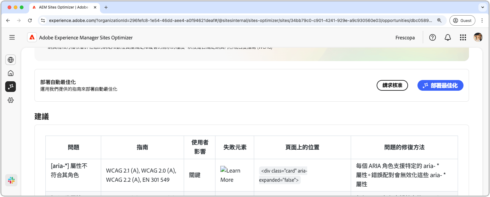

# 表單無障礙問題機會

搶先體驗計劃現在提供 Forms 最佳化功能。您可以使用官方電子郵件 ID 寫信至 aem-forms-ea@adobe.com，以加入搶先體驗計劃並要求存取該功能。

{align="center"}

表單無障礙問題機會可確認您的表單符合身心障礙人士需求的程度，以及表單是否遵循[網頁內容無障礙指南 (WCAG)](https://www.w3.org/TR/WCAG21/)。 評估您的表單符合 WCAG 標準的程度，有助於打造具有包容性的表單體驗。如此一來，視覺、聽覺、認知及運動障礙者都能瀏覽、操作並順利完成您的表單。這不僅在道德上極為重要，也有助於遵守法律規範。這也能改善表單完成率，並增加您的受眾觸及率，提升使用者體驗及業務績效。

## 自動識別

{align="center"}

**表單無障礙問題機會**&#x200B;可找出您的表單內具體的無障礙問題，並包含下列內容：

* **問題** – 在您的表單內發現的具體的無障礙問題。
* **WCAG 準則** – 表單問題違反的 [WCAG 指南 ID](https://www.w3.org/TR/WCAG21/)。
* **等級** – 問題的[合規性等級](https://www.w3.org/WAI/WCAG21/Understanding/conformance#levels)。
* **建議** - 有關如何修復表單無障礙問題的具體指引，包括程式碼範例和最佳做法。
* **來源 HTML** - 網頁上受問題影響之表單元素的 HTML 片段。

## 自動建議

{align="center"}

自動建議會在「**建議**」欄位中提供 AI 生成的建議，其提供如何解決表單無障礙問題的規範性指導。

<!-- 

## Auto-optimize

[!BADGE Ultimate]{type=Positive tooltip="Ultimate"}

{align="center"}

Sites Optimizer Ultimate adds the ability to deploy auto-optimization for the form accessibility issues found.

>[!BEGINTABS]

>[!TAB Deploy optimization]

{{auto-optimize-deploy-optimization-slack}}

>[!TAB Request approval]

{{auto-optimize-request-approval}}

>[!ENDTABS]
-->

