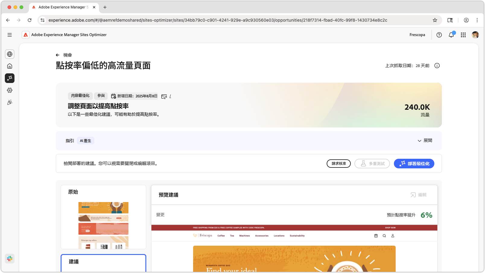
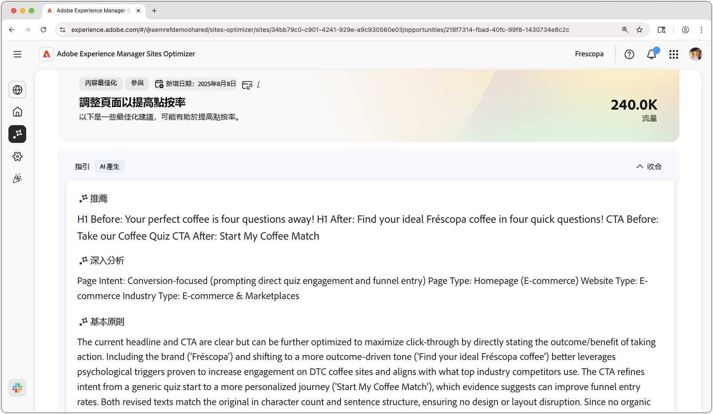
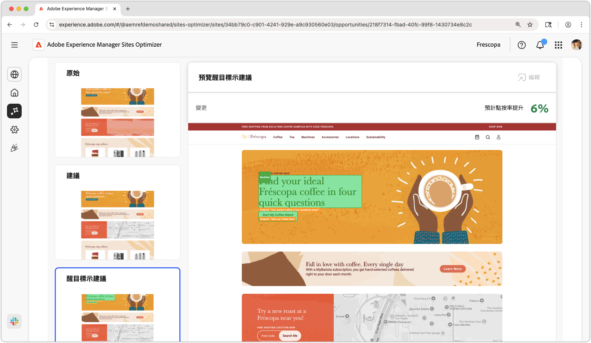
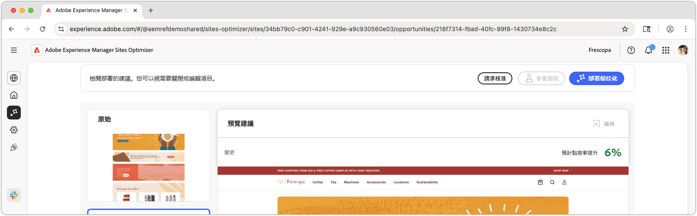

# 高流量頁面具有低CTR機會

{align="center"}

高流量頁面具有低CTR機會可識別網站上接收大量流量但點進率(CTR)低的頁面。 透過分析這些頁面，您可以發現可能阻礙使用者參與的潛在問題，並採取措施改善其效能。 這個機會是最佳化網站內容和版面配置的關鍵，最終可導致更高的轉換率和更好的使用者體驗。

## 自動識別

{align="center"}

**高流量頁面具有低CTR機會**&#x200B;會識別您網站上具有低CTR的高流量頁面，並包括下列專案：

* **建議** — 改善頁面CTR的建議動作。
* **Insight** — 說明頁面的CTR為何偏低。
* **理由** — 建議背後的原因。

## 自動建議

{align="center"}

自動建議可提供AI產生的建議，讓使用者瞭解最佳化網頁體驗的外觀。 建議包括&#x200B;**醒目提示**&#x200B;的檢視，讓您輕鬆檢視建議哪些變更。

您可以選取建議來完整檢視這些建議、其預計的CTR影響，以及在將這些建議套用至頁面之前編輯建議的能力。

## 自動最佳化

[!BADGE Ultimate]{type=Positive tooltip="Ultimate"}

{align="center"}

Sites Optimizer Ultimate新增了為建議的最佳化部署自動最佳化的功能。

>[!BEGINTABS]

>[!TAB 部署最佳化]

{{auto-optimize-deploy-optimization-slack}}

>[!TAB 請求核准]

{{auto-optimize-request-approval}}

>[!ENDTABS]
