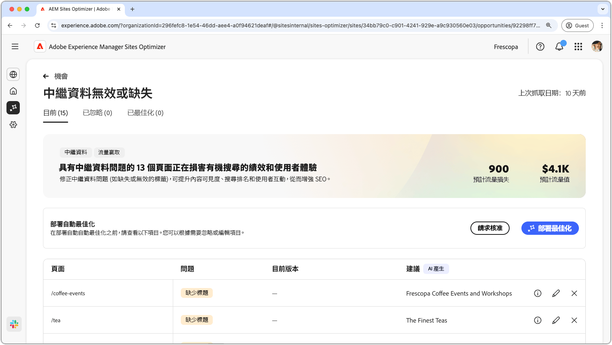
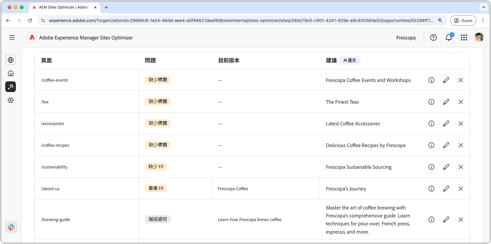
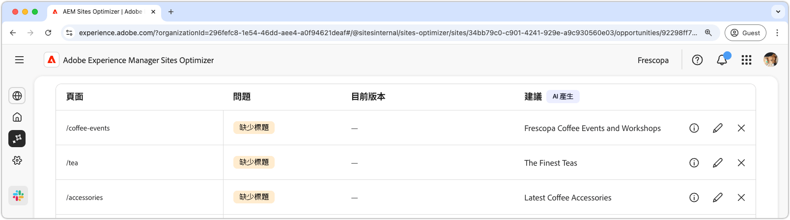
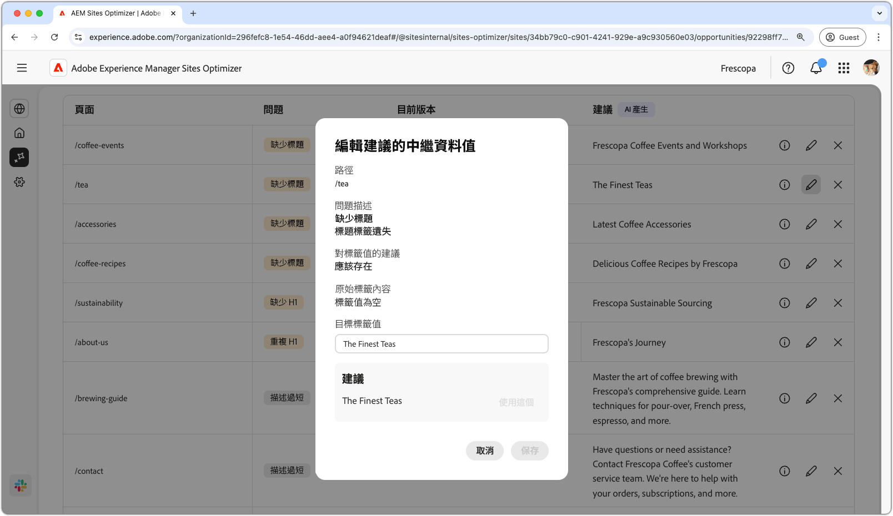
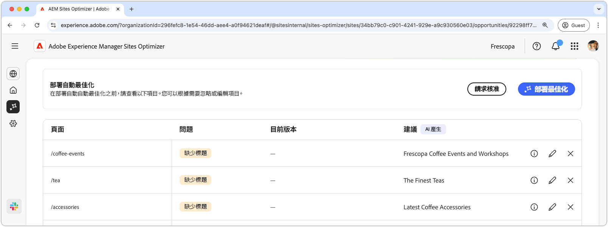

# 無效或遺失中繼資料機會

{align="center"}

無效或遺失的中繼資料機會可識別您的網頁上遺失或錯誤的中繼資料。 修正中繼資料問題可改善內容可見度、搜尋排名和使用者參與度，進而促進SEO。 這些問題可能是由遺失或無效的標籤、說明太長或太短等因素所造成。

無效或遺失的中繼資料機會會在頁面頂端顯示摘要，包括問題及其對網站和業務影響的摘要。

* **預計的流量遺失** — 由於錯誤的中繼資料而預估的流量遺失。
* **預計流量值** — 遺失流量的預估值。

## 自動識別

{align="center"}

無效或遺失的中繼資料機會會列出頁面上所有錯誤的中繼資料，並包括下列專案：

* **頁面** — 包含無效或遺失中繼資料的頁面。
* **問題** — 指出影響中繼資料標籤的問題型別。 其範圍包括缺少標題到複製H1等等。
* **值** — 需要變更的目前中繼資料標籤值。
* **建議** — 由AI產生的適合標籤更新的建議。 如需更多詳細資訊，請參閱以下區段。

## 自動建議

{align="center"}

無效或遺失的中繼資料機會也會提供AI產生的建議，說明如何變更或更新中繼資料標籤。 這些建議是根據包含錯誤中繼資料的初始標籤，以及建議更新的內容。

>[!BEGINTABS]

>[!TAB AI基本原則]

選取&#x200B;**資訊圖示**&#x200B;可提供建議更新的AI理由。

>[!TAB 編輯建議的中繼資料值]

{align="center"}

如果您不同意AI產生的建議，可以選取&#x200B;**編輯圖示**&#x200B;來編輯建議的中繼資料值。 這可讓您手動輸入您認為最適合中繼資料的值。 編輯視窗包含下列專案：

* **路徑** — 包含中繼資料（或缺乏）的頁面的路徑。
* **問題說明** — 指出影響中繼資料標籤的問題型別和簡短說明。
* **標籤值的建議** - AI產生的有關如何變更或更新中繼資料標籤的建議。 例如，標籤更新應包含多少字元等等。
* **原始標籤內容** — 原始標籤值。
* **目標標籤值** — 編輯此欄位並手動新增所需的標籤值。 當您選取&#x200B;**儲存**&#x200B;時，此值將會套用至提議的更新。
* **建議** - AI產生的關於如何變更值的建議。
* **儲存** — 儲存並套用&#x200B;**目標標籤值**&#x200B;欄位中的值。

>[!TAB 忽略專案]

您可以選擇忽略具有目標中斷或無效中繼資料的專案。 選取&#x200B;**忽略圖示**&#x200B;會從機會清單移除專案。 可以從機會頁面頂端的&#x200B;**Ignored**&#x200B;標籤重新使用已忽略的專案。

>[!ENDTABS]

## 自動最佳化[!BADGE Ultimate]{type=Positive tooltip="Ultimate"}

{align="center"}

Sites Optimizer Ultimate新增針對無效或遺失中繼資料機會所發現的問題部署自動最佳化的功能。<!--- TBD-need more in-depth and opportunity specific information here. What does the auto-optimization do?-->

>[!BEGINTABS]

>[!TAB 部署最佳化]

{{auto-optimize-deploy-optimization-slack}}

>[!TAB 要求核准]

{{auto-optimize-request-approval}}

>[!ENDTABS]
