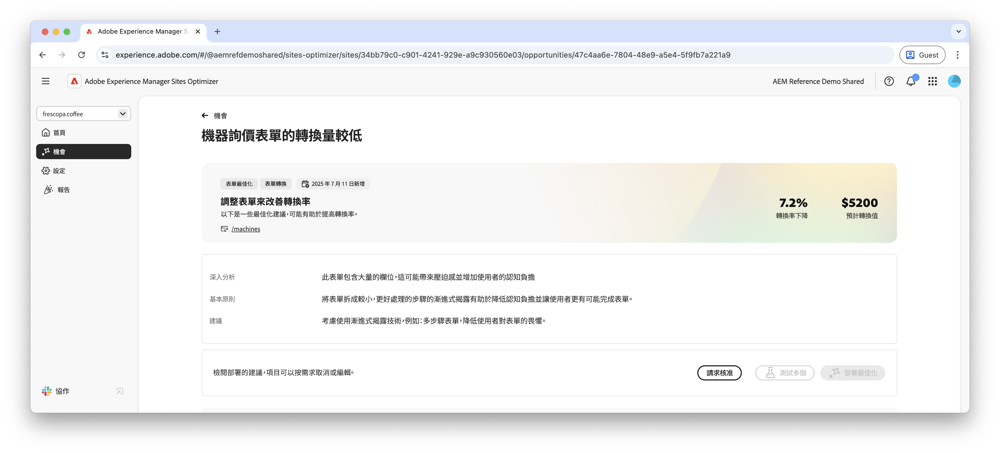
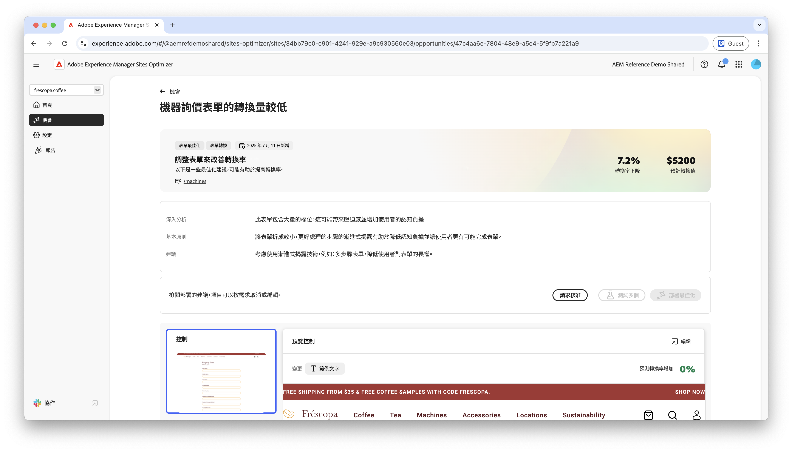
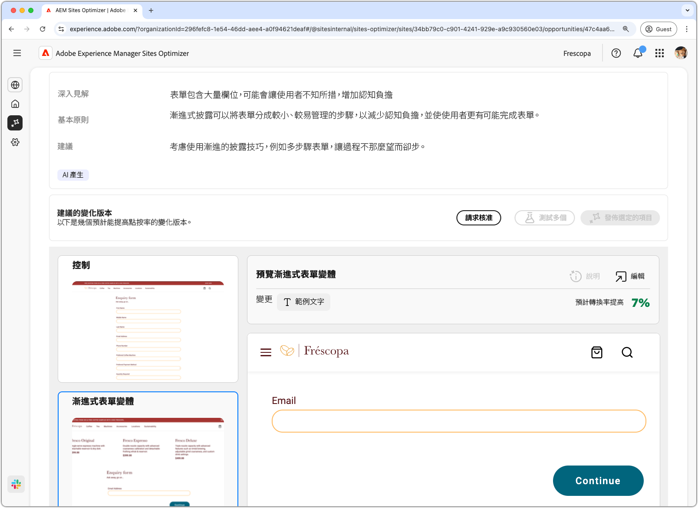
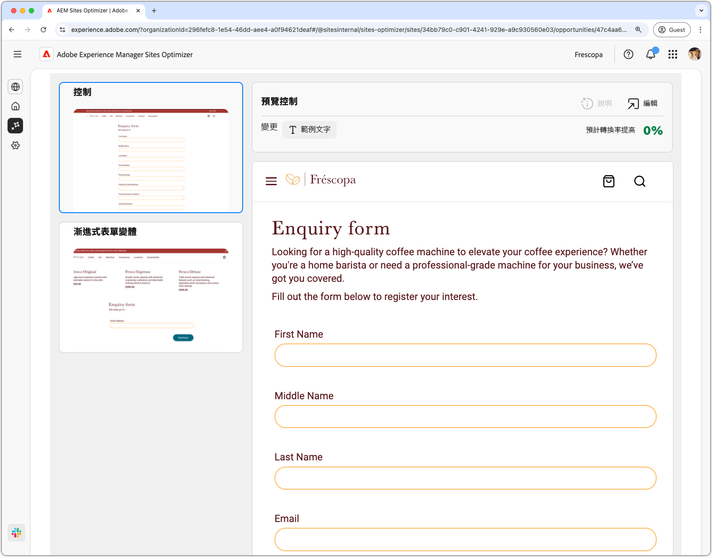
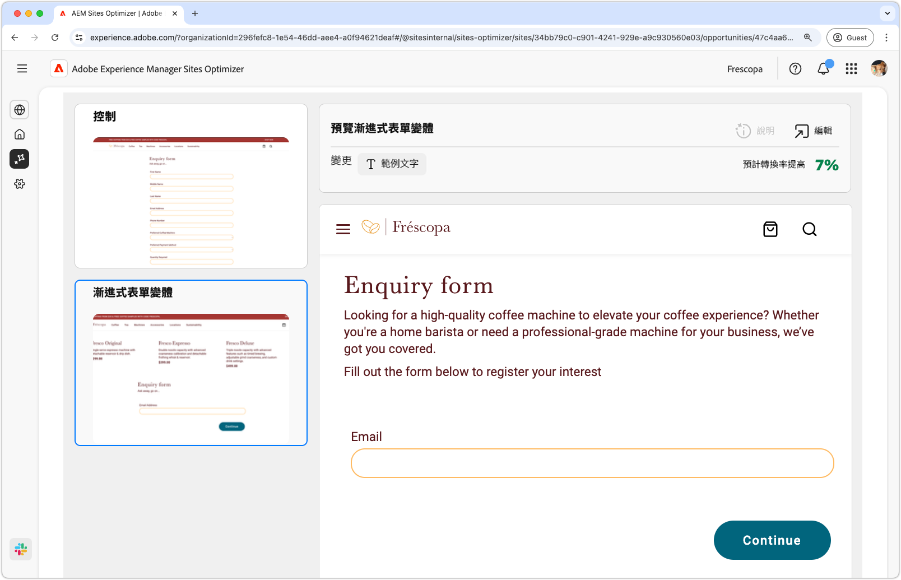
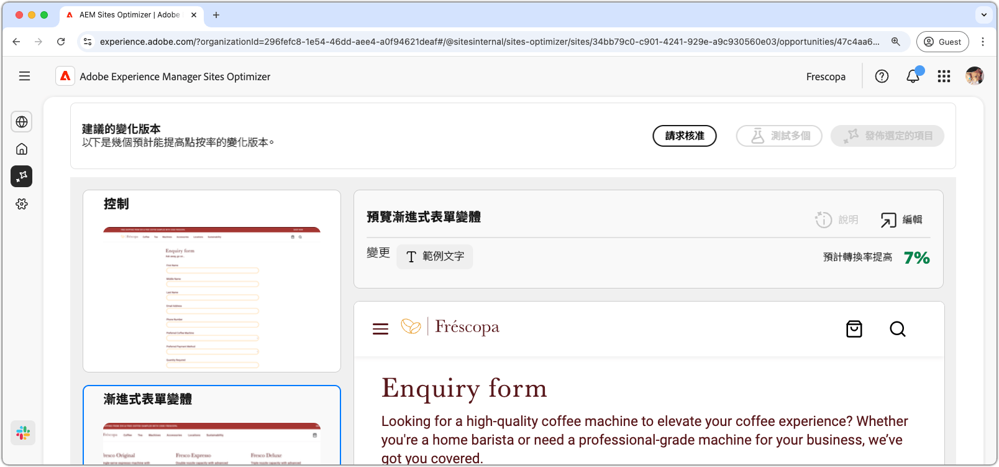

# Forms低轉換機會

 Forms Optimizer功能可在搶先存取計畫下取得。 您可以從您的正式電子郵件ID寫信到aem-forms-ea@adobe.com ，以加入搶先存取計畫並要求存取功能。

{align="center"}

低轉換機會可識別網站上轉換率低的表單。 此機會型別可協助您瞭解哪些表單表現不佳，並提供如何改善其參與率的建議。

## 自動識別

{align="center"}

每個具有低轉換率的網頁都會列為其自己的&#x200B;**低轉換率**&#x200B;機會。 商機與基本原理的簡短摘要會顯示在商機頁面的頂端。

## 自動建議

{align="center"}

自動建議提供AI產生的表單變數，這些變數旨在提高表單的轉換率。 每個變數都會根據其改善表單參與度的潛力，顯示&#x200B;**預計轉換率增加**，協助您排定最有效建議的優先順序。

>[!BEGINTABS]

>[!TAB 控制變化版本]

{align="center"}

控制項變數是網站上目前使用的原始表單。 此變化版本會作為用來比較所建議變化版本績效的基準線。

>[!TAB 建議的變化版本]

{align="center"}

建議的變數是AI產生的表單變數，旨在提高表單的轉換率。 每個變數都會根據其改善表單參與度的潛力，顯示&#x200B;**預計轉換率增加**，協助您排定最有效建議的優先順序。

按一下每個變化版本即可在畫面右側進行預覽。預覽畫面頂端有以下可用操作和資訊：

* **變更** - 有此變化版本與&#x200B;**控制**&#x200B;變化版本之間有何變更的簡短摘要。
* **預計轉換率增加** — 如果實作此變動，表單參與的預估增加。
* **編輯** - 按一下即可在 AEM 製作環境中編輯變化版本。

>[!ENDTABS]

<!-- 

## Auto-optimize

[!BADGE Ultimate]{type=Positive tooltip="Ultimate"}

{align="center"}

Sites Optimizer Ultimate adds the ability to deploy auto-optimization for the issues found by the low conversions opportunity.

>[!BEGINTABS]

>[!TAB Test multiple]

>[!TAB Publish selected]

{{auto-optimize-deploy-optimization-slack}}

>[!TAB Request approval]

{{auto-optimize-request-approval}}

>[!ENDTABS]

-->