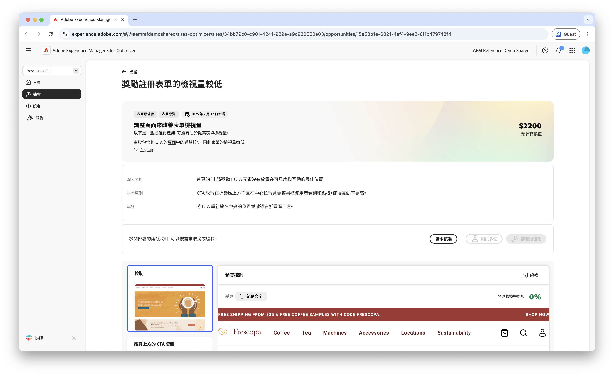

# 表單低瀏覽量機會

 Forms最佳化功能可在搶先存取程式下使用。 您可以使用官方電子郵件 ID 寫信至 aem-forms-ea@adobe.com，以加入搶先體驗計劃並要求存取該功能。

{align="center"}

低瀏覽量機會可識別您網站上瀏覽率較低的表單。此機會類型可協助您了解哪些表單效能不佳，並提供如何提高表單參與率的建議。

## 自動識別

{align="center"}

每個表單瀏覽量偏低的網頁都會列為其自己的&#x200B;**低瀏覽量**&#x200B;機會。機會頁面頂端會顯示機會的簡短摘要和原理。

## 自動建議

{align="center"}

自動建議會提供以增加表單瀏覽量為目標而由 AI 產生的表單變化版本。每個變化版本都會根據其提高表單參與度的潛力顯示&#x200B;**轉換率預計增長量**，協助您優先採用最有效的建議。

>[!BEGINTABS]

>[!TAB 控制變化版本]

{align="center"}

控制變化版本是您網站上目前使用中的原始表單。此變化版本會作為用來比較所建議變化版本績效的基準線。

>[!TAB 建議的變化版本]

{align="center"}

建議變化版本是以增加表單瀏覽量為目標而由 AI 產生的表單變化版本。每個變化版本都會根據其提高表單參與度的潛力顯示&#x200B;**轉換率預計增長量**，協助您優先採用最有效的建議。

按一下每個變化版本即可在畫面右側進行預覽。預覽畫面頂端有以下可用操作和資訊：

* **變更** - 有此變化版本與&#x200B;**控制**&#x200B;變化版本之間有何變更的簡短摘要。
* **轉換率預計增長量** - 實施此變化版本後的表單參與度預計增長量。
* **編輯** - 按一下即可在 AEM 製作環境中編輯變化版本。

>[!ENDTABS]

<!-- 

## Auto-optimize

[!BADGE Ultimate]{type=Positive tooltip="Ultimate"}

{align="center"}

Sites Optimizer Ultimate adds the ability to deploy auto-optimization for the issues found by the low views opportunity.

>[!BEGINTABS]

>[!TAB Test multiple]

>[!TAB Publish selected]

{{auto-optimize-deploy-optimization-slack}}

>[!TAB Request approval]

{{auto-optimize-request-approval}}

>[!ENDTABS]

-->

