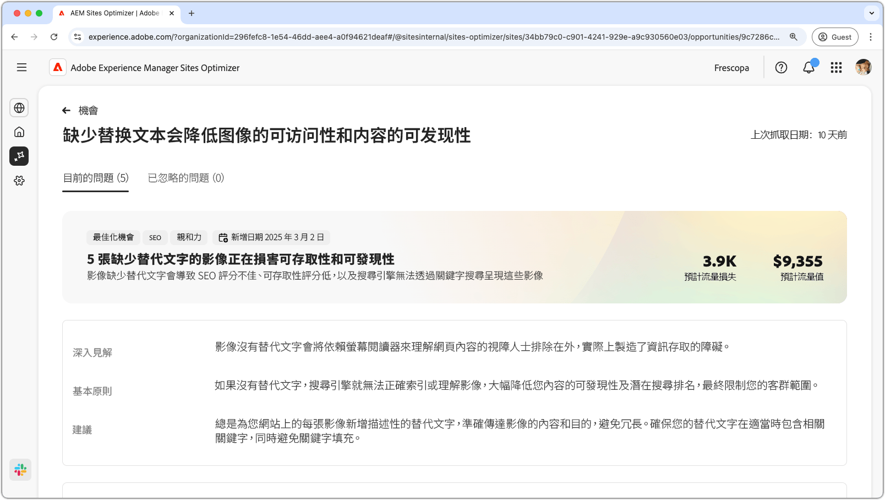
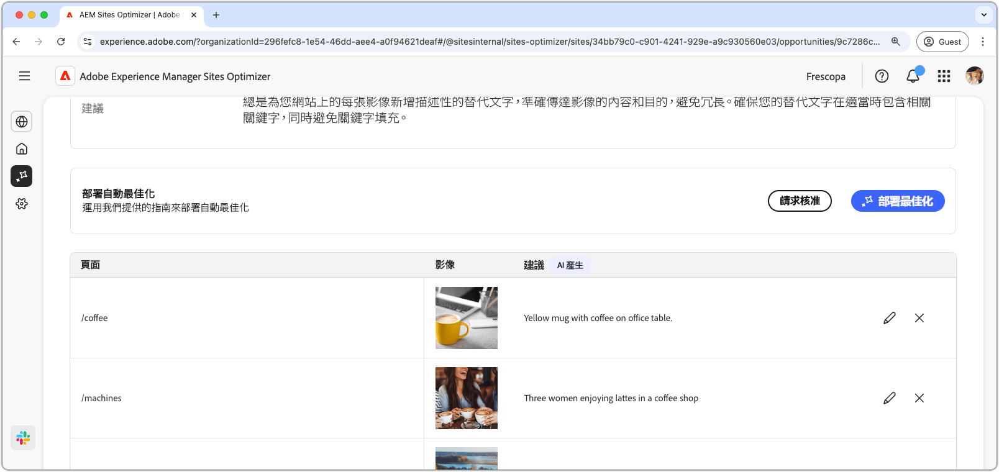
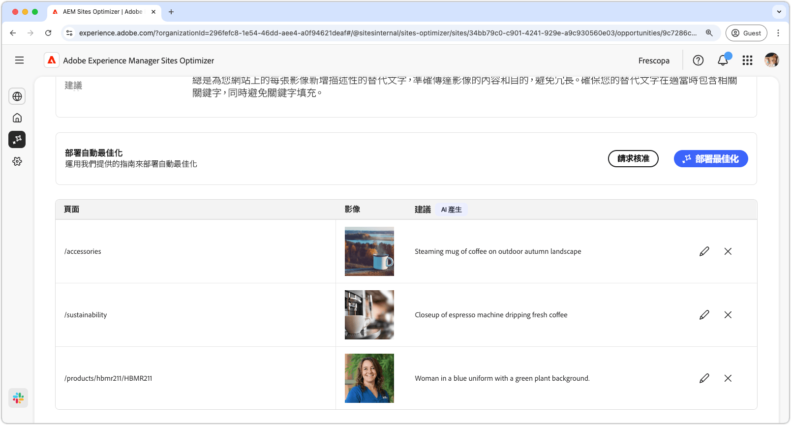
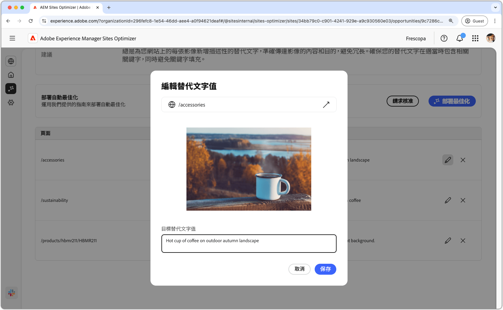
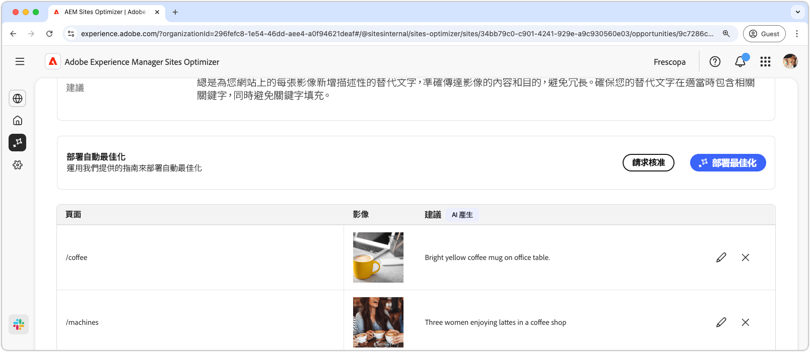

# 缺少替代文字機會

{align="center"}

缺少替代文字機會可識別您網站上沒有描述性替代文字的影像。如果沒有替代文字，搜尋引擎就無法正確地建立影像索引或理解影像。此功能會大幅降低內容的可搜尋性及搜尋排名，最終會限制您的客群觸及範圍。此外，影像若沒有替代文字，就會讓依賴螢幕助讀程式的視力障礙人士無法理解網頁內容，進而實際產生資訊獲取障礙。

缺少替代文字機會會在頁面頂端顯示摘要，內含問題的概要及其對您網站和業務的影響。

* **預計流量損失** – 預計會因缺少替代文字而損失的流量。
* **預計流量值** – 預計的損失流量值。

另外還有一個欄位會顯示與該機會相關的原理、分析和建議。

## 自動識別

{align="center"}

缺少替代文字機會會列出您網站上所有缺少替代文字的影像。此區段包含以下類別：

* **頁面** – 包含缺少替代文字之頁面的路徑。
* **影像** – 缺少描述性替代文字的影像。
* **建議** - AI 生成的替代文字建議。

## 自動建議

{align="center"}

自動建議會為影像的替代文字提供 AI 生成的建議。AI 產生的建議可以協助您快速地為影像新增替代文字，而不必手動分析每個影像。

>[!BEGINTABS]

>[!TAB 編輯缺少的替代文字]

{align="center"}

如果您不同意 AI 生成的建議，則可以透過選取&#x200B;**編輯圖示**&#x200B;來編輯建議的替代文字。您可以利用這個功能來手動調整您認為最適合影像的文字說明。編輯視窗包含以下內容：

* **頁面路徑** – 此為唯讀欄位，會顯示缺少替代文字問題發生所在頁面的路徑。按一下路徑旁的箭頭，即可開啟對應的頁面。
* **影像** – 需要替代文字之影像的唯讀預覽。
* **目標替代文字** – 此為可編輯的欄位，可供您手動輸入影像的描述性替代文字。請確保替代文字簡潔明瞭地傳達影像的內容和目的。如有相關的關鍵字，自然可以納入其中，但數量不要過多。

>[!TAB 忽略項目]

您可以選擇忽略機會清單中的項目。選取，即可從清單中移除此項目。使用機會頁面頂端的「**已忽略**」索引標籤，可以重新啟用已忽略的項目。

>[!ENDTABS]

## 自動最佳化

[!BADGE Ultimate]{type=Positive tooltip="Ultimate"}

{align="center"}

Sites Optimizer Ultimate 新增了針對缺少替代文字機會所發現的問題部署自動最佳化功能的能力。 <!--- TBD-need more in-depth and opportunity specific information here. What does the auto-optimization do?-->

>[!BEGINTABS]

>[!TAB 部署最佳化]

{{auto-optimize-deploy-optimization-slack}}

>[!TAB 請求核准]

{{auto-optimize-request-approval}}

>[!ENDTABS]
