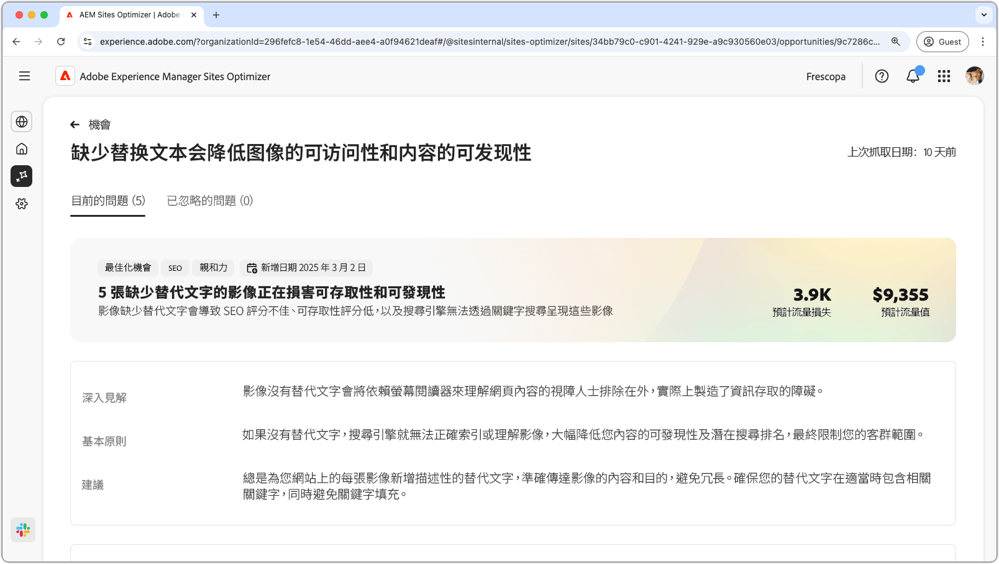
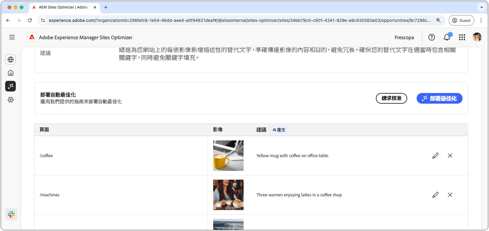
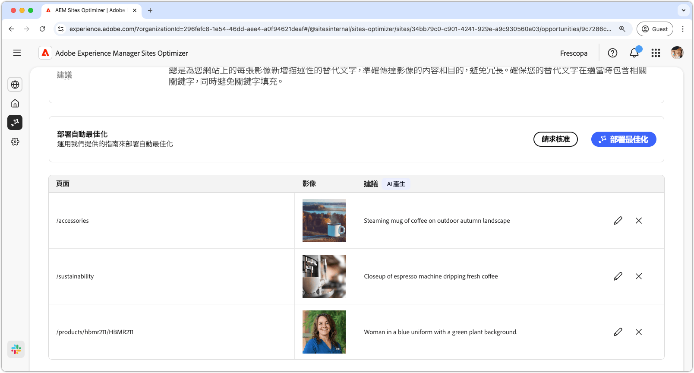
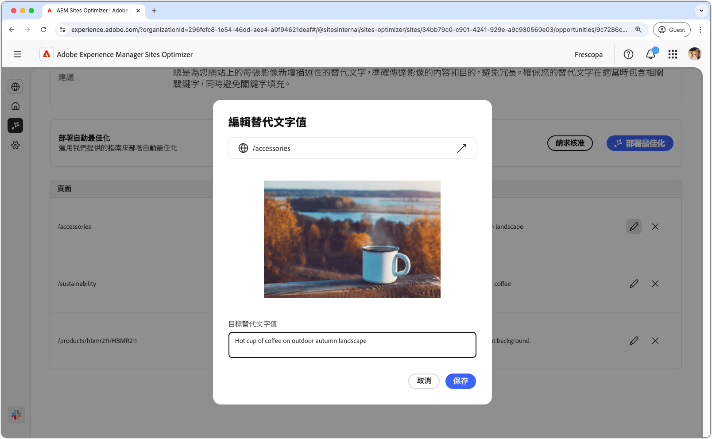

# 缺少替代文字機會

<!--{align="center"}-->

>[!VIDEO](https://video.tv.adobe.com/v/3483275/?captions=chi_hant&learn=on&enablevpops)

缺少的替代文字機會可識別網站上尚未提供描述性替代字的影像。 若沒有替代文字，依賴螢幕閱讀器的使用者將無法理解影響內容，進而造成無障礙使用上的障礙。 這也會限制搜尋引擎理解且索引影像的能力，降低內容發現性與搜尋效能。 AEM Sites Optimizer 會識別所有缺少的替代文字、提供特定的 AI 建議，顯示在單一、集中的視圖中，並啟用一鍵式部署來修正所顯示的問題。

## 自動識別

<!--{align="center"}-->

AEM Sites Optimizer 透過多步驟稽核來掃描您的網站，結合網站抓取、真實使用者流量資料與 AI 分析，以識別需要卻尚未定義替代文字的影像。 此功能也會評估頁面上的影像，判斷是否需要替代文字，並根據《網頁內容無障礙指引》(WCAG) 排除裝飾性或非資訊性影像。 系統會根據影像在頁面中的角色與相關性進行分析，並優先排定對無障礙性與搜尋引擎最佳化影響最大的修正項目。

此機會提供已識別問題的清單，包括：

* **頁面** – 包含缺少替代文字之頁面的路徑。
* **影像** – 缺少描述性替代文字的影像。

## 自動建議

<!--{align="center"}-->

AEM Sites Optimizer 會針對每個已識別的問題，建議影像可用的描述性替代文字。 此功能會使用 AI 視覺模型來分析影像，並生成可反映其頁面中之內容與角色的說明。 建議內容簡潔、相關，並符合無障礙最佳做法。 每個建議都可以在套用前進行審閱與編輯。

>[!BEGINTABS]

>[!TAB 編輯缺少的替代文字]

<!--{align="center"}-->

如果您不同意 AI 生成的建議，則可以透過選取&#x200B;**編輯圖示**&#x200B;來編輯建議的替代文字。 您可以利用這個功能來手動調整您認為最適合影像的文字說明。 編輯視窗包含以下內容：

* **頁面路徑** – 此為唯讀欄位，會顯示缺少替代文字問題發生所在頁面的路徑。 按一下路徑旁的箭頭，即可開啟對應的頁面。
* **影像** – 需要替代文字之影像的唯讀預覽。
* **目標替代文字** – 此為可編輯的欄位，可供您手動輸入影像的描述性替代文字。 請確保替代文字簡潔明瞭地傳達影像的內容和目的。 如有相關的關鍵字，自然可以納入其中，但數量不要過多。

>[!TAB 忽略項目]

您可以選擇忽略機會清單中的項目。 選取，即可從清單中移除此項目。 使用機會頁面頂端的「**已忽略**」索引標籤，可以重新啟用已忽略的項目。

>[!ENDTABS]

## 自動最佳化

<!--[!BADGE Ultimate]{type=Positive tooltip="Ultimate"}-->

審閱並核准建議後，您可以按下「**部署最佳化**」。 接著 AEM Sites Optimizer 會根據實施中的重新導向的管理方式，將修正內容套用至製作環境。 AEM 作者可從內容管理系統 (CMS) 發佈修正內容。

更新將根據設定，可能會直接套用至頁面內容、資產後設資料或支援的內容模型。 最佳化流程包含下列步驟：

* **驗證**：確保更新能安全套用而不影響現有功能。
* **部署**：透過現有程式 (例如 AEM 中的內容更新或與內容 API 的整合) 套用更新。
* **權限驗證**：驗證使用者是否擁有套用變更的適當權限。 若沒有，則可以使用替代輸出 (例如可下載的更新) 進行移交。

更新會在可支援的情況下建立版本，以提供能見度與復原能力。 這可確保替代文字更新都能準確地套用，並與現有實施保持一致，同時符合治理與無障礙標準。

AEM Sites Optimizer 會根據您的設定，自動套用替代文字更新，如下所示：

>[!BEGINTABS]

>[!TAB Edge Delivery Services]

更新來源文件 (例如，Google 文件或 SharePoint)。

>[!TAB AEM as a Cloud Service]

透過內容 API 直接寫入更新，並提供版本設定與遞補支援。

>[!TAB 數位資產管理 (選用)]

在適用的地方更新資產層級的替代文字。

>[!ENDTABS]
