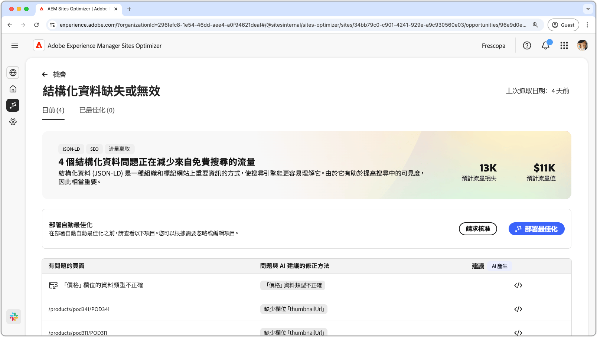
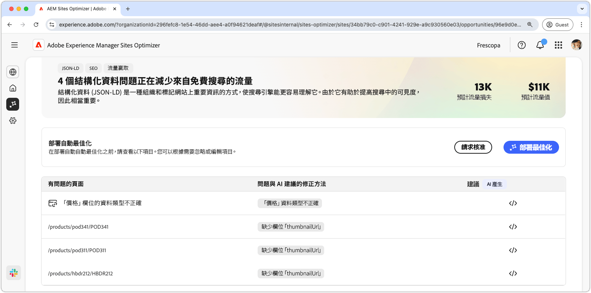
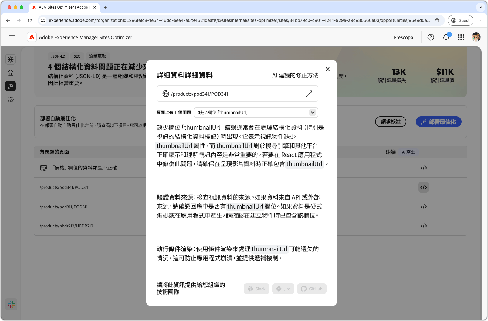
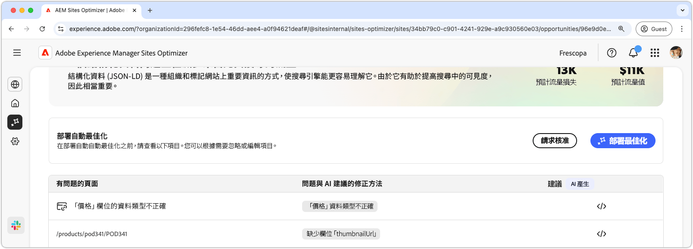

# 遺失或無效的結構化資料機會

{align="center"}

遺失或無效的結構化資料機會會識別Json-LD標準化格式的遺失或錯誤的結構化資料。 結構化資料是整理、描述和標示網站上重要資訊的一種方式。 它可協助搜尋引擎解譯您的頁面內容，並提升搜尋結果的可見度。 搜尋結果愈佳，您的網站就會吸引更多使用者。

遺失或無效的結構化資料機會會在頁面頂端顯示摘要，包括問題及其對網站和業務影響的摘要。

* **預計的流量遺失** — 由於錯誤的結構化資料所造成的預估流量遺失。
* **預計流量值** — 遺失流量的預估值。

## 自動識別

{align="center"}

遺失或無效的結構化資料機會列出了頁面上偵測到的所有問題，並包含以下類別：

* **有問題的頁面** — 包含無效或遺失結構化資料的頁面。
* **問題和AI建議的修正** — 指出影響頁面的結構化資料問題型別。
* **建議** — 適合結構化資料更新的AI產生建議。 如需更多詳細資訊，請參閱以下區段。

## 自動建議

{align="center"}

無效或遺失的結構化資料機會也會提供AI產生的建議，說明如何變更或更新結構化資料。 當您按一下「建議」按鈕時，會出現一個包含下列內容的新視窗：

* **頁面路徑** — 此欄位包含具有無效或遺失結構化資料的頁面路徑。
* **問題** — 包含問題數的欄位，以及列出所有問題的下拉式功能表。
* **建議欄位** - AI產生的描述和適合結構化資料更新的建議。 您可以向下捲動以取得其他建議和問題。

## 自動最佳化[!BADGE Ultimate]{type=Positive tooltip="Ultimate"}

{align="center"}

Sites Optimizer Ultimate新增針對無效或遺失結構化資料機會所發現的問題部署自動最佳化的功能。<!--- TBD-need more in-depth and opportunity specific information here. What does the auto-optimization do?-->

>[!BEGINTABS]

>[!TAB 部署最佳化]

{{auto-optimize-deploy-optimization-slack}}

>[!TAB 要求核准]

{{auto-optimize-request-approval}}

>[!ENDTABS]
