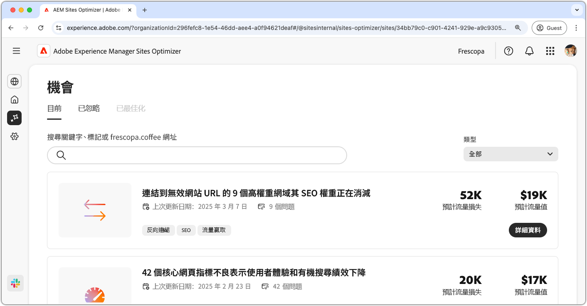

# 機會文件

{align="center"}

Sites Optimizer 是由 Adobe AI 提供支援的一組不斷增長的機會所構成，旨在識別並建議您的網站所能進行的改進。每個機會都會提供對於潛在商業價值的分析、點出需要關注的領域，並提供可操作的最佳化建議。按一下每個機會來探索已識別的問題、建議的改進，以及關於如何實施這些變更以增強網站績效和使用者體驗的逐步指導。

您可以透過 [Sites Optimizer 永久性導覽](/help/documentation/basics.md#navigation)中的「**機會**」選單選項來使用機會。

## 機會狀態

使用頂端的索引標籤並透過狀態來組織和篩選機會。

>[!BEGINTABS]

>[!TAB 目前]

{align="center"}

目前待處理的機會。

>[!TAB 已忽略]

{align="center"}

您已忽略的機會。您可以從這個檢視中還原已忽略的機會。

>[!TAB 已最佳化]

已最佳化之機會的歷史清單。

>[!ENDTABS]

## 機會

選取某個[機會狀態](#opportunity-status)後，便可以檢視機會清單。您可以透過下列方式來篩選機會清單：

* **搜尋** - 透過&#x200B;**關鍵字、標記或 URL** 搜尋機會。
* **機會類型** - 使用「**類型**」下拉式清單來依[機會類型](/help/opportunity-types/overview.md)篩選機會。

### 機會詳細資料

{align="center"}

每個機會都會提供問題的簡短說明、其對您網站的潛在影響，以及完整詳細資料的連結。您也可以查看其狀態，這會指出其已進行最佳化還是仍處於待處理狀態。

* **機會標題** – 問題的簡短說明，及其對您網站績效的潛在影響。
* **上次更新時間** - Sites Optimizer 上次在這個日期使用新資料更新機會的內容。
* **問題計數** - 在您網站上發現的問題實例數。
* **機會類型** - 此機會所屬的[機會類型](/help/opportunity-types/overview.md)，例如流量贏取、參與度、轉換率或網站健康情況。

每個機會的摘要資訊會隨類型而異，其中可能會包含有關收入影響、流量、使用者參與度或安全威脅的詳細資料。

若要檢視機會的詳細資料，請按一下「**詳細資料**」按鈕。

若要從 Sites Optimizer 儀表板中排除某個機會，請按一下「**忽略**」按鈕。此操作會將機會移到「[**已忽略**」索引標籤](#opportunity-status)。

## 所有機會

探索 Sites Optimizer 中所有可用的可能機會：

<!-- CARDS

* ./accessibility-issues.md
  {title=Accessibility issues}
  {image=../../assets/common/card-arrows.png} 
* ./broken-backlinks.md
  {title=Broken backlinks}
  {image=../../assets/common/card-arrows.png}
* ./broken-internal-links.md
  {title=Broken internal links}
  {image=../../assets/common/card-link.png}
* ./cors-configuration.md
  {title=CORS configuration}
  {image=../../assets/common/card-code.png}
* ./core-web-vitals.md
  {title=Core web vitals}
  {image=../../assets/common/card-performance.png}
* ./cross-site-scripting.md
  {title=Cross-site scripting}
  {image=../../assets/common/card-code.png}
* ./high-bounce-rate.md
  {title=High bounce rate}
  {image=../../assets/common/card-arrows.png}    
* ./invalid-or-missing-metadata.md
  {title=Invalid or missing metadata}
  {image=../../assets/common/card-code.png}
* ./low-conversions.md
  {title=Low conversions}
  {image=../../assets/common/card-bag.png}
* ./low-views.md
  {title=Low views}
  {image=../../assets/common/card-bag.png} 
* ./missing-alt-text.md
  {title=Missing alt text}
  {image=../../assets/common/card-arrows.png}
* ./missing-invalid-structured-data.md
  {title=Missing or invalid structured data}
  {image=../../assets/common/card-bag.png}
* ./sitemap-issues.md
  {title=Sitemap issues}
  {image=../../assets/common/card-relationship.png}
* ./website-permissions.md
  {title=Website permissions}
  {image=../../assets/common/card-people.png}
* ./website-vulnerabilities.md
  {title=Website vulnerabilities}
  {image=../../assets/common/card-puzzle.png}
  
--->
<!-- START CARDS HTML - DO NOT MODIFY BY HAND -->

    

        

            

                <figure class="image x-is-16by9">
                    
                </figure>
            

            

                

                    

                        <a href="./accessibility-issues.md" target="_blank" rel="referrer" title="協助工具問題">協助工具問題</a>
                    

                    
了解協助工具問題機會，以及如何使用它來提高網站的安全性。

                

                <a href="./accessibility-issues.md" target="_blank" rel="referrer" class="spectrum-Button spectrum-Button--outline spectrum-Button--primary spectrum-Button--sizeM" style="align-self: flex-start; margin-top: 1rem;">
                    了解更多
                </a>
            

        

    

    

        

            

                <figure class="image x-is-16by9">
                    
                </figure>
            

            

                

                    

                        <a href="./broken-backlinks.md" target="_blank" rel="referrer" title="損壞的反向連結">損壞的反向連結</a>
                    

                    
了解損壞的反向連結機會，以及如何使用它來改進流量贏取。

                

                <a href="./broken-backlinks.md" target="_blank" rel="referrer" class="spectrum-Button spectrum-Button--outline spectrum-Button--primary spectrum-Button--sizeM" style="align-self: flex-start; margin-top: 1rem;">
                    了解更多
                </a>
            

        

    

    

        

            

                <figure class="image x-is-16by9">
                    
                </figure>
            

            

                

                    

                        <a href="./broken-internal-links.md" target="_blank" rel="referrer" title="損壞的內部連結">損壞的內部連結</a>
                    

                    
了解損壞的連結機會，以及如何使用它來提高您網站上的參與度。

                

                <a href="./broken-internal-links.md" target="_blank" rel="referrer" class="spectrum-Button spectrum-Button--outline spectrum-Button--primary spectrum-Button--sizeM" style="align-self: flex-start; margin-top: 1rem;">
                    了解更多
                </a>
            

        

    

    

        

            

                <figure class="image x-is-16by9">
                    
                </figure>
            

            

                

                    

                        <a href="./cors-configuration.md" target="_blank" rel="referrer" title="CORS 設定">CORS 設定</a>
                    

                    
了解 CORS 設定機會並識別和解決網站安全性漏洞。

                

                <a href="./cors-configuration.md" target="_blank" rel="referrer" class="spectrum-Button spectrum-Button--outline spectrum-Button--primary spectrum-Button--sizeM" style="align-self: flex-start; margin-top: 1rem;">
                    了解更多
                </a>
            

        

    

    

        

            

                <figure class="image x-is-16by9">
                    
                </figure>
            

            

                

                    

                        <a href="./core-web-vitals.md" target="_blank" rel="referrer" title="核心網頁指標">核心網頁指標</a>
                    

                    
了解核心網頁指標機會，以及如何使用它來改進流量贏取。

                

                <a href="./core-web-vitals.md" target="_blank" rel="referrer" class="spectrum-Button spectrum-Button--outline spectrum-Button--primary spectrum-Button--sizeM" style="align-self: flex-start; margin-top: 1rem;">
                    了解更多
                </a>
            

        

    

    

        

            

                <figure class="image x-is-16by9">
                    
                </figure>
            

            

                

                    

                        <a href="./cross-site-scripting.md" target="_blank" rel="referrer" title="跨網站指令碼">跨網站指令碼</a>
                    

                    
了解跨網站指令碼機會並識別和解決網站安全性漏洞。

                

                <a href="./cross-site-scripting.md" target="_blank" rel="referrer" class="spectrum-Button spectrum-Button--outline spectrum-Button--primary spectrum-Button--sizeM" style="align-self: flex-start; margin-top: 1rem;">
                    了解更多
                </a>
            

        

    

    

        

            

                <figure class="image x-is-16by9">
                    
                </figure>
            

            

                

                    

                        <a href="./high-bounce-rate.md" target="_blank" rel="referrer" title="高跳出率">高跳出率</a>
                    

                    
了解低瀏覽量機會，以及如何使用此機會來提高網站上的表單參與度。

                

                <a href="./high-bounce-rate.md" target="_blank" rel="referrer" class="spectrum-Button spectrum-Button--outline spectrum-Button--primary spectrum-Button--sizeM" style="align-self: flex-start; margin-top: 1rem;">
                    了解更多
                </a>
            

        

    

    

        

            

                <figure class="image x-is-16by9">
                    
                </figure>
            

            

                

                    

                        <a href="./invalid-or-missing-metadata.md" target="_blank" rel="referrer" title="中繼資料無效或缺失">中繼資料無效或缺失</a>
                    

                    
了解無效或缺少中繼資料機會，以及如何使用它來改進流量贏取。

                

                <a href="./invalid-or-missing-metadata.md" target="_blank" rel="referrer" class="spectrum-Button spectrum-Button--outline spectrum-Button--primary spectrum-Button--sizeM" style="align-self: flex-start; margin-top: 1rem;">
                    了解更多
                </a>
            

        

    

        

            

                <figure class="image x-is-16by9">
                    
                </figure>
            

            

                

                    

                        <a href="./low-conversions.md" target="_blank" rel="referrer" title="表單低轉換率">表單低轉換率</a>
                    

                    
了解低轉換率機會，以及如何使用此機會來提高網站上的表單參與度。

                

                <a href="./low-conversions.md" target="_blank" rel="referrer" class="spectrum-Button spectrum-Button--outline spectrum-Button--primary spectrum-Button--sizeM" style="align-self: flex-start; margin-top: 1rem;">
                    了解更多
                </a>
            

        

    

    

        

            

                <figure class="image x-is-16by9">
                    
                </figure>
            

            

                

                    

                        <a href="./low-views.md" target="_blank" rel="referrer" title="低瀏覽量">表單低瀏覽量</a>
                    

                    
了解表單低瀏覽量機會，以及如何使用此機會來提高網站上的表單參與度。

                

                <a href="./low-views.md" target="_blank" rel="referrer" class="spectrum-Button spectrum-Button--outline spectrum-Button--primary spectrum-Button--sizeM" style="align-self: flex-start; margin-top: 1rem;">
                    了解更多
                </a>
            

        

    

    

        

            

                <figure class="image x-is-16by9">
                    
                </figure>
            

            

                

                    

                        <a href="./low-navigation.md" target="_blank" rel="referrer" title="表單低導覽行為">表單低導覽行為</a>
                    

                    
了解表單低導覽行為機會，以及如何使用此機會來提高網站上的表單參與度。

                

                <a href="./low-navigation.md" target="_blank" rel="referrer" class="spectrum-Button spectrum-Button--outline spectrum-Button--primary spectrum-Button--sizeM" style="align-self: flex-start; margin-top: 1rem;">
                    了解更多
                </a>
            

        

    

    

        

            

                <figure class="image x-is-16by9">
                    
                </figure>
            

            

                

                    

                        <a href="./forms-accessibility-issues.md" target="_blank" rel="referrer" title="表單無障礙問題">表單無障礙問題</a>
                    

                    
了解表單無障礙問題機會，以及如何使用此機會來提高網站上的參與度。

                

                <a href="./forms-accessibility-issues.md" target="_blank" rel="referrer" class="spectrum-Button spectrum-Button--outline spectrum-Button--primary spectrum-Button--sizeM" style="align-self: flex-start; margin-top: 1rem;">
                    了解更多
                </a>
            

        

    

    

        

            

                <figure class="image x-is-16by9">
                    
                </figure>
            

            

                

                    

                        <a href="./missing-alt-text.md" target="_blank" rel="referrer" title="缺少替代文字">缺少替代文字</a>
                    

                    
了解缺少替代文字機會，以及如何使用它來提高您網站上的參與度。

                

                <a href="./missing-alt-text.md" target="_blank" rel="referrer" class="spectrum-Button spectrum-Button--outline spectrum-Button--primary spectrum-Button--sizeM" style="align-self: flex-start; margin-top: 1rem;">
                    了解更多
                </a>
            

        

    

    

        

            

                <figure class="image x-is-16by9">
                    
                </figure>
            

            

                

                    

                        <a href="./missing-invalid-structured-data.md" target="_blank" rel="referrer" title="結構化資料缺失或無效">結構化資料缺失或無效</a>
                    

                    
了解缺少或無效的結構化資料機會，以及如何使用它來改進流量贏取。

                

                <a href="./missing-invalid-structured-data.md" target="_blank" rel="referrer" class="spectrum-Button spectrum-Button--outline spectrum-Button--primary spectrum-Button--sizeM" style="align-self: flex-start; margin-top: 1rem;">
                    了解更多
                </a>
            

        

    

    

        

            

                <figure class="image x-is-16by9">
                    
                </figure>
            

            

                

                    

                        <a href="./sitemap-issues.md" target="_blank" rel="referrer" title="Sitemap 問題">Sitemap 問題</a>
                    

                    
了解 Sitemap 問題機會，以及如何使用它來改進流量贏取。

                

                <a href="./sitemap-issues.md" target="_blank" rel="referrer" class="spectrum-Button spectrum-Button--outline spectrum-Button--primary spectrum-Button--sizeM" style="align-self: flex-start; margin-top: 1rem;">
                    了解更多
                </a>
            

        

    

    

        

            

                <figure class="image x-is-16by9">
                    
                </figure>
            

            

                

                    

                        <a href="./website-permissions.md" target="_blank" rel="referrer" title="網站權限">網站權限</a>
                    

                    
了解網站權限機會，以及如何使用它來提高網站的安全性。

                

                <a href="./website-permissions.md" target="_blank" rel="referrer" class="spectrum-Button spectrum-Button--outline spectrum-Button--primary spectrum-Button--sizeM" style="align-self: flex-start; margin-top: 1rem;">
                    了解更多
                </a>
            

        

    

    

        

            

                <figure class="image x-is-16by9">
                    
                </figure>
            

            

                

                    

                        <a href="./website-vulnerabilities.md" target="_blank" rel="referrer" title="網站漏洞">網站漏洞</a>
                    

                    
了解網站漏洞機會，以及如何使用它來提高網站的安全性。

                

                <a href="./website-vulnerabilities.md" target="_blank" rel="referrer" class="spectrum-Button spectrum-Button--outline spectrum-Button--primary spectrum-Button--sizeM" style="align-self: flex-start; margin-top: 1rem;">
                    了解更多
                </a>
            

        

    

<!-- END CARDS HTML - DO NOT MODIFY BY HAND -->

