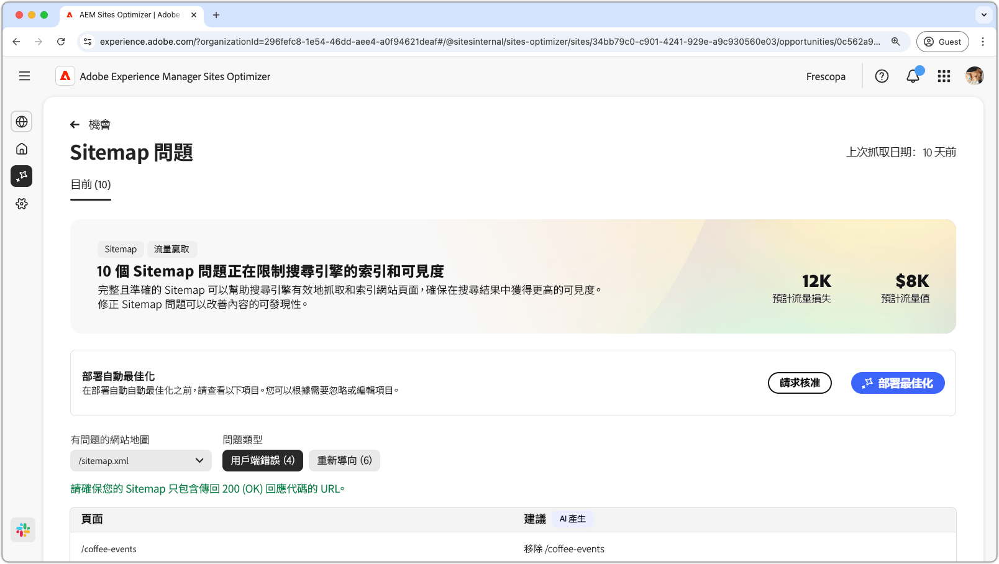
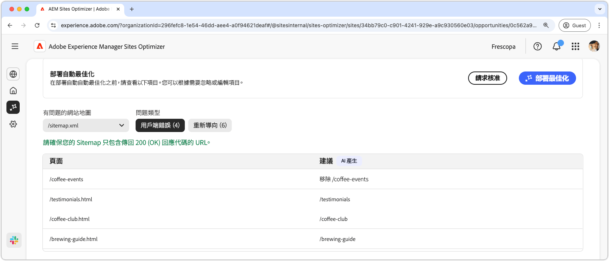
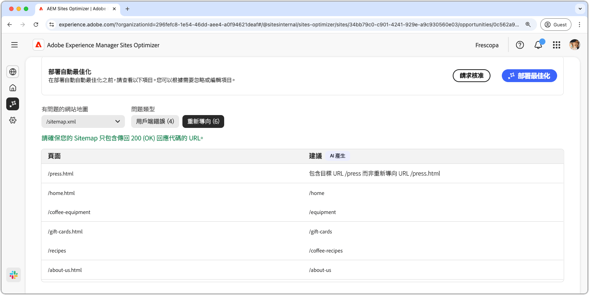
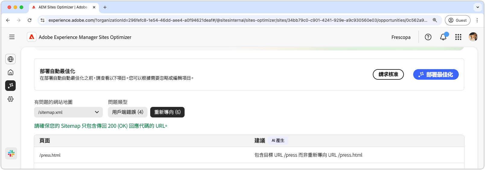

# Sitemap 問題機會

{align="center"}

完整且準確的 Sitemap 有助於搜尋引擎有效率地對網站頁面進行編目和索引，確保網站頁面能在搜尋結果中有更高的可見度。Sitemap 機會可識別您 Sitemap 的潛在問題。解決這些問題可以大幅提高您網站上的搜尋引擎索引和內容可發現性。

頁面頂端會顯示摘要，內含問題的概要及其對您網站和業務的影響。

* **預計流量損失** – 預計會因 Sitemap 問題而損失的流量。
* **預計流量值** – 預計的損失流量值。

## 自動識別

您可以使用以下條件來篩選 Sitemap 問題：

* **有問題的 Sitemap** – 已分析到有包含潛在問題的 Sitemap URL。
* **問題類型** – Sitemap 中所識別到之問題的類型：
   * **用戶端錯誤** – 未傳回 `200 Success` 回應的項目。
   * **重新導向** – 有問題或設定錯誤的重新導向。

>[!BEGINTABS]

>[!TAB 用戶端錯誤]

{align="center"}

如果您 Sitemap 中的 URL 傳回這些錯誤，搜尋引擎可能會認為您的 Sitemap 已過時，或有人錯誤地移除了網頁。用戶端會指出來自用戶端 (瀏覽器或編目程式) 的請求無效。常見的錯誤包括：

* **404 找不到** – 請求的頁面不存在。
* **403 禁止** – 伺服器拒絕您存取請求的頁面。
* **410 已消失** – 該頁面已遭刻意移除，不會恢復。
* **401 未授權** – 需要驗證，但未提供。

這些錯誤可能會損害 SEO，尤其是當重要頁面傳回 **404 或 410** 時，因為搜尋引擎可能會移除其索引。

以上各個問題會顯示在一張表格中，內有「**頁面**」欄可供您識別受影響的 Sitemap 項目：

* **頁面** – 有問題之 Sitemap 項目的 URL。

>[!TAB 重新導向]

{align="center"}

Sitemap 只應包含最終目標 URL，而非包含會重新導向的 URL。重新導向旨在將使用者和編目程式引導至正確位置，但如果設定錯誤可能會導致問題：

* **302 找到 (暫時重新導向)** – 如果錯誤地使用了此設定而非使用 **301**，則會造成 SEO 問題。
* **307 暫時重新導向** – 與 302 類似，但保留了 HTTP 方法。
* **重新導向迴圈** –當頁面重新導向回頁面本身或建立無限迴圈時。
* **重新導向損壞** – 當重新導向導致不存在或 4xx 頁面時。

以上各個問題會顯示在一張表格中，內有「**頁面**」欄可供您識別受影響的 Sitemap 項目：

* **頁面** – 有問題之 Sitemap 項目的 URL。

>[!ENDTABS]

## 自動建議

[符合篩選條件](#auto-identify)的各個 Sitemap 問題會列在有以下兩欄的表格中：

* **頁面** – 有問題之 Sitemap 項目的 URL。
* **建議** – 該問題的建議解決方式。

建議內通常會包含更新過的網站路徑以修正 Sitemap 項目。在某些情況下，建議內也可能會提供更詳細的指示，例如指定正確的重新導向目標。

## 自動最佳化

[!BADGE Ultimate]{type=Positive tooltip="Ultimate"}

{align="center"}

Sites Optimizer Ultimate 新增了為 Sitemap 部署自動最佳化功能的能力。

>[!BEGINTABS]

>[!TAB 部署最佳化]

{{auto-optimize-deploy-optimization-slack}}

>[!TAB 請求核准]

{{auto-optimize-request-approval}}

>[!ENDTABS]
