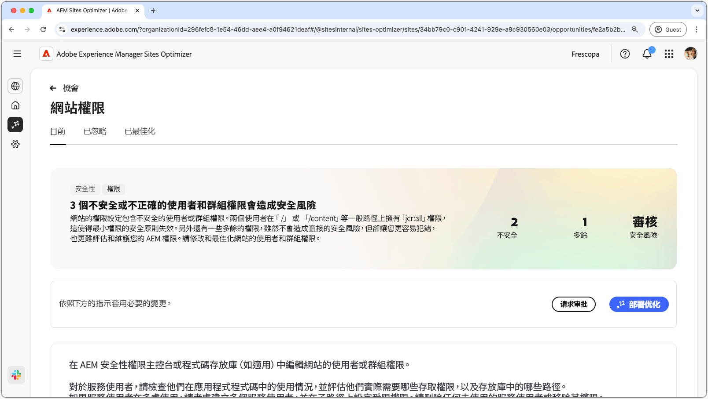
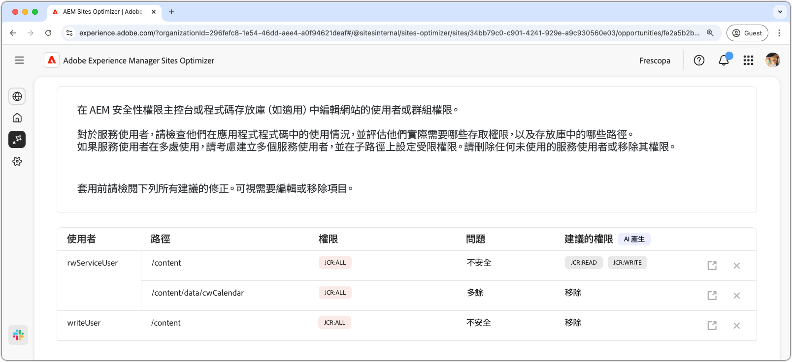
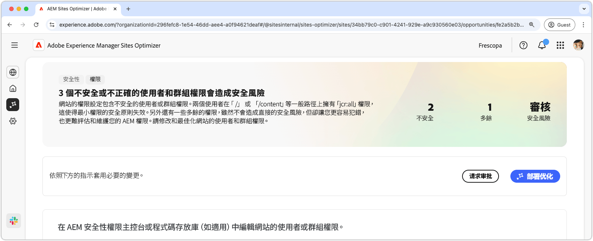

# 網站許可權機會

{align="center"}

網站許可權機會可最佳化網站許可權，這對於維護安全且可管理的AEM環境至關重要。 這個機會可讓您移除過於寬泛的許可權（例如`/`或`/content`等一般路徑上的`jcr:all`），並調整使用者存取許可權以符合最低許可權的原則，藉此調整存取控制。 透過簡化許可權及消除冗餘，您可以降低安全性風險、改善可維護性，並防止未來發生錯誤設定。 在AEM安全性許可權控制檯或您的程式碼存放庫中檢閱和更新許可權，以採取動作，確保服務使用者只有他們真正需要的存取權。

## 自動識別

{align="center"}

**網站許可權機會**&#x200B;功能會自動識別並列出

* **使用者** — 具有可疑許可權的使用者帳戶。
* **路徑** - AEM中受許可權影響的路徑。
* **許可權** — 可疑的許可權。
* **問題** — 指出影響許可權的問題型別。

## 自動建議

{align="center"}

自動建議會在&#x200B;**建議的許可權**&#x200B;欄位中提供AI產生的建議，可讓您以安全的替代專案取代任何標幟的許可權。

## 自動最佳化[!BADGE Ultimate]{type=Positive tooltip="Ultimate"}

{align="center"}

Sites Optimizer Ultimate新增針對已發現的漏洞部署自動最佳化的功能。

>[!BEGINTABS]

>[!TAB 部署最佳化]

{{auto-optimize-deploy-optimization-slack}}

>[!TAB 要求核准]

{{auto-optimize-request-approval}}

>[!ENDTABS]
