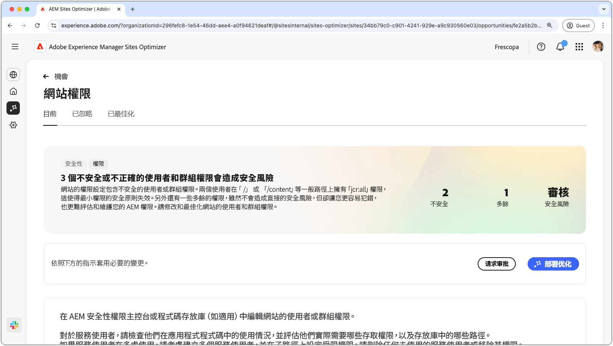
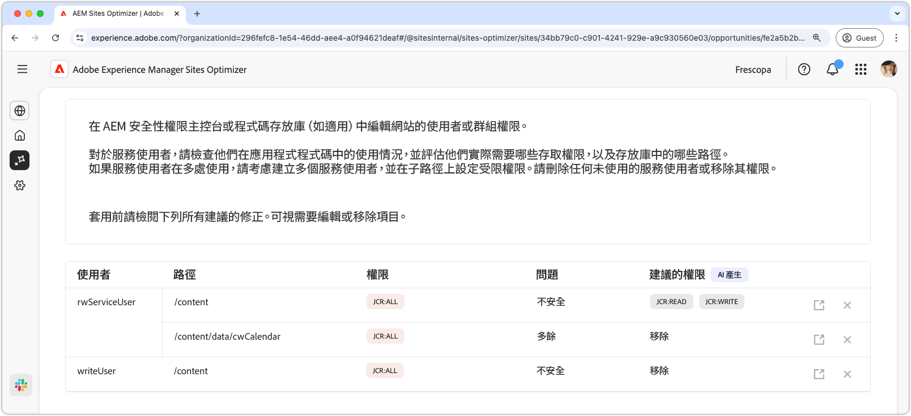
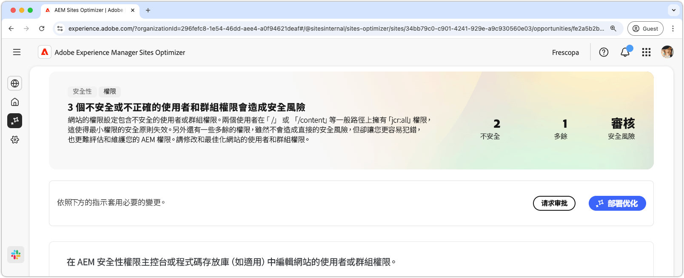

# 網站權限機會

{align="center"}

網站權限機會可將網站權限最佳化，這對於讓 AEM 環境保持安全且易於管理至關重要。 此機會可讓您移除範圍過大的權限 (例如 `/` 或 `/content` 等通用路徑上的 `jcr:all` 權限) 並讓使用者存取權與最低權限原則保持一致，藉此來調整存取控制。 透過簡化權限和消除冗餘，您可以降低安全風險、提高可維護性並防止日後發生錯誤設定的情況。 在「AEM 安全權限」控制台或您的程式碼存放庫中審查和更新權限。 這樣做可以確保服務使用者只擁有其真正需要的存取權限。

## 自動識別

{align="center"}

**網站權限機會**&#x200B;功能會自動識別並列出

* **使用者** – 具有可疑權限的使用者帳戶。
* **路徑** - 使用頂端的索引標籤並透過狀態來組織和篩選機會。
* **權限** - 可疑的權限。
* **問題** - 指出影響權限的問題類型。

## 自動建議

{align="center"}

自動建議會在「**建議的權限**」欄位中提供 AI 生成的建議，以讓您用安全的替代權限取代所標記的權限。

## 自動最佳化

[!BADGE Ultimate]{type=Positive tooltip="Ultimate"}

{align="center"}

Sites Optimizer Ultimate 新增了針對所發現的漏洞部署自動最佳化功能的能力。

>[!BEGINTABS]

>[!TAB 部署最佳化]

{{auto-optimize-deploy-optimization-slack}}

>[!TAB 請求核准]

{{auto-optimize-request-approval}}

>[!ENDTABS]
