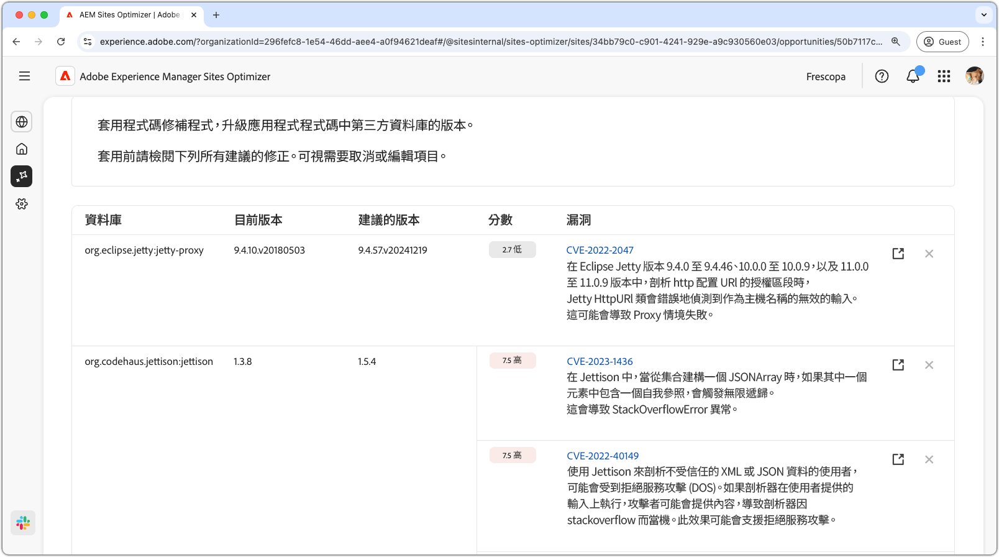

# 網站弱點機會

{align="center"}

網站弱點機會會識別您應用程式程式碼所使用的第三方程式庫中的安全弱點。 惡意攻擊者可能會利用這些漏洞，增加風險並降低網站的安全狀態。

網站弱點機會會在頁面頂端顯示摘要，包括下列內容：

* **發現的問題** — 發現的弱點數目，依其代表的安全性風險分類（低、中、高）。
* **彙總的安全性風險** — 根據機會發現的弱點，您的網站整體安全性風險。

## 自動識別

{align="center"}

**網站漏洞機會**&#x200B;功能會自動識別並列出您應用程式程式碼所使用的協力廠商程式庫中的漏洞。 它提供下列詳細資訊：

* **資料庫** — 包含漏洞的協力廠商資料庫。 單一程式庫可能有多個弱點。
* **目前版本** — 目前使用中的程式庫版本。
* **建議的版本** — 解決漏洞的建議版本。
* **分數** — 此漏洞的嚴重性評等，也是在頁面最上方摘要。
* **漏洞** — 漏洞識別碼、簡短說明，以及國家漏洞資料庫(NVD)的連結，以取得詳細資訊。 按一下說明旁邊的識別碼或連結來存取NVD連結。

## 自動建議

{align="center"}

自動建議針對您應該升級至之易受攻擊程式庫的&#x200B;**建議版本**，提供AI產生的建議。 每個專案都有&#x200B;**分數**，表示其整體嚴重性，有助於優先處理最關鍵的弱點。

>[!BEGINTABS]

>[!TAB 漏洞詳細資料]

每個漏洞都包含指向[國家漏洞資料庫(NVD)](https://nvd.nist.gov/)中詳細資訊的連結。 按一下漏洞識別碼或說明右側的連結專案，即可前往該漏洞的NVD頁面。

>[!TAB 忽略專案]

您可以選擇忽略漏洞清單中的專案。 選取&#x200B;**忽略圖示**&#x200B;會從清單中移除專案。 已忽略的專案可從機會頁面頂端的&#x200B;**已忽略**&#x200B;索引標籤重新參與。<!---right now it does not seem to be implemented, but the page description mentions this functionality-->

>[!ENDTABS]

## 自動最佳化[!BADGE Ultimate]{type=Positive tooltip="Ultimate"}

{align="center"}

Sites Optimizer Ultimate新增針對已發現的漏洞部署自動最佳化的功能。

>[!BEGINTABS]

>[!TAB 部署最佳化]

{{auto-optimize-deploy-optimization-slack}}

>[!TAB 要求核准]

{{auto-optimize-request-approval}}

>[!ENDTABS]