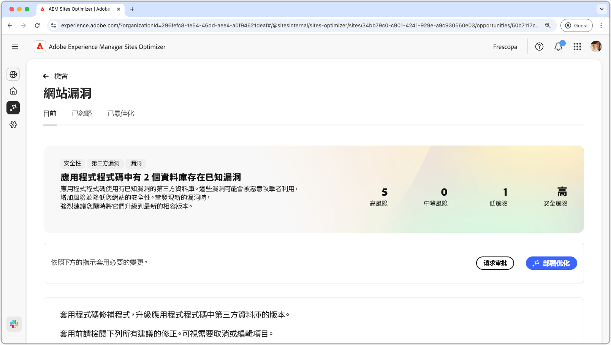

# 網站漏洞機會

{align="center"}

網站弱點機會會識別您應用程式程式碼所使用的協力廠商程式庫中的安全弱點。 惡意攻擊者會利用這些漏洞，增加風險並降低網站的安全性狀態。

網站漏洞機會會在頁面頂端顯示摘要，其中包含以下內容：

* **所發現的問題** – 所發現的漏洞數量，並依其呈現的安全性風險進行分類 (低、中、高)。
* **彙總的安全性風險** – 根據此機會所發現的漏洞，您的網站所面臨的整體安全性風險。

## 自動識別

{align="center"}

**網站漏洞機會**&#x200B;功能會自動識別並列出在您應用程式的程式碼所用第三方程式庫中所發現的漏洞。其會提供以下詳細資料：

* **程式庫** – 包含漏洞的第三方程式庫。一個程式庫可能會有多個漏洞。
* **目前版本** – 目前所用程式庫的版本。
* **建議版本** – 可解決漏洞的建議版本。
* **分數** – 漏洞的嚴重程度等級，也會在頁面頂端摘要列出。
* **漏洞** – 漏洞識別碼、簡短說明，以及可供獲取更多詳細資料之國家漏洞資料庫 (NVD) 的連結。按一下識別碼或說明旁邊的連結即可存取 NVD 連結。

## 自動建議

{align="center"}

自動建議針對您應升級至之易受攻擊的程式庫的&#x200B;**建議版本**，提供AI產生的建議。 每個項目都會有一個&#x200B;**分數**，以指出其整體嚴重程度，從而協助您確定最關鍵漏洞的先後順序。

>[!BEGINTABS]

>[!TAB 漏洞詳細資料]

每個漏洞均包含指向[國家漏洞資料庫 (NVD)](https://nvd.nist.gov/) 中詳細資訊的連結。按一下漏洞識別碼或說明右側的連結專案，即可前往該漏洞的NVD頁面。

>[!TAB 忽略項目]

您可以選擇忽略漏洞清單中的項目。選取會從清單中移除專案。 若要重新啟用已忽略的項目，可從機會頁面頂端的「**已忽略**」索引標籤進行。<!---right now it does not seem to be implemented, but the page description mentions this functionality-->

>[!ENDTABS]

## 自動最佳化

[!BADGE Ultimate]{type=Positive tooltip="Ultimate"}

{align="center"}

Sites Optimizer Ultimate 新增了針對所發現的漏洞部署自動最佳化功能的能力。

>[!BEGINTABS]

>[!TAB 部署最佳化]

{{auto-optimize-deploy-optimization-slack}}

>[!TAB 請求核准]

{{auto-optimize-request-approval}}

>[!ENDTABS]