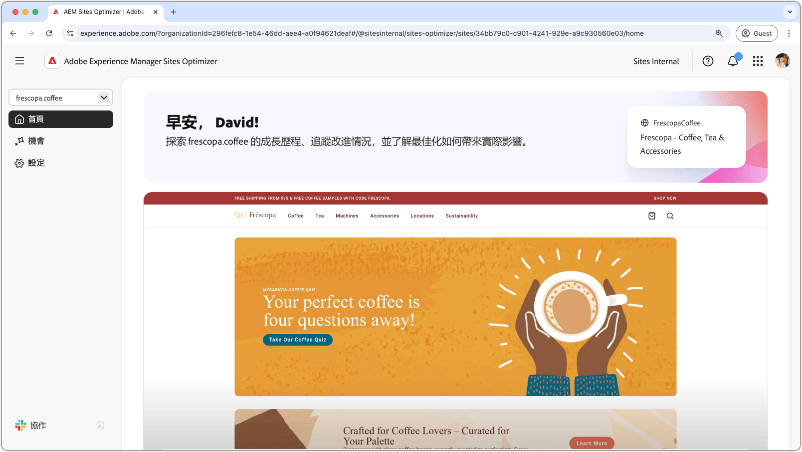

# Sites Optimizer 文件

{align="center"}

歡迎閱讀 Sites Optimizer 文件。您會在這裡找到有關如何使用 Sites Optimizer 將 AEM 網站最佳化的資訊。

## Sites Optimizer 基本資訊

探索 AEM Sites Optimizer 文件以了解關鍵 UI 元件，包括首頁儀表板、設定配置和可獲得最佳化分析的機會清單。

<!-- CARDS 

* ./basics.md
  {title = Basics}
  {image = ./assets/basics/card.png}
* ./opportunities/overview.md
  {title = Opportunities}
* ./settings.md
  {title = Settings}

-->
<!-- START CARDS HTML - DO NOT MODIFY BY HAND -->

    

        

            

                <figure class="image x-is-16by9">
                    
                </figure>
            

            

                

                    

                        <a href="./basics.md" target="_blank" rel="referrer" title="基本資訊">基本資訊</a>
                    

                    
了解 Sites Optimizer 的基本資訊及其導覽方式。

                

                <a href="./basics.md" target="_blank" rel="referrer" class="spectrum-Button spectrum-Button--outline spectrum-Button--primary spectrum-Button--sizeM" style="align-self: flex-start; margin-top: 1rem;">
                    了解更多
                </a>
            

        

    

    

        

            

                <figure class="image x-is-16by9">
                    
                </figure>
            

            

                

                    

                        <a href="./opportunities/overview.md" target="_blank" rel="referrer" title="機會">機會</a>
                    

                    
了解所有可用的 Sites Optimizer 機會，以及如何使用這些機會來提高網站的績效。

                

                <a href="./opportunities/overview.md" target="_blank" rel="referrer" class="spectrum-Button spectrum-Button--outline spectrum-Button--primary spectrum-Button--sizeM" style="align-self: flex-start; margin-top: 1rem;">
                    了解更多
                </a>
            

        

    

    

        

            

                <figure class="image x-is-16by9">
                    
                </figure>
            

            

                

                    

                        <a href="./settings.md" target="_blank" rel="referrer" title="設定">設定</a>
                    

                    
了解如何設定 Sites Optimizer 設定並與其他工具整合。

                

                <a href="./settings.md" target="_blank" rel="referrer" class="spectrum-Button spectrum-Button--outline spectrum-Button--primary spectrum-Button--sizeM" style="align-self: flex-start; margin-top: 1rem;">
                    了解更多
                </a>
            

        

    

<!-- END CARDS HTML - DO NOT MODIFY BY HAND -->

