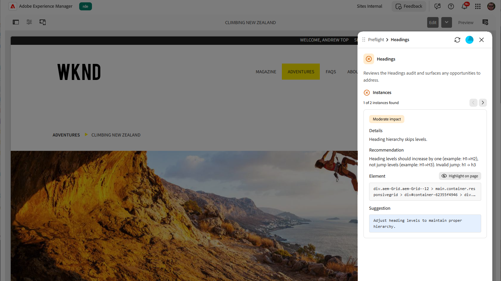

# 預檢的稽核結果

稽核完成時，預檢會在整備儀表板中顯示結果。 儀表板會顯示整體整備程度儀表及其找到的機會（依稽核類別分組）。 在每個類別中，個別稽核會識別要檢閱或修正的特定專案。

## 整備程度計量器

在控制面板頂端，整備程度計量器會反映整體稽核結果。 它以百分比形式顯示整備分數，根據無機會完成的稽核比例，以及在所有稽核中找到的機會總數。 整備度表可協助您快速評估整體的頁面健康狀態。

{align="center"}

當稽核仍在執行時，準備程度計量器會顯示進度列，其狀態為&#x200B;**正在執行稽核**&#x200B;或仍在執行的稽核數目。 稽核完成時，計量器會顯示最終整備百分比和機會計數。

## 稽核類別

預檢群組相關稽核會分成多個類別，例如&#x200B;**SEO**&#x200B;和&#x200B;**協助工具**。 每個類別都會顯示為一個卡片，顯示找到的機會數量，或指出其所有稽核都通過但無機會。

展開類別以檢視其個別稽核。 每個稽核都會顯示它是否通過或找到商機、簡短說明，以及找到的商機計數。 選取發現可開啟其詳細資訊頁面的稽核。

如需稽核類別的完整清單，以及每個類別中的稽核，請參閱[預檢稽核類別](./overview.md#preflight-audit-categories)。

## 機會詳細資料

詳細資訊頁面會顯示所選稽核找到的機會。 當同一個問題出現在多個位置時，每個事件都稱為例項。 使用導覽器（**上一個執行個體**&#x200B;和&#x200B;**下一個執行個體**）逐一瀏覽這些執行個體；它會顯示您的位置，例如，找到&#x200B;*個5個執行個體中的* 1。

{align="center"}

每個機會包括：

* 嚴重程度或影響徽章，指出機會的重要性。
* 有關機會的詳細資訊，例如問題說明、建議，以及針對協助工具，相關的WCAG規則和符合性層級。
* 在頁面上顯示受影響專案的&#x200B;**Element**&#x200B;區段，其中包含&#x200B;**在頁面**&#x200B;上反白顯示的按鈕。
* 含有建議修正的&#x200B;**建議**&#x200B;區段。 當AI產生建議時，會將其標示為AI產生的建議，並可能包含說明建議修正的簡短理由。

## 在頁面上醒目標示

稽核完成後，您可以直接在頁面上醒目提示商機，快速找到並瞭解商機。

「預檢」會在內容中反白標示受影響的元素，將面板中的結果連結至內容中的確切位置。 透過此功能，您不需要在頁面中手動搜尋，就可輕鬆地審閱並解決機會。

1. 在要稽核的頁面內容中開啟「預檢」面板，然後選取&#x200B;**分析頁面**&#x200B;以執行稽核。
1. 從整備儀表板選取稽核，然後選取要複查的機會。
1. 選取&#x200B;**在頁面**&#x200B;上反白顯示。 預覽會自動捲動至相關區域並反白顯示對應的元素，因此您可以輕鬆識別並最佳化內容中的商機。

## 工作ID

每個預檢執行都有唯一的工作ID，顯示在面板底部。 它主要在管理員疑難排解特定執行時有用。 將游標暫留在ID上，並選取右側顯示的復製圖示；ID會複製到剪貼簿，且會顯示確認訊息。 當您回報問題時，請包含此ID。
