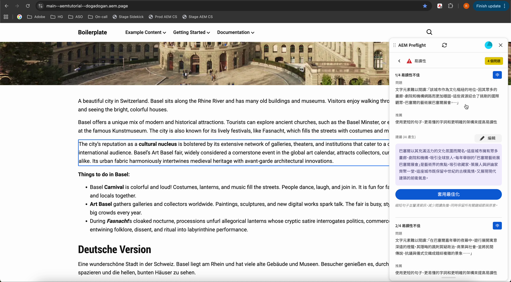

# 預檢中的稽核結果

稽核完成時，Preflight會將稽核結果顯示為機會。 每個機會都會依型別分組，並包含可協助您增強和最佳化頁面的建議。 在機會中，個別問題會識別要檢閱或修正的特定專案。

AEM Preflight對話方塊頂端是反映整體稽核結果的使用者進度列。 它會顯示通過但無問題的機會百分比，以及在所有機會中找到的問題總數。 使用者進度列可協助作者快速評估整體的頁面健康狀態。

{align="center"}

長條圖以不同色彩標示：

* **少於1/3**&#x200B;個商機完成的紅色
* 橙色的&#x200B;**1/3到2/3完成**
* 綠色代表&#x200B;**超過2/3個完成**
* 當稽核&#x200B;**仍在執行時，顯示為藍色**

檢視可用機會型別的[完整清單，以及如何解決它們](./overview.md#preflight-opportunities)。

## 導覽至問題

稽核完成後，您可以快速移至預覽中的已識別問題。

{align="center"}

### 導覽至問題

1. 從「預檢」面板的問題清單中選取問題。
1. 預覽會自動捲動到並反白頁面上的對應位置，因此您可以在內容中檢閱問題，而無需手動搜尋。
