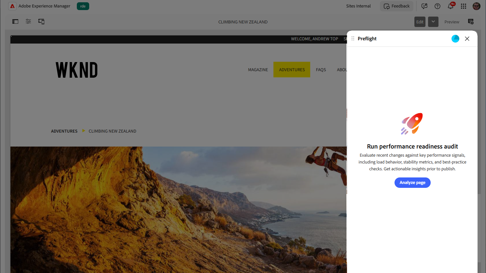

# 預檢中的稽核

預檢會稽核您的頁面，以便在發佈之前提供增強內容品質的機會。 與自動掃描不同，您可以選擇要執行稽核的時間，以便在準備就緒時分析頁面。

{align="center"}

若要在預檢中執行網頁稽核，請執行下列動作：

1. 在您的[製作環境](./access-preflight.md) 中 (通用編輯器、文件型製作或 AEM Sites 頁面編輯器) 開啟您要稽核的頁面。
1. 開啟[預檢面板](./access-preflight.md)。 預檢會開啟至&#x200B;**執行效能整備稽核**&#x200B;登陸畫面。
1. 選取&#x200B;**分析頁面**。 預檢會在目前頁面上執行其所有稽核，並開啟整備儀表板，其中顯示整備分數及其找到的機會（依類別分組）。

若要瞭解預覽結果並識別最佳化機會，請參閱預檢中的[稽核結果](./audit-results.md)。
