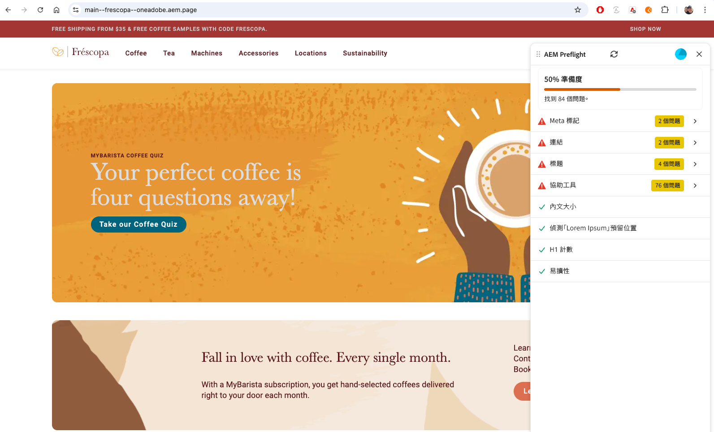

# 預檢基本資訊

{align="center"}

預檢可協助您在網頁發佈前找出機會來增強網頁。 Preflight擴充功能會透過對您的內容執行稽核來識別商機，並在面板中顯示結果，以便您在發佈之前處理這些商機。

## 預檢出現的位置

預檢可用於不同的編寫環境：

* **通用編輯器** - Preflight擴充功能出現在&#x200B;**側邊欄**&#x200B;中。 選取此選項可開始稽核目前頁面。
* **檔案式撰寫** — 透過Sidekick （書籤小程式）對預覽的頁面內容執行預檢工具，以檢視機會清單。
* **AEM Sites頁面編輯器** — 使用瀏覽器中的預檢書籤小程式開始稽核。

如需設定指示，請參閱[預檢設定](./setup.md)。

## 開始稽核

若要執行「預檢」：

1. 在編寫環境中(通用編輯器、檔案式預覽或AEM Sites頁面編輯器)開啟您要稽核的頁面。
2. 開啟「預檢」面板 — 從側邊欄選取「預檢擴充功能」，或按一下Sidekick中的「預檢」按鈕。
3. 「預檢」會分析頁面並顯示可用來增強頁面的機會。

## 稽核結果

稽核完成時，Preflight會顯示找到的機會。 每個機會都按型別組織，並包含如何解決問題的詳細資訊。

## 關於預檢機會

「預檢」會評估內容的多個方面，包括協助工具、中繼資料、連結和可讀性。 請參閱[預檢商機](./overview.md)，以取得可用商機型別的完整清單以及如何解決它們。