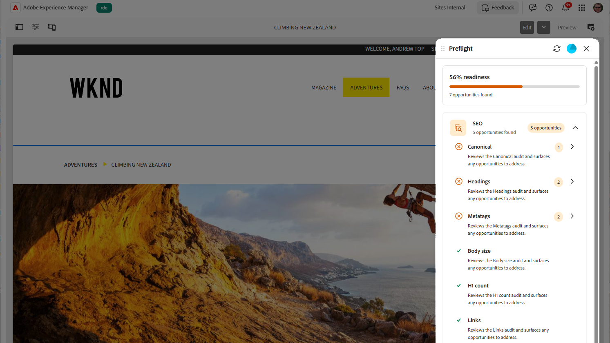

# AEM Sites Optimizer 預檢

{align="center"}

AEM Sites Optimizer中的「預檢」可協助您分析內容和結構，並透過可行的建議來呈現商機，以在頁面正式上線之前驗證和最佳化頁面。 此功能專為作者、行銷人員和開發人員設計，協助確保頁面高品質、高效且可隨時發佈，同時減少重複工作。

您從編寫環境開始Preflight，並選取&#x200B;**分析頁面**&#x200B;以執行其稽核。 稽核會評估頁面的一個方面，例如其中繼資料或標題結構，以及預檢群組相關稽核分為多個類別，例如&#x200B;**SEO**&#x200B;和&#x200B;**協助工具**。 接著，預檢會報告頁面的整備分數，以及它找到的機會，也就是您可以改善的特定專案，每個專案都會提供可操作的建議。

## 開始使用預檢

預檢快速入門非常簡單。 設定Preflight，在您的編寫環境中開啟它，在您的頁面上執行稽核，然後Preflight完成其餘工作。

1. [設定預檢](./setup.md)：了解如何為您的 AEM 實例設定預檢
1. [存取預檢](./access-preflight.md)：了解預檢在您製作環境中的位置
1. [執行稽核](./audits.md)：了解如何執行預檢稽核
1. [稽核結果與機會](./audit-results.md)：了解如何解讀稽核結果

## 預檢稽核類別

<!--
CARDS

* ./opportunities/accessibility.md
* ./opportunities/seo.md
-->
<!-- START CARDS HTML - DO NOT MODIFY BY HAND -->

    

        

            

                <figure class="image x-is-16by9">
                    
                </figure>
            

            

                

                    

                        <a href="./opportunities/accessibility.md" target="_blank" rel="referrer" title="印前檢查協助工具稽核">預檢協助工具稽核</a>
                    

                    
瞭解Sites Optimizer中的Preflight協助工具稽核。

                

                <a href="./opportunities/accessibility.md" target="_blank" rel="referrer" class="spectrum-Button spectrum-Button--outline spectrum-Button--primary spectrum-Button--sizeM" style="align-self: flex-start; margin-top: 1rem;">
                    了解更多
                </a>
            

        

    

    

        

            

                <figure class="image x-is-16by9">
                    
                </figure>
            

            

                

                    

                        <a href="./opportunities/seo.md" target="_blank" rel="referrer" title="預檢SEO稽核">預檢SEO稽核</a>
                    

                    
瞭解Sites Optimizer中的Preflight SEO稽核。

                

                <a href="./opportunities/seo.md" target="_blank" rel="referrer" class="spectrum-Button spectrum-Button--outline spectrum-Button--primary spectrum-Button--sizeM" style="align-self: flex-start; margin-top: 1rem;">
                    了解更多
                </a>
            

        

    

<!-- END CARDS HTML - DO NOT MODIFY BY HAND -->
