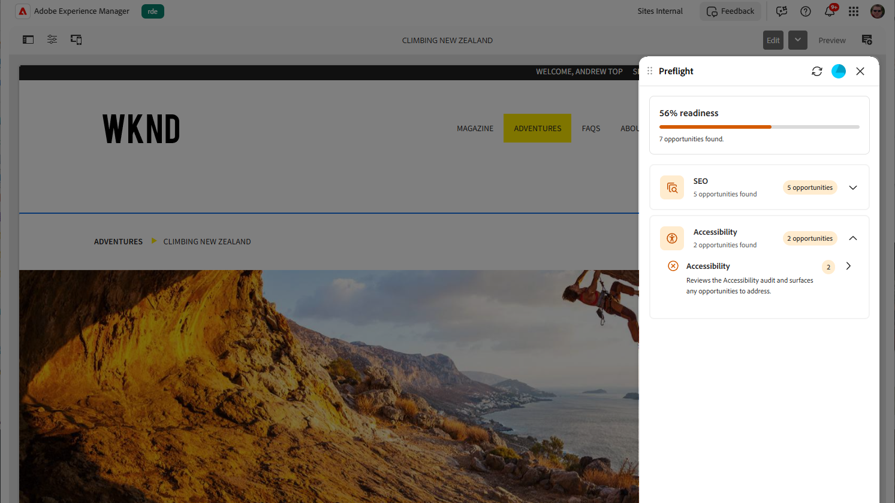
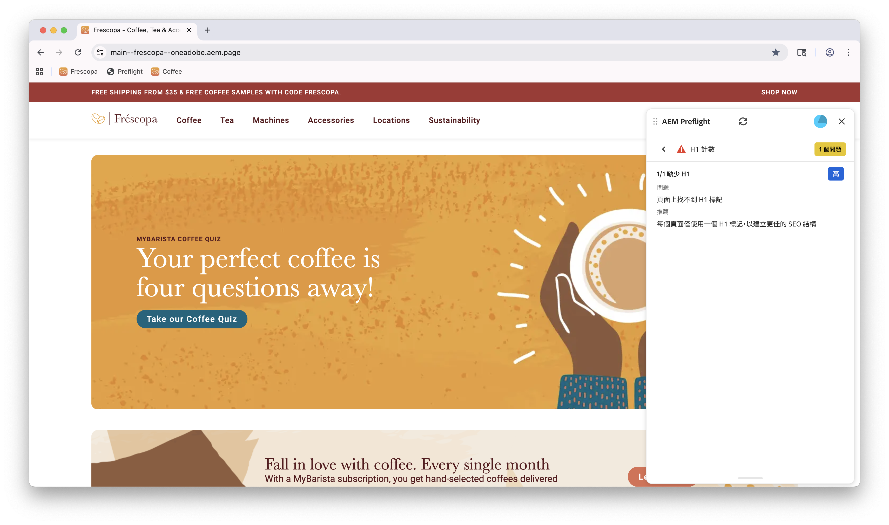
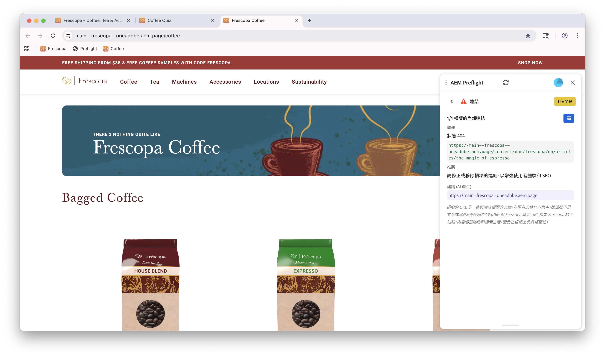
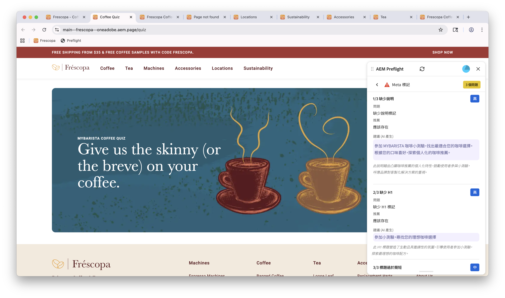
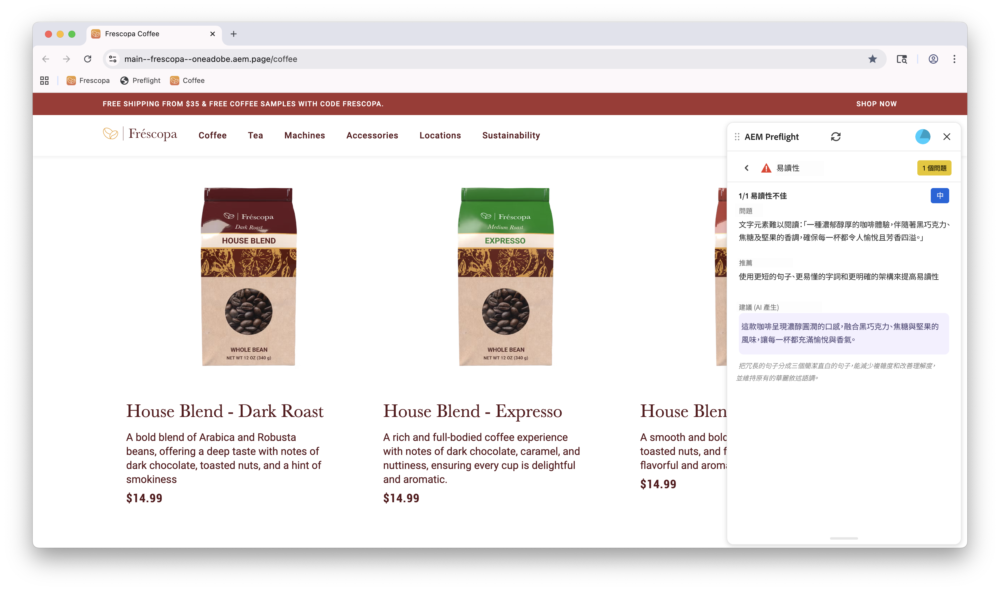

# AEM Sites Optimizer 預檢

{align="center"}

AEM Sites Optimizer 中的預檢功能可分析內容和結構，並透過可操作的建議來標示問題，協助您在頁面上線前驗證並最佳化頁面。此功能專為作者、行銷人員和開發人員設計，協助確保頁面高品質、高效且可隨時發佈，同時減少重複工作。

預檢的核心是「機會」，預檢會透過一組稽核來識別機會，並且在發佈之前評估頁面的關鍵元素。這些稽核會發現潛在問題，並提供清晰、可行的建議以改善整體品質和效能。

## 開始使用預檢

預檢快速入門非常簡單。只要設定預檢，在您的製作環境中開啟此功能，並在頁面上執行稽核，預檢就會完成剩下的工作。

1. [設定預檢](./setup.md)：了解如何為您的 AEM 實例設定預檢
1. [存取預檢](./access-preflight.md)：了解預檢在您製作環境中的位置
1. [執行稽核](./audits.md)：了解如何執行預檢稽核
1. [稽核結果與機會](./audit-results.md)：了解如何解讀稽核結果

## 預檢機會

<!--
CARDS

* ./opportunities/accessibility.md
* ./opportunities/h1-count.md
* ./opportunities/links.md
* ./opportunities/meta-data.md
* ./opportunities/readability.md
-->
<!-- START CARDS HTML - DO NOT MODIFY BY HAND -->

    

        

            

                <figure class="image x-is-16by9">
                    
                </figure>
            

            

                

                    

                        <a href="./opportunities/accessibility.md" target="_blank" rel="referrer" title="預檢無障礙機會">預檢無障礙機會</a>
                    

                    
了解 Sites Optimizer 中的預檢無障礙機會。

                

                <a href="./opportunities/accessibility.md" target="_blank" rel="referrer" class="spectrum-Button spectrum-Button--outline spectrum-Button--primary spectrum-Button--sizeM" style="align-self: flex-start; margin-top: 1rem;">
                    了解更多
                </a>
            

        

    

    

        

            

                <figure class="image x-is-16by9">
                    
                </figure>
            

            

                

                    

                        <a href="./opportunities/h1-count.md" target="_blank" rel="referrer" title="預檢 H1 計數機會">預檢 H1 計數機會</a>
                    

                    
了解 Sites Optimizer 中的預檢無障礙機會。

                

                <a href="./opportunities/h1-count.md" target="_blank" rel="referrer" class="spectrum-Button spectrum-Button--outline spectrum-Button--primary spectrum-Button--sizeM" style="align-self: flex-start; margin-top: 1rem;">
                    了解更多
                </a>
            

        

    

    

        

            

                <figure class="image x-is-16by9">
                    
                </figure>
            

            

                

                    

                        <a href="./opportunities/links.md" target="_blank" rel="referrer" title="預檢連結機會">預檢連結機會</a>
                    

                    
了解 Sites Optimizer 中的預檢連結機會。

                

                <a href="./opportunities/links.md" target="_blank" rel="referrer" class="spectrum-Button spectrum-Button--outline spectrum-Button--primary spectrum-Button--sizeM" style="align-self: flex-start; margin-top: 1rem;">
                    了解更多
                </a>
            

        

    

    

        

            

                <figure class="image x-is-16by9">
                    
                </figure>
            

            

                

                    

                        <a href="./opportunities/meta-data.md" target="_blank" rel="referrer" title="預檢後設資料機會">預檢後設資料機會</a>
                    

                    
了解 Sites Optimizer 中的預檢後設資料機會。

                

                <a href="./opportunities/meta-data.md" target="_blank" rel="referrer" class="spectrum-Button spectrum-Button--outline spectrum-Button--primary spectrum-Button--sizeM" style="align-self: flex-start; margin-top: 1rem;">
                    了解更多
                </a>
            

        

    

    

        

            

                <figure class="image x-is-16by9">
                    
                </figure>
            

            

                

                    

                        <a href="./opportunities/readability.md" target="_blank" rel="referrer" title="預檢易讀性機會">預檢可讀性機會</a>
                    

                    
了解 Sites Optimizer 中的預檢易讀性機會。

                

                <a href="./opportunities/readability.md" target="_blank" rel="referrer" class="spectrum-Button spectrum-Button--outline spectrum-Button--primary spectrum-Button--sizeM" style="align-self: flex-start; margin-top: 1rem;">
                    了解更多
                </a>
            

        

    

<!-- END CARDS HTML - DO NOT MODIFY BY HAND -->
