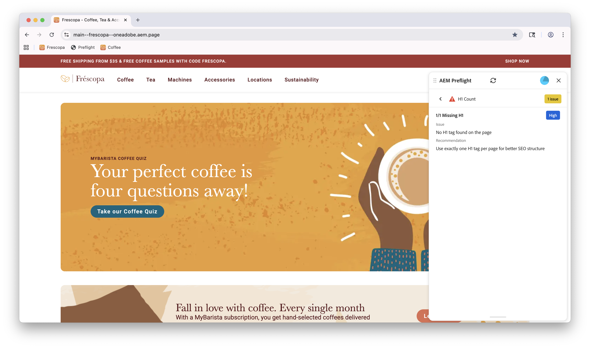

# 預檢機會

{align="center"}

Sites Optimizer預檢機會由一組評估組成，這些評估會在發佈網頁之前分析網站內容和結構的不同方面。 這些評估有助於識別潛在問題，並提供可操作的建議以改善網站的整體品質和效能。

## 預檢設定

請依照[預檢設定](./setup.md)指南中的步驟，在您的網站中設定Preflight擴充功能。

## 預檢機會

<!-- CARDS
* ./accessibility.md
* ./h1-count.md
* ./links.md
* ./meta-data.md
* ./readability.md
-->
<!-- START CARDS HTML - DO NOT MODIFY BY HAND -->

    

        

            

                <figure class="image x-is-16by9">
                    
                </figure>
            

            

                

                    

                        <a href="./accessibility.md" target="_blank" rel="referrer" title="預檢協助工具機會">預檢協助工具機會</a>
                    

                    
瞭解Sites Optimizer中的Preflight協助工具機會。

                

                <a href="./accessibility.md" target="_blank" rel="referrer" class="spectrum-Button spectrum-Button--outline spectrum-Button--primary spectrum-Button--sizeM" style="align-self: flex-start; margin-top: 1rem;">
                    了解更多
                </a>
            

        

    

    

        

            

                <figure class="image x-is-16by9">
                    
                </figure>
            

            

                

                    

                        <a href="./h1-count.md" target="_blank" rel="referrer" title="預檢H1計數機會">預檢H1計數機會</a>
                    

                    
瞭解Sites Optimizer中的Preflight協助工具機會。

                

                <a href="./h1-count.md" target="_blank" rel="referrer" class="spectrum-Button spectrum-Button--outline spectrum-Button--primary spectrum-Button--sizeM" style="align-self: flex-start; margin-top: 1rem;">
                    了解更多
                </a>
            

        

    

    

        

            

                <figure class="image x-is-16by9">
                    
                </figure>
            

            

                

                    

                        <a href="./links.md" target="_blank" rel="referrer" title="預檢連結機會">預檢連結機會</a>
                    

                    
瞭解Sites Optimizer中的預檢連結商機。

                

                <a href="./links.md" target="_blank" rel="referrer" class="spectrum-Button spectrum-Button--outline spectrum-Button--primary spectrum-Button--sizeM" style="align-self: flex-start; margin-top: 1rem;">
                    了解更多
                </a>
            

        

    

    

        

            

                <figure class="image x-is-16by9">
                    
                </figure>
            

            

                

                    

                        <a href="./meta-data.md" target="_blank" rel="referrer" title="預檢中繼資料機會">預檢中繼資料機會</a>
                    

                    
瞭解Sites Optimizer中的預檢中繼資料機會。

                

                <a href="./meta-data.md" target="_blank" rel="referrer" class="spectrum-Button spectrum-Button--outline spectrum-Button--primary spectrum-Button--sizeM" style="align-self: flex-start; margin-top: 1rem;">
                    了解更多
                </a>
            

        

    

    

        

            

                <figure class="image x-is-16by9">
                    
                </figure>
            

            

                

                    

                        <a href="./readability.md" target="_blank" rel="referrer" title="預檢可讀性機會">預檢可讀性機會</a>
                    

                    
瞭解Sites Optimizer中的預檢可讀性機會。

                

                <a href="./readability.md" target="_blank" rel="referrer" class="spectrum-Button spectrum-Button--outline spectrum-Button--primary spectrum-Button--sizeM" style="align-self: flex-start; margin-top: 1rem;">
                    了解更多
                </a>
            

        

    

<!-- END CARDS HTML - DO NOT MODIFY BY HAND -->
