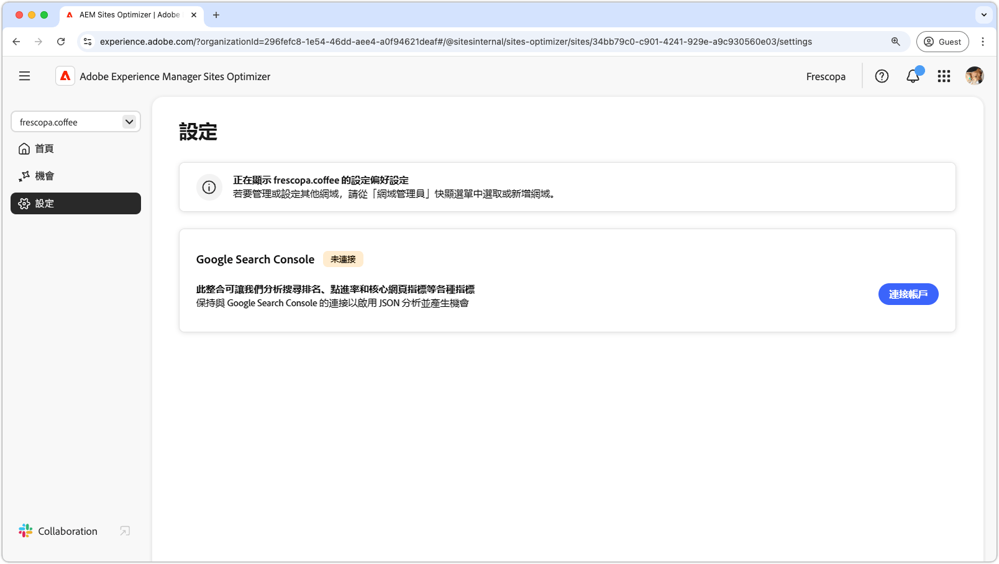
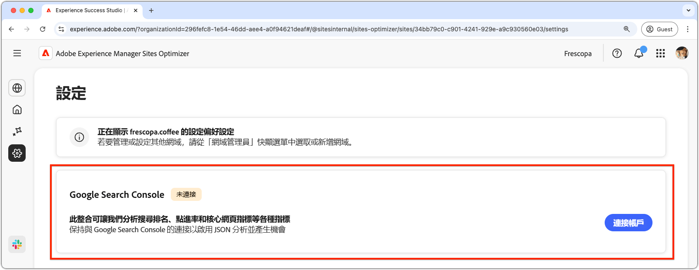

# Sites Optimizer 設定

{align="center"}

Sites Optimizer 設定是您設定 Sites Optimizer 體驗的中樞。

## Google Search Console

{align="center"}

AEM Sites Optimizer 中的 Google Search Console 設定連接器可讓您分析關鍵 SEO 量度，例如搜尋排名、點按率和核心網頁指標。透過讓 Google Search Console 保持連接，您可以利用 JSON 分析來發現最佳化機會並提高網站績效。

若要設定此連接器，您必須擁有能以系統管理員身分存取該網域之 Google Search Console 的認證。
