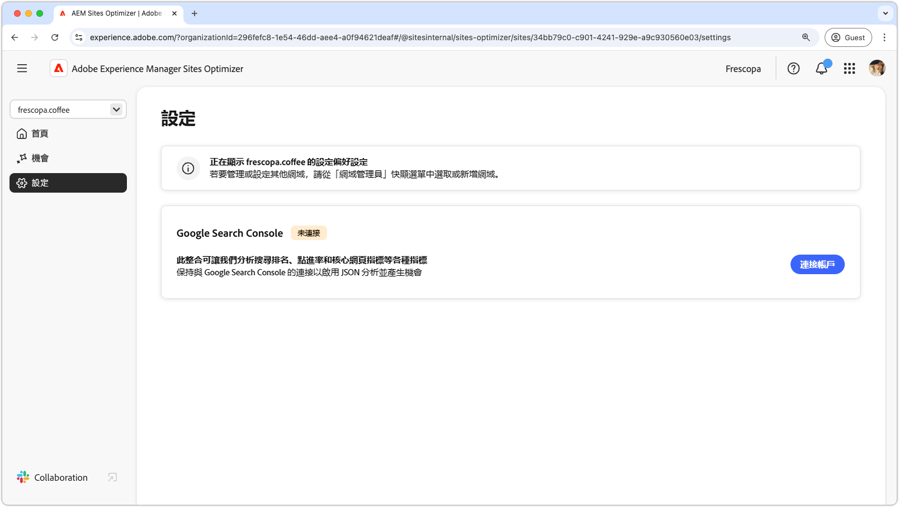
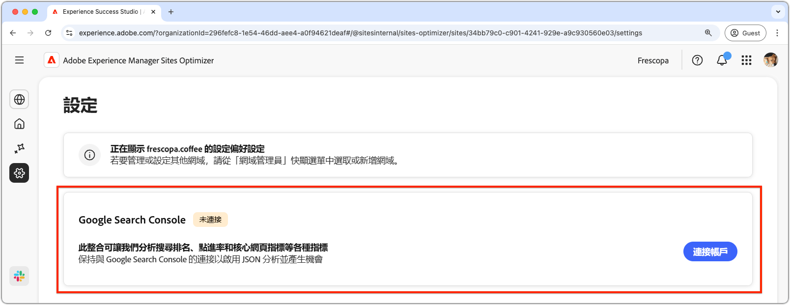
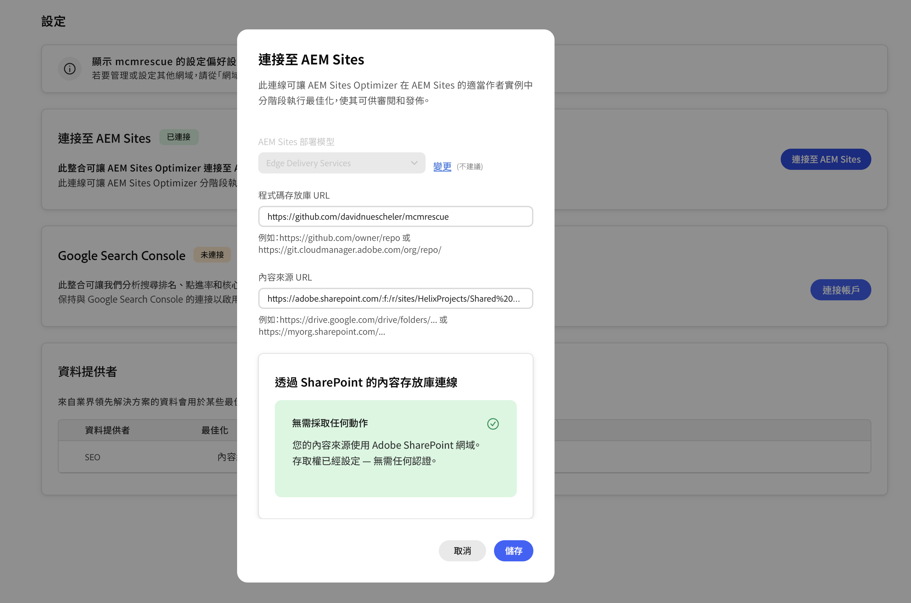
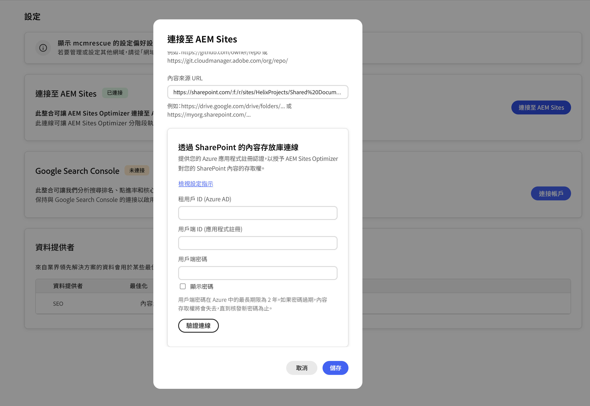
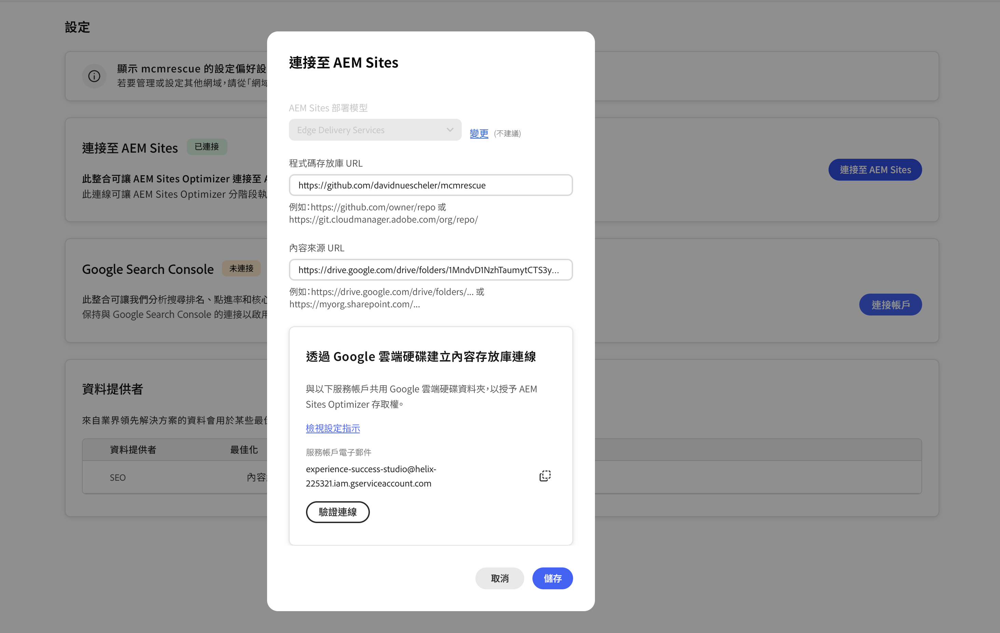

# Sites Optimizer 設定

{align="center"}

Sites Optimizer設定是設定Sites Optimizer體驗的中央樞紐。

## Google Search Console

Google Search Console的{align="center"}

AEM Sites Optimizer 中的 Google Search Console 設定連接器可讓您分析關鍵 SEO 量度，例如搜尋排名、點按率和核心網頁指標。 透過讓 Google Search Console 保持連接，您可以利用 JSON 分析來發現最佳化機會並提高網站績效。

若要設定此連接器，您必須擁有能以系統管理員身分存取該網域之 Google Search Console 的認證。

## 連線至AEM Sites

以下指南說明如何將您現有的Edge Delivery Services (EDS)網站連結至AEM Sites Optimizer。 開始之前，請確定您的EDS網站已設定且正常運作 — 此連線專供AEM Sites Optimizer存取您的內容。

連線需要兩個步驟：

1. 提供您的程式碼存放庫URL和內容來源URL。
2. 授予AEM Sites Optimizer存取權給您的內容來源。

### 步驟1 — 連結您的程式碼存放庫和內容來源

在AEM Sites Optimizer中，移至&#x200B;**設定→連線至AEM Sites**&#x200B;並輸入下列內容：

- **程式碼存放庫URL** — 您EDS網站的GitHub URL，例如：
  `https://github.com/owner/repo`

- **內容Source URL** — 支援您EDS網站的SharePoint資料夾或Google磁碟機資料夾的URL，例如：
  `https://drive.google.com/drive/folders/...` 或 `https://myorg.sharepoint.com/...`

此URL必須符合您EDS網站的`fstab.yaml`中設定的專案。

輸入「內容Source URL」後，AEM Sites Optimizer會偵測您的內容來源型別，並顯示下列相關存取指示。

### 步驟2 — 授予內容來源的存取權

請遵循符合您內容來源的區段。

#### SharePoint — Adobe網域

{align="center"}

如果您的內容Source URL使用Adobe SharePoint網域，則不需要進一步動作。 已設定存取。 按一下&#x200B;**儲存**&#x200B;以完成連線。

#### SharePoint — 自訂網域

如果您的內容Source URL使用您組織自己的SharePoint網域，您需要註冊Azure應用程式並提供其憑證給AEM Sites Optimizer。

##### 您將需要什麼

- 在Azure入口網站註冊應用程式的許可權，或可代表您註冊應用程式的連絡人。
- 授予API同意的租使用者管理員許可權，或可為您核准API同意的管理員。

##### 步驟2a — 在Azure中註冊應用程式

1. 移至&#x200B;**Azure入口網站→ Microsoft Entra ID→應用程式註冊→新註冊**。
2. 為其命名，例如： `AEM Sites Optimizer`。
3. 保留所有其他預設值，然後按一下&#x200B;**註冊**。
4. 在&#x200B;**概觀**&#x200B;頁面上，記下以下內容：
   - **應用程式（使用者端）識別碼**
   - **目錄（租使用者） ID**

##### 步驟2b — 新增API許可權

1. 移至&#x200B;**API許可權→新增Microsoft Graph →應用程式許可權→許可權**。
2. 新增下列兩項：
   - `Sites.Selected` — 特定SharePoint網站集合的範圍存取權。
   - `Files.SelectedOperations.Selected` — 沒有登入使用者的檔案存取。
3. 按一下&#x200B;**授予管理員同意**，兩者皆可。

{align="center"}

>[!NOTE]
>
>授與管理員同意需要租使用者管理員許可權。 如果您沒有此專案，請先要求IT或Azure管理員完成此步驟，再繼續進行。

##### 步驟2c — 建立使用者端密碼

應用程式註冊的{align="center"}

1. 移至&#x200B;**新使用者端密碼→憑證與密碼**。
2. 設定說明和到期日，然後按一下[新增]。**&#x200B;**
3. 立即複製機密值 — 只顯示一次。

##### 步驟2d — 授予應用程式存取SharePoint網站的許可權

您可以使用Microsoft Graph Explorer、PowerShell或直接Graph API呼叫，授與應用程式存取權。

導覽至[Microsoft Graph Explorer](https://developer.microsoft.com/graph/graph-explorer)，使用您的Microsoft帳戶登入，然後執行下列請求：

1. 尋找您的網站ID：

```
GET https://graph.microsoft.com/v1.0/sites/{tenant}.sharepoint.com:/sites/{site-name}
```

1. 從回應複製`id`，然後授與網站層級的存取權：

```
POST https://graph.microsoft.com/v1.0/sites/{siteId}/permissions
```

內文：

```json
{
  "roles": ["write"],
  "grantedToIdentities": [{
    "application": {
      "id": "{your-client-id}",
      "displayName": "{Your app name}"
    }
  }]
}
```

##### 步驟2e — 在AEM Sites Optimizer中輸入認證

{align="center"}

返回&#x200B;**連線至AEM Sites**&#x200B;對話方塊，在&#x200B;**透過SharePoint連線內容存放庫**&#x200B;下輸入下列內容：

- **租使用者ID (Azure AD)** — 來自應用程式註冊→概觀。
- **使用者端ID （應用程式註冊）** — 從應用程式註冊→概觀。
- **使用者端密碼** — 已在步驟2c建立。

按一下&#x200B;**驗證連線**&#x200B;以確認存取，然後按一下&#x200B;**儲存**。

#### Google Drive

{align="center"}

1. 在Google Drive中，用滑鼠右鍵按一下支援您EDS網站的資料夾，並選取&#x200B;**共用**。
2. 在&#x200B;**新增人員和群組**&#x200B;欄位中，輸入&#x200B;**連線至AEM Sites**&#x200B;對話方塊中顯示的服務帳戶電子郵件：
   `experience-success-studio@helix-225321.iam.gserviceaccount.com`
3. 將許可權等級設定為&#x200B;**編輯器**。
4. 取消勾選&#x200B;**通知人員**&#x200B;並按一下&#x200B;**共用**。

共用完成後，在對話方塊中按一下&#x200B;**驗證連線**，然後按一下&#x200B;**儲存**。
