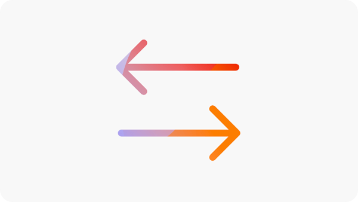

# Sites Optimizer試用版

透過此針對現有Sites Optimizer客戶（Edge Delivery Services、Cloud Services和Managed Services）的試用版，開始使用AEM Sites。 您的網域資料已預先上線，因此您可以立即開始最佳化。 以下影片將逐步說明試用體驗，並示範如何開始使用。

>[!VIDEO](https://video.tv.adobe.com/v/3483253/?learn=on&enablevpops)

>[!TIP]
>
> 若有任何問題或要求，請連絡[siteoptimizer-now@adobe.com](mailto:siteoptimizer-now@adobe.com)。

## 立即開始試用！

請依照下列步驟開始使用您的試用版：

1. 使用您的AEM Sites IMS組織ID登入[www.sitesoptimizer.live](http://www.sitesoptimizer.live/)。
2. 檢視關鍵量度，例如頁面檢視、載入時間和參與率，以及您根據影響排定優先順序的熱門最佳化機會。
3. 探索三種可用的機會型別： [中斷的背景連結](./opportunities/broken-backlinks.md)、[Core Web Vitals](./opportunities/core-web-vitals.md)和[遺失替代文字](./opportunities/missing-alt-text.md)。
4. 針對每個商機，最多可檢閱三個已確認的問題。 使用AI產生的建議，並在就緒後直接將最佳化部署至您的AEM環境。
5. 隨時升級至完整授權，釋放更多商機。

## 試用版中有哪些功能

下列內容已納入試用版：

* 三種機會型別： [中斷的反向連結](./opportunities/broken-backlinks.md)、[Core Web Vitals](./opportunities/core-web-vitals.md)和[遺漏替代文字](./opportunities/missing-alt-text.md)。
* 每個商機每月最多三個問題。
* 每個問題的完整工作流程：自動識別、自動建議和自動最佳化。
   * **自動識別** — 使用多個資料來源偵測您網站上的問題。
   * **自動建議** — 針對每個問題提供規範性、AI產生的建議。
   * **自動最佳化** — 核准後，將修正直接部署至您的編寫環境。 更新會遵循您現有的工作流程，讓您的團隊可透過AEM檢閱和發佈。

## 常見問題

請參閱下列內容，瞭解有關AEM Sites Optimizer試用版的常見問題解答。

+++什麼是AEM Sites Optimizer？

[AEM Sites Optimizer](/help/home.md)是AI優先的應用程式，可識別您網站上的問題、提供規範性建議，並協助您修正這些問題，以提高流量贏取、參與和轉換。

+++
+++誰可以參與此試用？

AEM Sites現有客戶（Edge Delivery Services、Cloud Services和Managed Services）。

+++
+++如何存取試用版？

前往[www.sitesoptimizer.live](http://www.sitesoptimizer.live/)並使用您的AEM Sites IMS組織ID登入。

+++
+++此試用版是否需支付任何費用？

否。 現有AEM Sites客戶可免費使用此試用版。

+++
+++是否有到期日？

否。 此試用版不是以時間為基礎。 透過可用機會型別和問題的數量來限制使用量。
+++
+++修正所有問題後會發生什麼事？

Sites Optimizer會持續找出影響效能的問題。 免費試用版只會每月新增問題。 升級以持續稽核及最佳化。

+++
+++如何存取更多商機？

使用產品體驗提供的升級或連絡銷售CTA，或電子郵件[siteoptimizer-now@adobe.com](mailto:siteoptimizer-now@adobe.com)。

+++

<!--
CARDS
* ./opportunities/core-web-vitals.md
  {title=Core web vitals}
  {image=../assets/common/card-performance.png}
* ./opportunities/missing-alt-text.md
  {title=Missing alt text}
  {image=../assets/common/card-arrows.png}
* ./opportunities/broken-backlinks.md
  {title=Broken backlinks}
  {image=../assets/common/card-arrows.png}
-->

<!-- START CARDS HTML - DO NOT MODIFY BY HAND -->

    

        

            

                <figure class="image x-is-16by9">
                    
                </figure>
            

            

                

                    

                        <a href="./opportunities/core-web-vitals.md" target="_blank" rel="referrer" title="核心網頁指標">核心網頁指標</a>
                    

                    
了解核心網頁指標機會，以及如何使用它來改進流量贏取。

                

                <a href="./opportunities/core-web-vitals.md" target="_blank" rel="referrer" class="spectrum-Button spectrum-Button--outline spectrum-Button--primary spectrum-Button--sizeM" style="align-self: flex-start; margin-top: 1rem;">
                    進一步瞭解
                </a>
            

        

    

    

        

            

                <figure class="image x-is-16by9">
                    
                </figure>
            

            

                

                    

                        <a href="./opportunities/missing-alt-text.md" target="_blank" rel="referrer" title="缺少替代文字">缺少替代文字</a>
                    

                    
了解缺少替代文字機會，以及如何使用它來提高您網站上的參與度。

                

                <a href="./opportunities/missing-alt-text.md" target="_blank" rel="referrer" class="spectrum-Button spectrum-Button--outline spectrum-Button--primary spectrum-Button--sizeM" style="align-self: flex-start; margin-top: 1rem;">
                    進一步瞭解
                </a>
            

        

    

    

        

            

                <figure class="image x-is-16by9">
                    
                </figure>
            

            

                

                    

                        <a href="./opportunities/broken-backlinks.md" target="_blank" rel="referrer" title="損壞的反向連結">損壞的反向連結</a>
                    

                    
了解損壞的反向連結機會，以及如何使用它來改進流量贏取。

                

                <a href="./opportunities/broken-backlinks.md" target="_blank" rel="referrer" class="spectrum-Button spectrum-Button--outline spectrum-Button--primary spectrum-Button--sizeM" style="align-self: flex-start; margin-top: 1rem;">
                    進一步瞭解
                </a>
            

        

    

<!-- END CARDS HTML - DO NOT MODIFY BY HAND -->
