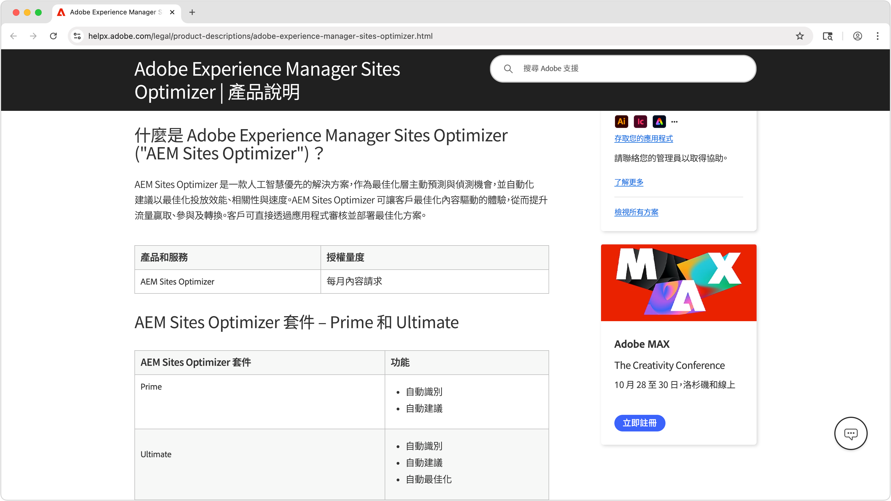
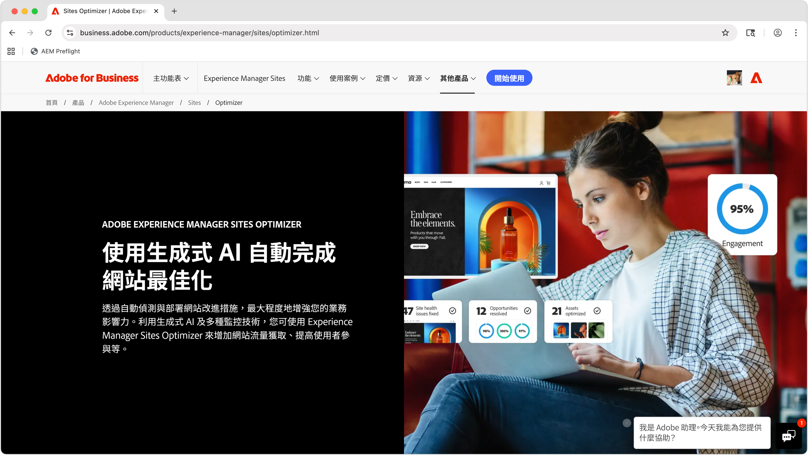

# AEM Sites Optimizer

>[!VIDEO](https://video.tv.adobe.com/v/3455085/?learn=on&enablevpops)

Adobe Experience Manager (AEM) Sites Optimizer 是一項雲端型服務，可分析和改進以 AEM 為基礎建置的網站之效能。Sites Optimizer 可以針對頁面載入、元件使用情況及內容傳遞找出需改進的地方。此功能有助於提高網站的效能，同時降低維護和更新成本。透過使用 Sites Optimizer，您可以確保流暢可靠的線上體驗，這對於維持參與度和轉換率來說非常重要。

## 開始使用 Sites Optimizer

<!-- CARDS 

* ./opportunity-types/overview.md
    * {title=Opportunity types}
    * {description = Learn about the available Site Optimizer opportunities and how to use them to improve your site's performance.}
* ./opportunity-types/preflight.md
  * {title=Preflight opportunities}
  * {description = Learn about the Preflight opportunities in Sites Optimizer and how to optimize your web pages before they're even published.}
* ./documentation/overview.md
  * {title=Documentation}
  * {description=Explore the Sites Optimizer documentation to learn about all its capabilities.}

-->
<!-- START CARDS HTML - DO NOT MODIFY BY HAND -->

    

        

            

                <figure class="image x-is-16by9">
                    
                </figure>
            

            

                

                    

                        <a href="./opportunity-types/overview.md" target="_blank" rel="referrer" title="機會類型">機會類型</a>
                    

                    
了解可用的 Sites Optimizer 機會，以及如何使用這些機會來提高網站的績效。

                

                <a href="./opportunity-types/overview.md" target="_blank" rel="referrer" class="spectrum-Button spectrum-Button--outline spectrum-Button--primary spectrum-Button--sizeM" style="align-self: flex-start; margin-top: 1rem;">
                    了解更多
                </a>
            

        

    

    

        

            

                <figure class="image x-is-16by9">
                    
                </figure>
            

            

                

                    

                        <a href="./documentation/overview.md" target="_blank" rel="referrer" title="文件">文件</a>
                    

                    
探索 Sites Optimizer 文件以了解其所有功能。

                

                <a href="./documentation/overview.md" target="_blank" rel="referrer" class="spectrum-Button spectrum-Button--outline spectrum-Button--primary spectrum-Button--sizeM" style="align-self: flex-start; margin-top: 1rem;">
                    了解更多
                </a>
            

        

    

<!-- END CARDS HTML - DO NOT MODIFY BY HAND -->

## 了解更多關於 Sites Optimizer 的資訊

<!-- CARDS 
* https://helpx.adobe.com/tw/legal/product-descriptions/adobe-experience-manager-sites-optimizer.html
    {title=Packages and licensing}
    {description=Learn about AEM Sites Optimizer packages and licensing.}
    {image=./assets/home/licensing.png}
    {target=_blank}
    {cta=Learn more}
* https://business.adobe.com/products/experience-manager/sites/optimizer.html
    {title=Explore the capabilities of AEM Sites Optimizer}
    {description=Learn what AEM Site Optimizer can do for your company.}
    {image=./assets/home/business-adobe-com.png}
    {target=_blank}
    {cta=Learn more}
-->
<!-- START CARDS HTML - DO NOT MODIFY BY HAND -->

    

        

            

                <figure class="image x-is-16by9">
                    
                </figure>
            

            

                

                    

                        <a href="https://helpx.adobe.com/tw/legal/product-descriptions/adobe-experience-manager-sites-optimizer.html" target="_blank" rel="referrer" title="封裝和授權">封裝和授權</a>
                    

                    
瞭解 AEM Sites Optimizer 封裝和授權。

                

                <a href="https://helpx.adobe.com/tw/legal/product-descriptions/adobe-experience-manager-sites-optimizer.html" target="_blank" rel="referrer" class="spectrum-Button spectrum-Button--outline spectrum-Button--primary spectrum-Button--sizeM" style="align-self: flex-start; margin-top: 1rem;">
                    了解更多
                </a>
            

        

    

    

        

            

                <figure class="image x-is-16by9">
                    
                </figure>
            

            

                

                    

                        <a href="https://business.adobe.com/tw/products/experience-manager/sites/optimizer.html" target="_blank" rel="referrer" title="探索 AEM Sites Optimizer 的功能">探索 AEM Sites Optimizer 的功能</a>
                    

                    
了解 AEM Site Optimizer 可以為您的公司完成哪些工作。

                

                <a href="https://business.adobe.com/tw/products/experience-manager/sites/optimizer.html" target="_blank" rel="referrer" class="spectrum-Button spectrum-Button--outline spectrum-Button--primary spectrum-Button--sizeM" style="align-self: flex-start; margin-top: 1rem;">
                    了解更多
                </a>
            

        

    

<!-- END CARDS HTML - DO NOT MODIFY BY HAND -->
