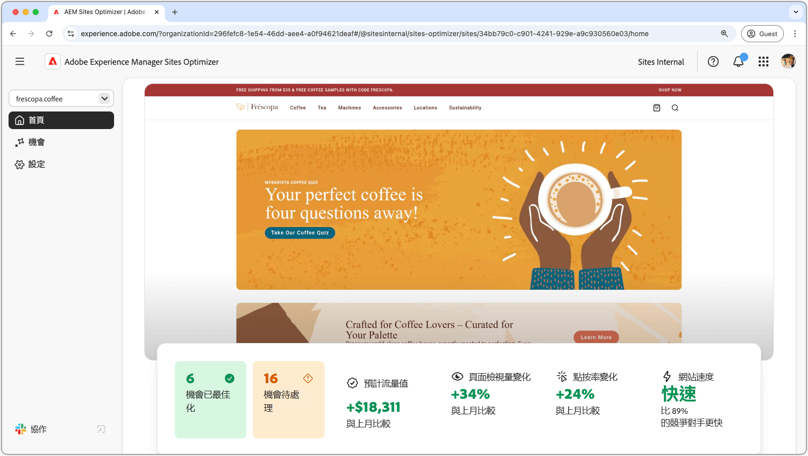
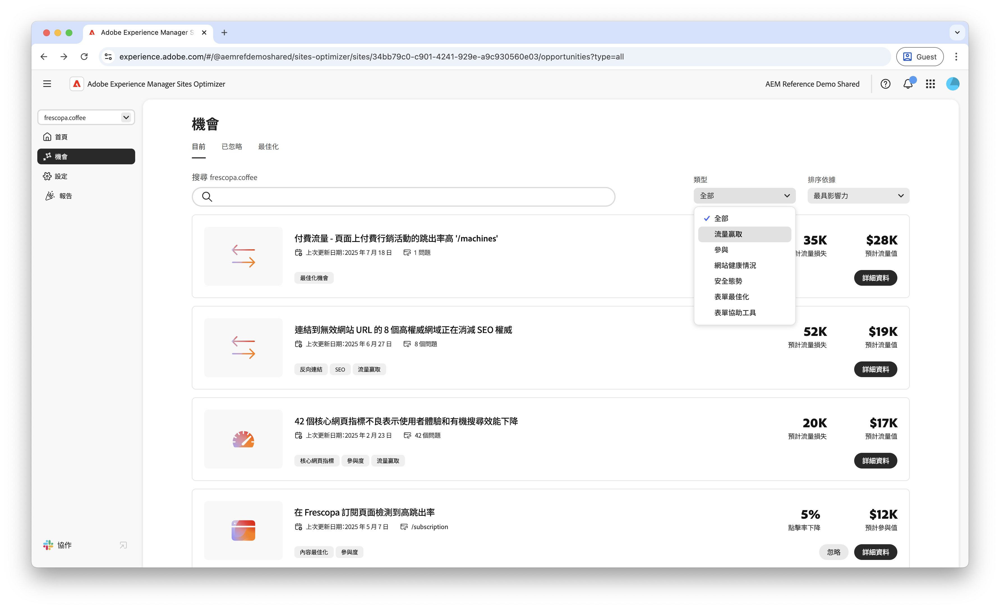
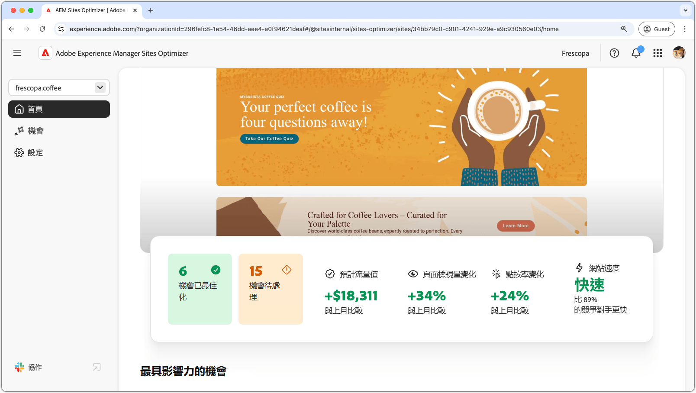

# AEM Sites Optimizer

{align="center"}

Adobe Experience Manager (AEM) Sites Optimizer是雲端型服務，可分析和改善以AEM建置的網站效能。 它會識別可改善頁面載入、元件使用和內容傳送的區域，協助您增強網站的效能，並降低維護和更新成本。 使用Sites Optimizer可確保順暢可靠的線上體驗，這對於維護參與度和轉換率非常重要。

## 開始使用Sites Optimizer

<!-- CARDS 

* ./opportunity-types/overview.md
   {title=Opportunity types}
   {description = Learn about the available Site Optimizer opportunities and how to use them to improve your site's performance.}
* ./documentation/overview.md
  * {title=Documentation}
  * {description=Explore the Sites Optimizer documentation to learn about all its capabilities.}

-->
<!-- START CARDS HTML - DO NOT MODIFY BY HAND -->

    

        

            

                <figure class="image x-is-16by9">
                    
                </figure>
            

            

                

                    

                        <a href="./opportunity-types/overview.md" target="_blank" rel="referrer" title="機會型別">機會型別</a>
                    

                    
瞭解可用的Site Optimizer機會，以及如何使用它們來提高您網站的效能。

                

                <a href="./opportunity-types/overview.md" target="_blank" rel="referrer" class="spectrum-Button spectrum-Button--outline spectrum-Button--primary spectrum-Button--sizeM" style="align-self: flex-start; margin-top: 1rem;">
                    進一步瞭解
                </a>
            

        

    

    

        

            

                <figure class="image x-is-16by9">
                    
                </figure>
            

            

                

                    

                        <a href="./documentation/overview.md" target="_blank" rel="referrer" title="文件">文件</a>
                    

                    
探索Sites Optimizer檔案以瞭解其所有功能。

                

                <a href="./documentation/overview.md" target="_blank" rel="referrer" class="spectrum-Button spectrum-Button--outline spectrum-Button--primary spectrum-Button--sizeM" style="align-self: flex-start; margin-top: 1rem;">
                    進一步瞭解
                </a>
            

        

    

<!-- END CARDS HTML - DO NOT MODIFY BY HAND -->
