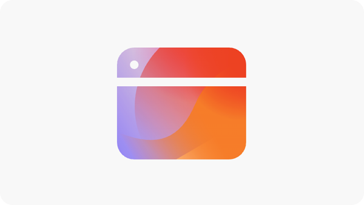

# 參與度機會

{align="center"}

AEM Sites Optimizer 中的參與度機會對於增強數位體驗來說至關重要，因為其可以提供有關使用者如何與網頁互動的可操作分析。透過識別可改進的領域 (例如協助工具問題、損壞的內部連結、高跳出率和缺少替代文字)，行銷人員和內容作者可以將其網站最佳化以獲得更好的績效和使用者參與度。這些機會有助於確保內容有效、可發現且引人注目，並於最終促成更高的轉換率和更無縫的客戶歷程。團隊可以使用 AEM Sites Optimizer 的建議不斷調整其數位策略，並大規模地提供高影響力的體驗。

## 機會

<!-- CARDS

* ../documentation/opportunities/accessibility-issues.md
  {title=Accessibility issues}
  {image=../assets/common/card-puzzle.png}
* ../documentation/opportunities//broken-internal-links.md
  {title=Broken internal links}
  {image=../assets/common/card-link.png}
* ../documentation/opportunities//high-bounce-rate.md
  {title=High bounce rate}
  {image=../assets/common/card-arrows.png}
* ../documentation/opportunities/high-traffic-page-has-low-ctr.md
  {title=High traffic page has low CTR}
  {image=../assets/common/card-browser.png}
* ../documentation/opportunities/missing-alt-text.md  
  {title=Missing alt text}
  {image=../assets/common/card-arrows.png}

-->
<!-- START CARDS HTML - DO NOT MODIFY BY HAND -->

    

        

            

                <figure class="image x-is-16by9">
                    
                </figure>
            

            

                

                    

                        <a href="../documentation/opportunities/accessibility-issues.md" target="_blank" rel="referrer" title="協助工具問題">協助工具問題</a>
                    

                    
了解協助工具問題機會，以及如何使用它來提高網站的安全性。

                

                <a href="../documentation/opportunities/accessibility-issues.md" target="_blank" rel="referrer" class="spectrum-Button spectrum-Button--outline spectrum-Button--primary spectrum-Button--sizeM" style="align-self: flex-start; margin-top: 1rem;">
                    了解更多
                </a>
            

        

    

    

        

            

                <figure class="image x-is-16by9">
                    
                </figure>
            

            

                

                    

                        <a href="../documentation/opportunities//broken-internal-links.md" target="_blank" rel="referrer" title="損壞的內部連結">損壞的內部連結</a>
                    

                    
了解損壞的連結機會，以及如何使用它來提高您網站上的參與度。

                

                <a href="../documentation/opportunities//broken-internal-links.md" target="_blank" rel="referrer" class="spectrum-Button spectrum-Button--outline spectrum-Button--primary spectrum-Button--sizeM" style="align-self: flex-start; margin-top: 1rem;">
                    了解更多
                </a>
            

        

    

    

        

            

                <figure class="image x-is-16by9">
                    
                </figure>
            

            

                

                    

                        <a href="../documentation/opportunities//high-bounce-rate.md" target="_blank" rel="referrer" title="高跳出率">高跳出率</a>
                    

                    
了解低瀏覽量機會，以及如何使用此機會來提高網站上的表單參與度。

                

                <a href="../documentation/opportunities//high-bounce-rate.md" target="_blank" rel="referrer" class="spectrum-Button spectrum-Button--outline spectrum-Button--primary spectrum-Button--sizeM" style="align-self: flex-start; margin-top: 1rem;">
                    了解更多
                </a>
            

        

    

    

        

            

                <figure class="image x-is-16by9">
                    
                </figure>
            

            

                

                    

                        <a href="../documentation/opportunities/high-traffic-page-has-low-ctr.md" target="_blank" rel="referrer" title="高流量頁面具有低CTR">高流量頁面具有低CTR</a>
                    

                    
瞭解高流量頁面具有低CTR機會，以及如何使用它來提高您網站的參與度。

                

                <a href="../documentation/opportunities/high-traffic-page-has-low-ctr.md" target="_blank" rel="referrer" class="spectrum-Button spectrum-Button--outline spectrum-Button--primary spectrum-Button--sizeM" style="align-self: flex-start; margin-top: 1rem;">
                    了解更多
                </a>
            

        

    

    

        

            

                <figure class="image x-is-16by9">
                    
                </figure>
            

            

                

                    

                        <a href="../documentation/opportunities/missing-alt-text.md" target="_blank" rel="referrer" title="缺少替代文字">缺少替代文字</a>
                    

                    
了解缺少替代文字機會，以及如何使用它來提高您網站上的參與度。

                

                <a href="../documentation/opportunities/missing-alt-text.md" target="_blank" rel="referrer" class="spectrum-Button spectrum-Button--outline spectrum-Button--primary spectrum-Button--sizeM" style="align-self: flex-start; margin-top: 1rem;">
                    了解更多
                </a>
            

        

    

<!-- END CARDS HTML - DO NOT MODIFY BY HAND -->
