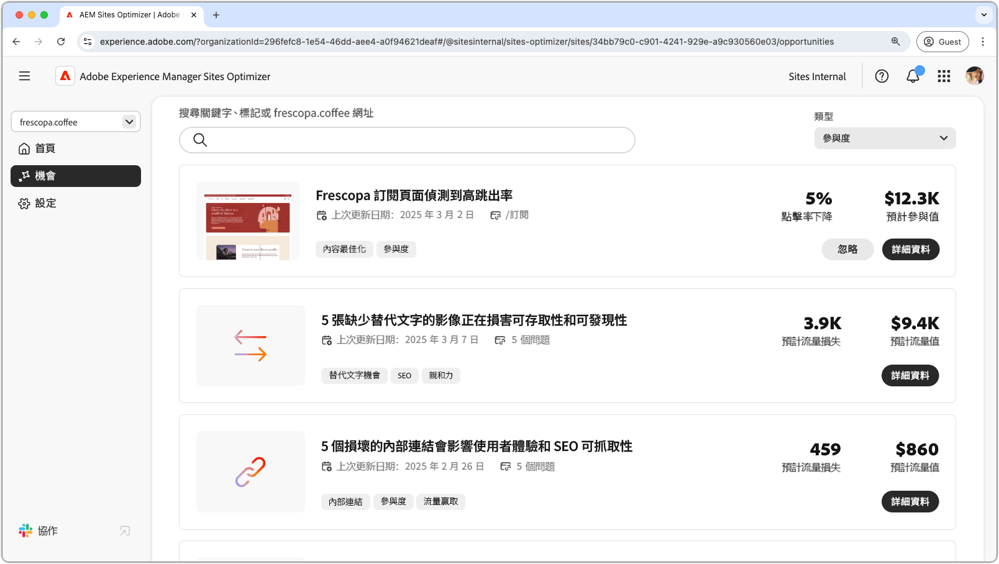

# 參與機會

{align="center"}

AEM Sites Optimizer中的參與機會對於透過提供使用者如何與網頁互動的可操作見解來增強數位體驗至關重要。 透過找出需要改善的領域 — 例如協助工具問題、內部連結中斷、高跳出率和遺失替代文字 — 行銷人員和內容作者可以最佳化其網站，以獲得更優異的效能和使用者參與。 這些機會有助於確保內容有效、可發現且引人入勝，最終推動更高轉換率以及更順暢的客戶歷程。 運用AEM Sites Optimizer的建議，讓團隊持續調整數位策略，並大規模提供高影響力的體驗。

## 機會

<!-- CARDS

* ../documentation/opportunities/accessibility-issues.md
  {title=Accessibility issues}
  {image=../assets/common/card-puzzle.png}
* ../documentation/opportunities//broken-internal-links.md
  {title=Broken internal links}
  {image=../assets/common/card-link.png}
* ../documentation/opportunities//high-bounce-rate.md
  {title=High bounce rate}
  {image=../assets/common/card-arrows.png}
* ../documentation/opportunities/missing-alt-text.md  
  {title=Missing alt text}
  {image=../assets/common/card-arrows.png}

-->
<!-- START CARDS HTML - DO NOT MODIFY BY HAND -->

    

        

            

                <figure class="image x-is-16by9">
                    
                </figure>
            

            

                

                    

                        <a href="../documentation/opportunities/accessibility-issues.md" target="_blank" rel="referrer" title="協助工具問題">協助工具問題</a>
                    

                    
瞭解無障礙問題商機，以及如何使用它來提高網站上的安全性。

                

                <a href="../documentation/opportunities/accessibility-issues.md" target="_blank" rel="referrer" class="spectrum-Button spectrum-Button--outline spectrum-Button--primary spectrum-Button--sizeM" style="align-self: flex-start; margin-top: 1rem;">
                    進一步瞭解
                </a>
            

        

    

    

        

            

                <figure class="image x-is-16by9">
                    
                </figure>
            

            

                

                    

                        <a href="../documentation/opportunities//broken-internal-links.md" target="_blank" rel="referrer" title="損壞的內部連結">中斷的內部連結</a>
                    

                    
瞭解中斷連結商機，以及如何使用它來改善網站上的參與度。

                

                <a href="../documentation/opportunities//broken-internal-links.md" target="_blank" rel="referrer" class="spectrum-Button spectrum-Button--outline spectrum-Button--primary spectrum-Button--sizeM" style="align-self: flex-start; margin-top: 1rem;">
                    進一步瞭解
                </a>
            

        

    

    

        

            

                <figure class="image x-is-16by9">
                    
                </figure>
            

            

                

                    

                        <a href="../documentation/opportunities//high-bounce-rate.md" target="_blank" rel="referrer" title="高跳出率">高跳出率</a>
                    

                    
瞭解低檢視機會以及如何使用它來改善網站上的表單參與度。

                

                <a href="../documentation/opportunities//high-bounce-rate.md" target="_blank" rel="referrer" class="spectrum-Button spectrum-Button--outline spectrum-Button--primary spectrum-Button--sizeM" style="align-self: flex-start; margin-top: 1rem;">
                    進一步瞭解
                </a>
            

        

    

    

        

            

                <figure class="image x-is-16by9">
                    
                </figure>
            

            

                

                    

                        <a href="../documentation/opportunities/missing-alt-text.md" target="_blank" rel="referrer" title="遺失替代文字">遺失替代文字</a>
                    

                    
瞭解遺失的替代文字機會，以及如何使用它來改善網站上的參與度。

                

                <a href="../documentation/opportunities/missing-alt-text.md" target="_blank" rel="referrer" class="spectrum-Button spectrum-Button--outline spectrum-Button--primary spectrum-Button--sizeM" style="align-self: flex-start; margin-top: 1rem;">
                    進一步瞭解
                </a>
            

        

    

<!-- END CARDS HTML - DO NOT MODIFY BY HAND -->
