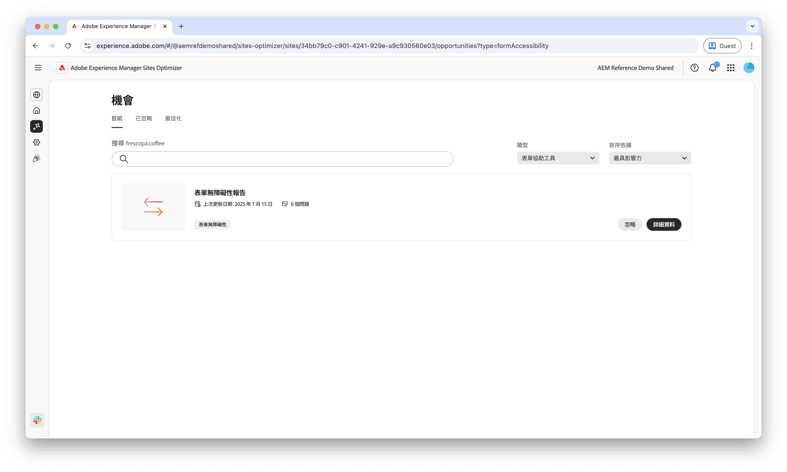

# 表單無障礙機會

 Forms最佳化功能可在搶先存取計畫下使用。 您可以使用官方電子郵件 ID 寫信至 aem-forms-ea@adobe.com，以加入搶先體驗計劃並要求存取該功能。

{align="center"}

表單無障礙機會是改善使用者互動與提高轉換率的關鍵。評估表單符合網頁內容無障礙指南 (WCAG) 的程度，有助於確保患有視覺、聽覺、認知和運動障礙的使用者享有具包容性的體驗。這樣做不但符合道德和法律要求，也能改善表單完成率並擴大客群，進而帶來更好的使用者體驗和更出色的業務成果。

## 機會

<!-- CARDS
 
* ../documentation/opportunities/low-views.md
  {title=Low views}
  {image=../assets/common/card-bag.png}
* ../documentation/opportunities/low-conversions.md
  {title=Low conversions}
  {image=../assets/common/card-bag.png}

--->
<!-- START CARDS HTML - DO NOT MODIFY BY HAND -->

    

        

            

                <figure class="image x-is-16by9">
                    
                </figure>
            

            

                

                    

                        <a href="../documentation/opportunities/forms-accessibility-issues.md" target="_blank" rel="referrer" title="表單無障礙問題">表單無障礙問題</a>
                    

                    
了解表單無障礙問題，以及如何利用這些問題來改善網站上的表單參與度。

                

                <a href="../documentation/opportunities/forms-accessibility-issues.md" target="_blank" rel="referrer" class="spectrum-Button spectrum-Button--outline spectrum-Button--primary spectrum-Button--sizeM" style="align-self: flex-start; margin-top: 1rem;">
                    了解更多
                </a>
            

        

    

<!-- END CARDS HTML - DO NOT MODIFY BY HAND -->
