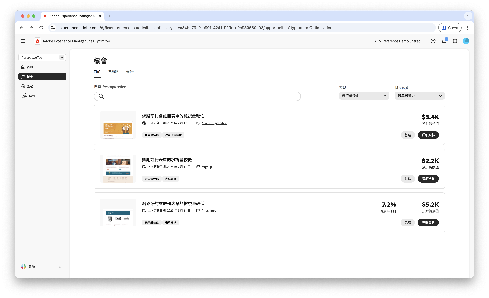
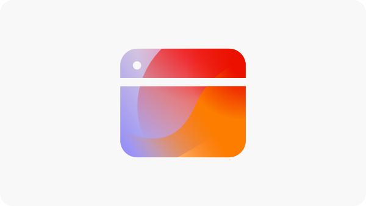

# Forms最佳化機會

 Forms最佳化功能可在搶先存取計畫下使用。 您可以從您的正式電子郵件ID寫信到aem-forms-ea@adobe.com ，以加入搶先存取計畫並要求存取功能。

<!-- [!VIDEO](https://video.tv.adobe.com/v/3469472/) -->

{align="center"}

Forms最佳化機會可讓組織系統地改善使用者互動並提高表單轉換率。 透過偵測低檢視、低轉換和低導覽率等問題，團隊可以對表單設計、版位和內容進行資料導向調整。 這些最佳化有助於簡化使用者體驗，讓訪客更容易完成表格並達成想要的結果。 運用Forms Optimization的深入分析，可支援持續找出並解決效能差距，進而提高表單效益及改善業務成果。

## 機會

<!-- CARDS
 
* ../documentation/opportunities/low-views.md
  {title=Low views}
  {image=../assets/common/card-bag.png}
* ../documentation/opportunities/low-conversions.md
  {title=Low conversions}
  {image=../assets/common/card-bag.png}

--->
<!-- START CARDS HTML - DO NOT MODIFY BY HAND -->

    

        

            

                <figure class="image x-is-16by9">
                    
                </figure>
            

            

                

                    

                        <a href="../documentation/opportunities/low-views.md" target="_blank" rel="referrer" title="低瀏覽量">低瀏覽量</a>
                    

                    
瞭解低檢視機會，以及如何使用它來提高您網站上的表單參與度。

                

                <a href="../documentation/opportunities/low-views.md" target="_blank" rel="referrer" class="spectrum-Button spectrum-Button--outline spectrum-Button--primary spectrum-Button--sizeM" style="align-self: flex-start; margin-top: 1rem;">
                    了解更多
                </a>
            

        

    

    

        

            

                <figure class="image x-is-16by9">
                    
                </figure>
            

            

                

                    

                        <a href="../documentation/opportunities/low-conversions.md" target="_blank" rel="referrer" title="低轉換率">低轉換率</a>
                    

                    
瞭解低轉換率機會，以及如何使用它來提高您網站上的表單參與度。

                

                <a href="../documentation/opportunities/low-conversions.md" target="_blank" rel="referrer" class="spectrum-Button spectrum-Button--outline spectrum-Button--primary spectrum-Button--sizeM" style="align-self: flex-start; margin-top: 1rem;">
                    了解更多
                </a>
            

        

    

    

        

            

                <figure class="image x-is-16by9">
                    
                </figure>
            

            

                

                    

                        <a href="../documentation/opportunities/low-navigation.md" target="_blank" rel="referrer" title="協助工具問題">低階導覽</a>
                    

                    
瞭解低導覽商機，以及如何使用它來提高您網站上的表單參與度。

                

                <a href="../documentation/opportunities/low-navigation.md" target="_blank" rel="referrer" class="spectrum-Button spectrum-Button--outline spectrum-Button--primary spectrum-Button--sizeM" style="align-self: flex-start; margin-top: 1rem;">
                    了解更多
                </a>
            

        

    

<!-- END CARDS HTML - DO NOT MODIFY BY HAND -->
