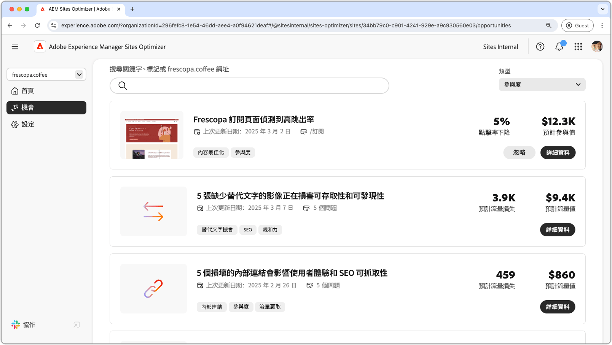
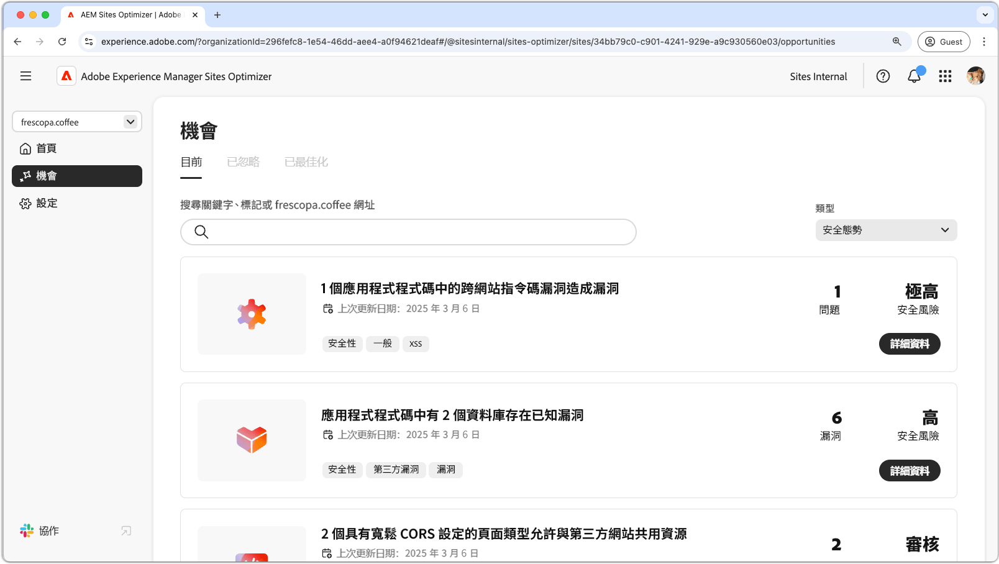
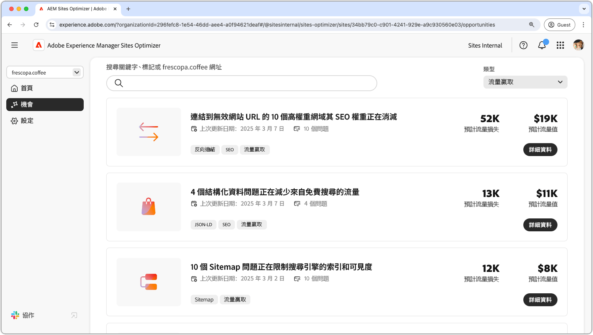

# 機會類型

{align="center"}

AEM Sites Optimizer 會提供寶貴的分析和建議，以協助您提高網站的績效、可用性和安全性。這些洞察根據下列重要的機會領域進行分組：

* 參與度
* 流量贏取
* 安全性態勢
* 網站健康情況
* 預檢

每個類別均強調一個增強網站的不同方法。某個類別可能會增加訪客互動。另一個則可以提高可搜尋性。其他則將焦點放在增強安全性或維持網站穩定性。預檢能協助您在頁面發佈之前加以分析和最佳化。

使用這些機會可以改善使用者體驗、吸引合適的客群，並確保您的網站安全可靠。提升參與度和流量贏取可促進互動和提高可見度，而強大的安全態勢和網站健康情況則有助於確保信任和穩定性。預檢分析可確保您的內容在上線前已最佳化。 請探索下面的連結，以查看按類別組織的機會，並找到改進網站的方法。

## 機會類型

<!-- CARDS 

* ./engagement.md
   { title = Engagement }
* ./security-posture.md
   { title = Security posture }
* ./site-health.md
   { title = Site health }
* ./traffic-acquisition.md
   { title = Traffic acquisition }
* ./form-optimization.md
   { title = Forms Optimization }
* ./preflight.md
   { title = Preflight }

-->
<!-- START CARDS HTML - DO NOT MODIFY BY HAND -->

    

        

            

                <figure class="image x-is-16by9">
                    
                </figure>
            

            

                

                    

                        <a href="./engagement.md" target="_blank" rel="referrer" title="參與度">參與</a>
                    

                    
了解如何使用 Sites Optimizer 提高參與度。

                

                <a href="./engagement.md" target="_blank" rel="referrer" class="spectrum-Button spectrum-Button--outline spectrum-Button--primary spectrum-Button--sizeM" style="align-self: flex-start; margin-top: 1rem;">
                    了解更多
                </a>
            

        

    

    

        

            

                <figure class="image x-is-16by9">
                    
                </figure>
            

            

                

                    

                        <a href="./security-posture.md" target="_blank" rel="referrer" title="安全態勢">安全態勢</a>
                    

                    
了解如何使用 Sites Optimizer 來提高網站的安全性。

                

                <a href="./security-posture.md" target="_blank" rel="referrer" class="spectrum-Button spectrum-Button--outline spectrum-Button--primary spectrum-Button--sizeM" style="align-self: flex-start; margin-top: 1rem;">
                    了解更多
                </a>
            

        

    

    

        

            

                <figure class="image x-is-16by9">
                    
                </figure>
            

            

                

                    

                        <a href="./site-health.md" target="_blank" rel="referrer" title="網站健康情況">網站健康情況</a>
                    

                    
了解如何使用 Sites Optimizer 來提高網站的健康情況。

                

                <a href="./site-health.md" target="_blank" rel="referrer" class="spectrum-Button spectrum-Button--outline spectrum-Button--primary spectrum-Button--sizeM" style="align-self: flex-start; margin-top: 1rem;">
                    了解更多
                </a>
            

        

    

    

        

            

                <figure class="image x-is-16by9">
                    
                </figure>
            

            

                

                    

                        <a href="./traffic-acquisition.md" target="_blank" rel="referrer" title="流量贏取">流量贏取</a>
                    

                    
了解如何使用 Sites Optimizer 來增加流量贏取。

                

                <a href="./traffic-acquisition.md" target="_blank" rel="referrer" class="spectrum-Button spectrum-Button--outline spectrum-Button--primary spectrum-Button--sizeM" style="align-self: flex-start; margin-top: 1rem;">
                    了解更多
                </a>
            

        

    

    

        

            

                <figure class="image x-is-16by9">
                    
                </figure>
            

            

                

                    

                        <a href="./form-optimization.md" target="_blank" rel="referrer" title="表單最佳化">表單最佳化</a>
                    

                    
了解如何使用表單最佳化提高表單轉換率。

                

                <a href="./form-optimization.md" target="_blank" rel="referrer" class="spectrum-Button spectrum-Button--outline spectrum-Button--primary spectrum-Button--sizeM" style="align-self: flex-start; margin-top: 1rem;">
                    了解更多
                </a>
            

        

    

    

        

            

                <figure class="image x-is-16by9">
                    
                </figure>
            

            

                

                    

                        <a href="./form-optimization.md" target="_blank" rel="referrer" title="表單無障礙">表單無障礙</a>
                    

                    
了解如何使用表單最佳化改善表單無障礙。

                

                <a href="./form-optimization.md" target="_blank" rel="referrer" class="spectrum-Button spectrum-Button--outline spectrum-Button--primary spectrum-Button--sizeM" style="align-self: flex-start; margin-top: 1rem;">
                    了解更多
                </a>
            

        

    

    

        

            

                <figure class="image x-is-16by9">
                    
                </figure>
            

            

                

                    

                        <a href="./preflight.md" target="_blank" rel="referrer" title="預檢">預檢</a>
                    

                    
了解預檢分析，以及如何在 Sites Optimizer 中設定預檢機會。

                

                <a href="./preflight.md" target="_blank" rel="referrer" class="spectrum-Button spectrum-Button--outline spectrum-Button--primary spectrum-Button--sizeM" style="align-self: flex-start; margin-top: 1rem;">
                    了解更多
                </a>
            

        

    

     

<!-- END CARDS HTML - DO NOT MODIFY BY HAND -->

 Forms最佳化和Forms協助工具功能可在搶先存取計畫下取得。 您可以使用官方電子郵件 ID 寫信至 aem-forms-ea@adobe.com，以加入搶先體驗計劃並要求存取該功能。
