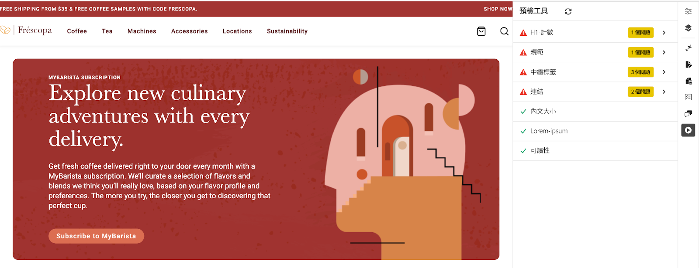

# 預檢機會

{align="center"}

<span class="preview">AEM Sites Optimizer 預檢功能會分析您頁面的技術和效能資料，並在頁面發佈之前預測和偵測機會。此功能使用生成式 AI 提供最佳化建議。</span>

## 機會

<!-- CARDS

* ../documentation/opportunities/invalid-or-missing-metadata.md
  {title=Canonical}
  {image=../assets/common/card-link.png}
* ../documentation/opportunities/broken-internal-links.md
  {title=Broken Internal Links}
  {image=../assets/common/card-link.png}
* ../documentation/opportunities/invalid-or-missing-metadata.md
  {title=Metatags}
  {image=../assets/common/card-code.png}
* ../documentation/opportunities/invalid-or-missing-metadata.md
  {title=H1 count}
  {image=../assets/common/card-code.png}
* ../documentation/opportunities/accessibility-issues.md
  {title=Accessibility}
  {image=../assets/common/card-puzzle.png}

-->
<!-- START CARDS HTML - DO NOT MODIFY BY HAND -->
<div class="columns">
    <div class="column is-half-tablet is-half-desktop is-one-third-widescreen" aria-label="Canonical">
        <div class="card" style="height: 100%; display: flex; flex-direction: column; height: 100%;">
            <div class="card-image">
                <figure class="image x-is-16by9">
                    <a href="../documentation/opportunities/invalid-or-missing-metadata.md" title="規範" target="_blank" rel="referrer">
                        
                    </a>
                </figure>
            </div>
            <div class="card-content is-padded-small" style="display: flex; flex-direction: column; flex-grow: 1; justify-content: space-between;">
                <div class="top-card-content">
                    <p class="headline is-size-6 has-text-weight-bold">
                        <a href="../documentation/opportunities/invalid-or-missing-metadata.md" target="_blank" rel="referrer" title="規範">規範</a>
                    </p>
                    <p class="is-size-6">了解規範機會，以及如何使用此機會改善 SEO 並防止重複內容的問題。</p>
                </div>
                <a href="../documentation/opportunities/invalid-or-missing-metadata.md" target="_blank" rel="referrer" class="spectrum-Button spectrum-Button--outline spectrum-Button--primary spectrum-Button--sizeM" style="align-self: flex-start; margin-top: 1rem;">
                    <span class="spectrum-Button-label has-no-wrap has-text-weight-bold">了解更多</span>
                </a>
            </div>
        </div>
    </div>
    <div class="column is-half-tablet is-half-desktop is-one-third-widescreen" aria-label="Broken Internal Links">
        <div class="card" style="height: 100%; display: flex; flex-direction: column; height: 100%;">
            <div class="card-image">
                <figure class="image x-is-16by9">
                    <a href="../documentation/opportunities/broken-internal-links.md" title="損壞的內部連結" target="_blank" rel="referrer">
                        
                    </a>
                </figure>
            </div>
            <div class="card-content is-padded-small" style="display: flex; flex-direction: column; flex-grow: 1; justify-content: space-between;">
                <div class="top-card-content">
                    <p class="headline is-size-6 has-text-weight-bold">
                        <a href="../documentation/opportunities/broken-internal-links.md" target="_blank" rel="referrer" title="損壞的內部連結">損壞的內部連結</a>
                    </p>
                    <p class="is-size-6">了解損壞的內部連結機會，以及如何使用此機會識別和修復網站上損壞或有問題的連結。</p>
                </div>
                <a href="../documentation/opportunities/broken-internal-links.md" target="_blank" rel="referrer" class="spectrum-Button spectrum-Button--outline spectrum-Button--primary spectrum-Button--sizeM" style="align-self: flex-start; margin-top: 1rem;">
                    <span class="spectrum-Button-label has-no-wrap has-text-weight-bold">了解更多</span>
                </a>
            </div>
        </div>
    </div>
    <div class="column is-half-tablet is-half-desktop is-one-third-widescreen" aria-label="Metatags">
        <div class="card" style="height: 100%; display: flex; flex-direction: column; height: 100%;">
            <div class="card-image">
                <figure class="image x-is-16by9">
                    <a href="../documentation/opportunities/invalid-or-missing-metadata.md" title="中繼資料標記" target="_blank" rel="referrer">
                        
                    </a>
                </figure>
            </div>
            <div class="card-content is-padded-small" style="display: flex; flex-direction: column; flex-grow: 1; justify-content: space-between;">
                <div class="top-card-content">
                    <p class="headline is-size-6 has-text-weight-bold">
                        <a href="../documentation/opportunities/invalid-or-missing-metadata.md" target="_blank" rel="referrer" title="中繼資料標記">中繼資料標記</a>
                    </p>
                    <p class="is-size-6">了解中繼資料標記機會，以及如何使用此機會將頁面的中繼資料最佳化，獲得更好的 SEO 效能。</p>
                </div>
                <a href="../documentation/opportunities/invalid-or-missing-metadata.md" target="_blank" rel="referrer" class="spectrum-Button spectrum-Button--outline spectrum-Button--primary spectrum-Button--sizeM" style="align-self: flex-start; margin-top: 1rem;">
                    <span class="spectrum-Button-label has-no-wrap has-text-weight-bold">了解更多</span>
                </a>
            </div>
        </div>
    </div>
    <div class="column is-half-tablet is-half-desktop is-one-third-widescreen" aria-label="H1 count">
        <div class="card" style="height: 100%; display: flex; flex-direction: column; height: 100%;">
            <div class="card-image">
                <figure class="image x-is-16by9">
                    <a href="../documentation/opportunities/invalid-or-missing-metadata.md" title="H1 計數" target="_blank" rel="referrer">
                        
                    </a>
                </figure>
            </div>
            <div class="card-content is-padded-small" style="display: flex; flex-direction: column; flex-grow: 1; justify-content: space-between;">
                <div class="top-card-content">
                    <p class="headline is-size-6 has-text-weight-bold">
                        <a href="../documentation/opportunities/invalid-or-missing-metadata.md" target="_blank" rel="referrer" title="H1 計數">H1 計數</a>
                    </p>
                    <p class="is-size-6">了解 H1 計數機會，以及如何使用此機會確保合適的標題結構和 SEO 最佳化。</p>
                </div>
                <a href="../documentation/opportunities/invalid-or-missing-metadata.md" target="_blank" rel="referrer" class="spectrum-Button spectrum-Button--outline spectrum-Button--primary spectrum-Button--sizeM" style="align-self: flex-start; margin-top: 1rem;">
                    <span class="spectrum-Button-label has-no-wrap has-text-weight-bold">了解更多</span>
                </a>
            </div>
        </div>
    </div>
    <div class="column is-half-tablet is-half-desktop is-one-third-widescreen" aria-label="Accessibility">
        <div class="card" style="height: 100%; display: flex; flex-direction: column; height: 100%;">
            <div class="card-image">
                <figure class="image x-is-16by9">
                    <a href="../documentation/opportunities/accessibility-issues.md" title="協助工具" target="_blank" rel="referrer">
                        
                    </a>
                </figure>
            </div>
            <div class="card-content is-padded-small" style="display: flex; flex-direction: column; flex-grow: 1; justify-content: space-between;">
                <div class="top-card-content">
                    <p class="headline is-size-6 has-text-weight-bold">
                        <a href="../documentation/opportunities/accessibility-issues.md" target="_blank" rel="referrer" title="協助工具">協助工具</a>
                    </p>
                    <p class="is-size-6">了解協助工具機會，以及如何使用此機會確保所有使用者都能夠存取您的網站。</p>
                </div>
                <a href="../documentation/opportunities/accessibility-issues.md" target="_blank" rel="referrer" class="spectrum-Button spectrum-Button--outline spectrum-Button--primary spectrum-Button--sizeM" style="align-self: flex-start; margin-top: 1rem;">
                    <span class="spectrum-Button-label has-no-wrap has-text-weight-bold">了解更多</span>
                </a>
            </div>
        </div>
    </div>

</div>
<!-- END CARDS HTML - DO NOT MODIFY BY HAND -->

## 設定方法

### 通用編輯器設定

1. 從以下 URL 前往 Extension Manager：https://experience.adobe.com/#/@org/aem/extension-manager/universal-editor
2. 選取 AEM Sites Optimizer 預檢擴充功能並要求啟用
3. AEM 團隊會為您的組織啟用此擴充功能
4. 此動作完成後，請在通用編輯器中開啟一個頁面，例如：https://author-p12345-e123456.adobeaemcloud.com/ui#/@org/aem/universal-editor/canvas/author-p12345-e123456.adobeaemcloud.com/content/site/subscription.html
5. 預檢擴充功能將顯示在側邊欄中
6. 在側邊欄按一下「預檢擴充功能」，會針對當前頁面開始進行預檢稽核

### 文件型預覽設定

#### 步驟 1：使用預檢按鈕啟用 Sidekick

將以下設定新增至您 GitHub 存放庫中的 `/tools/sidekick/config.json`：

```json
{
  "plugins": [
    {
      "id": "preflight",
      "titleI18n": {
        "en": "Preflight"
      },
      "environments": ["preview"],
      "event": "preflight"
    }
  ]
}
```

#### 步驟 2：建立 Sidekick 整合指令碼

使用以下內容建立 `/tools/sidekick/aem-sites-optimizer-preflight.js`：

```javascript
(function () {
  let isAEMSitesOptimizerPreflightAppLoaded = false;
  function loadAEMSitesOptimizerPreflightApp() {
    const script = document.createElement('script');
    script.src = 'https://experience.adobe.com/solutions/OneAdobe-aem-sites-optimizer-preflight-mfe/static-assets/resources/sidekick/client.js?source=plugin';
    script.onload = function () {
      isAEMSitesOptimizerPreflightAppLoaded = true;
    };
    script.onerror = function () {
      console.error('Error loading AEMSitesOptimizerPreflightApp.');
    };
    document.head.appendChild(script);
  }

  function handlePluginButtonClick() {
    if (!isAEMSitesOptimizerPreflightAppLoaded) {
      loadAEMSitesOptimizerPreflightApp();
    }
  }

  // Sidekick V1 extension support
  const sidekick = document.querySelector('helix-sidekick');
  if (sidekick) {
    sidekick.addEventListener('custom:preflight', handlePluginButtonClick);
  } else {
    document.addEventListener('sidekick-ready', () => {
      document.querySelector('helix-sidekick')
        .addEventListener('custom:preflight', handlePluginButtonClick);
    }, { once: true });
  }

  // Sidekick V2 extension support
  const sidekickV2 = document.querySelector('aem-sidekick');
  if (sidekickV2) {
    sidekickV2.addEventListener('custom:preflight', handlePluginButtonClick);
  } else {
    document.addEventListener('sidekick-ready', () => {
      document.querySelector('aem-sidekick')
        .addEventListener('custom:preflight', handlePluginButtonClick);
    }, { once: true });
  }
}());
```

#### 步驟 3：更新指令碼檔案

將以下匯入語句新增至預覽 URL 之 `/scripts/scripts.js` 的 `loadLazy()` 函數內，如下所示：

```javascript
if (window.location.href.includes('.aem.page')) {
   import('../tools/sidekick/aem-sites-optimizer-preflight.js');
}
```

現在，應該就會在 Sidekick 中看到「預檢」按鈕了。

#### 步驟 4：執行稽核

開啟受稽核頁面的預覽 URL (*.aem.page)。在 Sidekick 按一下「預檢」按鈕。

### AEM Cloud Service 設定

您可以使用書籤小程式選項，在 AEM Cloud Service 頁面編輯器和沙箱環境上測試預檢。

<!-- Drag the button below to your Bookmarks Bar to get started. -->

按下 **Ctrl+Shift+B** (Windows) 或 **Cmd+Shift+B** (Mac) 顯示您的書籤列。在書籤列上按一下右鍵，然後選取「新頁面」或「新增書籤」。在位址欄位中複製以下程式碼。

<!-- **Drag this link to your Bookmarks Bar:**

<a href="javascript:(function(){const script=document.createElement('script');script.src='https://experience.adobe.com/solutions/OneAdobe-aem-sites-optimizer-preflight-mfe/static-assets/resources/sidekick/client.js?source=bookmarklet&target-source=aem-cloud-service';document.head.appendChild(script);})();">Preflight</a> -->

**複製此程式碼並建立一個新書籤：**

```
javascript:(function(){const script=document.createElement('script');script.src='https://experience.adobe.com/solutions/OneAdobe-aem-sites-optimizer-preflight-mfe/static-assets/resources/sidekick/client.js?source=bookmarklet&target-source=aem-cloud-service';document.head.appendChild(script);})();
```

新增書籤小程式後，開啟受稽核頁面的預覽 URL (*.aem.page)。按一下「預檢」書籤，開始預檢稽核。

## 最佳實務

使用預檢時，請留意以下事項：

* 在發佈之前，對所有中繼/預覽頁面執行預檢稽核。
* 首先解決影響較大的問題 (損壞的連結、缺少 H1 標記、不安全的連結)。
* 啟用受保護中繼環境的驗證功能。
* 審閱並實施中繼標記建議，以獲得更好的 SEO 效能。
