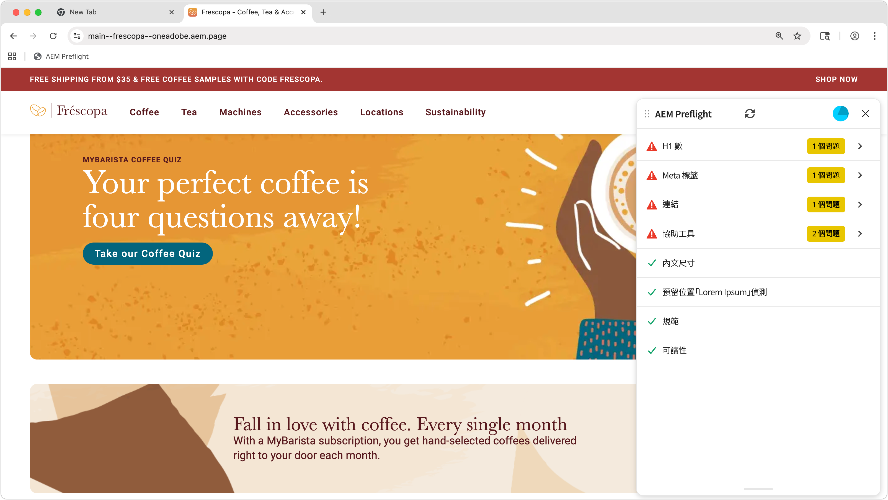

# 預檢機會

{align="center"}

<span class="preview">AEM Sites Optimizer Preflight會分析頁面的技術和效能資料，並在發佈之前預測和偵測機會。 它使用產生式AI來建議最佳化。</span>

## 機會

<!-- CARDS

* ../documentation/opportunities/invalid-or-missing-metadata.md
  {title=Canonical}
  {image=../assets/common/card-link.png}
* ../documentation/opportunities/broken-internal-links.md
  {title=Broken Internal Links}
  {image=../assets/common/card-link.png}
* ../documentation/opportunities/invalid-or-missing-metadata.md
  {title=Metatags}
  {image=../assets/common/card-code.png}
* ../documentation/opportunities/invalid-or-missing-metadata.md
  {title=H1 count}
  {image=../assets/common/card-code.png}
* ../documentation/opportunities/accessibility-issues.md
  {title=Accessibility}
  {image=../assets/common/card-puzzle.png}

-->
<!-- START CARDS HTML - DO NOT MODIFY BY HAND -->
<div class="columns">
    <div class="column is-half-tablet is-half-desktop is-one-third-widescreen" aria-label="Canonical">
        <div class="card" style="height: 100%; display: flex; flex-direction: column; height: 100%;">
            <div class="card-image">
                <figure class="image x-is-16by9">
                    <a href="../documentation/opportunities/invalid-or-missing-metadata.md" title="規範" target="_blank" rel="referrer">
                        
                    </a>
                </figure>
            </div>
            <div class="card-content is-padded-small" style="display: flex; flex-direction: column; flex-grow: 1; justify-content: space-between;">
                <div class="top-card-content">
                    <p class="headline is-size-6 has-text-weight-bold">
                        <a href="../documentation/opportunities/invalid-or-missing-metadata.md" target="_blank" rel="referrer" title="規範">標準</a>
                    </p>
                    <p class="is-size-6">瞭解標準機會，以及如何使用它來改善SEO並防止重複內容問題。</p>
                </div>
                <a href="../documentation/opportunities/invalid-or-missing-metadata.md" target="_blank" rel="referrer" class="spectrum-Button spectrum-Button--outline spectrum-Button--primary spectrum-Button--sizeM" style="align-self: flex-start; margin-top: 1rem;">
                    <span class="spectrum-Button-label has-no-wrap has-text-weight-bold">了解更多</span>
                </a>
            </div>
        </div>
    </div>
    <div class="column is-half-tablet is-half-desktop is-one-third-widescreen" aria-label="Broken Internal Links">
        <div class="card" style="height: 100%; display: flex; flex-direction: column; height: 100%;">
            <div class="card-image">
                <figure class="image x-is-16by9">
                    <a href="../documentation/opportunities/broken-internal-links.md" title="損壞的內部連結" target="_blank" rel="referrer">
                        
                    </a>
                </figure>
            </div>
            <div class="card-content is-padded-small" style="display: flex; flex-direction: column; flex-grow: 1; justify-content: space-between;">
                <div class="top-card-content">
                    <p class="headline is-size-6 has-text-weight-bold">
                        <a href="../documentation/opportunities/broken-internal-links.md" target="_blank" rel="referrer" title="損壞的內部連結">中斷的內部連結</a>
                    </p>
                    <p class="is-size-6">瞭解中斷的內部連結商機，以及如何使用它來識別和修正網站上中斷或問題的連結。</p>
                </div>
                <a href="../documentation/opportunities/broken-internal-links.md" target="_blank" rel="referrer" class="spectrum-Button spectrum-Button--outline spectrum-Button--primary spectrum-Button--sizeM" style="align-self: flex-start; margin-top: 1rem;">
                    <span class="spectrum-Button-label has-no-wrap has-text-weight-bold">了解更多</span>
                </a>
            </div>
        </div>
    </div>
    <div class="column is-half-tablet is-half-desktop is-one-third-widescreen" aria-label="Metatags">
        <div class="card" style="height: 100%; display: flex; flex-direction: column; height: 100%;">
            <div class="card-image">
                <figure class="image x-is-16by9">
                    <a href="../documentation/opportunities/invalid-or-missing-metadata.md" title="中繼資料" target="_blank" rel="referrer">
                        
                    </a>
                </figure>
            </div>
            <div class="card-content is-padded-small" style="display: flex; flex-direction: column; flex-grow: 1; justify-content: space-between;">
                <div class="top-card-content">
                    <p class="headline is-size-6 has-text-weight-bold">
                        <a href="../documentation/opportunities/invalid-or-missing-metadata.md" target="_blank" rel="referrer" title="中繼資料">中繼資料</a>
                    </p>
                    <p class="is-size-6">瞭解中繼資料商機，以及如何使用它來最佳化您的頁面中繼資料，以提升SEO效能。</p>
                </div>
                <a href="../documentation/opportunities/invalid-or-missing-metadata.md" target="_blank" rel="referrer" class="spectrum-Button spectrum-Button--outline spectrum-Button--primary spectrum-Button--sizeM" style="align-self: flex-start; margin-top: 1rem;">
                    <span class="spectrum-Button-label has-no-wrap has-text-weight-bold">了解更多</span>
                </a>
            </div>
        </div>
    </div>
    <div class="column is-half-tablet is-half-desktop is-one-third-widescreen" aria-label="H1 count">
        <div class="card" style="height: 100%; display: flex; flex-direction: column; height: 100%;">
            <div class="card-image">
                <figure class="image x-is-16by9">
                    <a href="../documentation/opportunities/invalid-or-missing-metadata.md" title="H1計數" target="_blank" rel="referrer">
                        
                    </a>
                </figure>
            </div>
            <div class="card-content is-padded-small" style="display: flex; flex-direction: column; flex-grow: 1; justify-content: space-between;">
                <div class="top-card-content">
                    <p class="headline is-size-6 has-text-weight-bold">
                        <a href="../documentation/opportunities/invalid-or-missing-metadata.md" target="_blank" rel="referrer" title="H1計數">H1計數</a>
                    </p>
                    <p class="is-size-6">瞭解H1計數機會，以及如何使用它來確保適當的標題結構和SEO最佳化。</p>
                </div>
                <a href="../documentation/opportunities/invalid-or-missing-metadata.md" target="_blank" rel="referrer" class="spectrum-Button spectrum-Button--outline spectrum-Button--primary spectrum-Button--sizeM" style="align-self: flex-start; margin-top: 1rem;">
                    <span class="spectrum-Button-label has-no-wrap has-text-weight-bold">了解更多</span>
                </a>
            </div>
        </div>
    </div>
    <div class="column is-half-tablet is-half-desktop is-one-third-widescreen" aria-label="Accessibility">
        <div class="card" style="height: 100%; display: flex; flex-direction: column; height: 100%;">
            <div class="card-image">
                <figure class="image x-is-16by9">
                    <a href="../documentation/opportunities/accessibility-issues.md" title="協助工具" target="_blank" rel="referrer">
                        
                    </a>
                </figure>
            </div>
            <div class="card-content is-padded-small" style="display: flex; flex-direction: column; flex-grow: 1; justify-content: space-between;">
                <div class="top-card-content">
                    <p class="headline is-size-6 has-text-weight-bold">
                        <a href="../documentation/opportunities/accessibility-issues.md" target="_blank" rel="referrer" title="協助工具">協助工具</a>
                    </p>
                    <p class="is-size-6">瞭解無障礙機會以及如何使用它來確保您的網站可供所有使用者存取。</p>
                </div>
                <a href="../documentation/opportunities/accessibility-issues.md" target="_blank" rel="referrer" class="spectrum-Button spectrum-Button--outline spectrum-Button--primary spectrum-Button--sizeM" style="align-self: flex-start; margin-top: 1rem;">
                    <span class="spectrum-Button-label has-no-wrap has-text-weight-bold">了解更多</span>
                </a>
            </div>
        </div>
    </div>

</div>
<!-- END CARDS HTML - DO NOT MODIFY BY HAND -->

## 設定方法

### 通用編輯器設定

1. 從URL前往Extension Manager： https://experience.adobe.com/#/@org/aem/extension-manager/universal-editor
2. 選取AEM Sites Optimizer Preflight擴充功能並請求啟用
3. AEM團隊將為您的組織啟用此擴充功能
4. 完成後，在通用編輯器中開啟頁面，例如：https://author-p12345-e123456.adobeaemcloud.com/ui#/@org/aem/universal-editor/canvas/author-p12345-e123456.adobeaemcloud.com/content/site/subscription.html
5. 預檢擴充功能將顯示在側邊欄中
6. 按一下側邊欄中的「預檢擴充功能」 ，將會開始目前頁面的「預檢稽核」

### 檔案式預覽設定

#### 步驟1：使用預檢按鈕啟用Sidekick

將下列設定新增至GitHub存放庫中的`/tools/sidekick/config.json`：

```json
{
  "plugins": [
    {
      "id": "preflight",
      "titleI18n": {
        "en": "Preflight"
      },
      "environments": ["preview"],
      "event": "preflight"
    }
  ]
}
```

#### 步驟2：建立Sidekick整合指令碼

使用下列內容建立`/tools/sidekick/aem-sites-optimizer-preflight.js`：

```javascript
(function () {
  let isAEMSitesOptimizerPreflightAppLoaded = false;
  function loadAEMSitesOptimizerPreflightApp() {
    const script = document.createElement('script');
    script.src = 'https://experience.adobe.com/solutions/OneAdobe-aem-sites-optimizer-preflight-mfe/static-assets/resources/sidekick/client.js?source=plugin';
    script.onload = function () {
      isAEMSitesOptimizerPreflightAppLoaded = true;
    };
    script.onerror = function () {
      console.error('Error loading AEMSitesOptimizerPreflightApp.');
    };
    document.head.appendChild(script);
  }

  function handlePluginButtonClick() {
    if (!isAEMSitesOptimizerPreflightAppLoaded) {
      loadAEMSitesOptimizerPreflightApp();
    }
  }

  // Sidekick V1 extension support
  const sidekick = document.querySelector('helix-sidekick');
  if (sidekick) {
    sidekick.addEventListener('custom:preflight', handlePluginButtonClick);
  } else {
    document.addEventListener('sidekick-ready', () => {
      document.querySelector('helix-sidekick')
        .addEventListener('custom:preflight', handlePluginButtonClick);
    }, { once: true });
  }

  // Sidekick V2 extension support
  const sidekickV2 = document.querySelector('aem-sidekick');
  if (sidekickV2) {
    sidekickV2.addEventListener('custom:preflight', handlePluginButtonClick);
  } else {
    document.addEventListener('sidekick-ready', () => {
      document.querySelector('aem-sidekick')
        .addEventListener('custom:preflight', handlePluginButtonClick);
    }, { once: true });
  }
}());
```

#### 步驟3：更新指令碼檔案

將下列匯入陳述式新增至預覽URL之`loadLazy()`中的`/scripts/scripts.js`函式，如下所示：

```javascript
if (window.location.href.includes('.aem.page')) {
   import('../tools/sidekick/aem-sites-optimizer-preflight.js');
}
```

現在，Sidekick中應該會顯示「預檢」按鈕。

#### 步驟4：執行稽核

開啟已稽核頁面的預覽URL (*.aem.page)。 按一下Sidekick中的「預檢」按鈕。

### AEM雲端服務設定

您可以使用書籤小程式選項在AEM Cloud Service頁面編輯器和沙箱環境中測試預檢。

<!-- Drag the button below to your Bookmarks Bar to get started. -->

按&#x200B;**Ctrl+Shift+B** (Windows)或&#x200B;**Cmd+Shift+B** (Mac)以顯示書籤列。 在書籤列上按一下滑鼠右鍵，然後選取「新頁面」或「新增書籤」。 在位址列位中，複製下面的程式碼。

<!-- **Drag this link to your Bookmarks Bar:**

<a href="javascript:(function(){const script=document.createElement('script');script.src='https://experience.adobe.com/solutions/OneAdobe-aem-sites-optimizer-preflight-mfe/static-assets/resources/sidekick/client.js?source=bookmarklet&target-source=aem-cloud-service';document.head.appendChild(script);})();">Preflight</a> -->

**複製此程式碼並建立新書籤：**

```
javascript:(function(){const script=document.createElement('script');script.src='https://experience.adobe.com/solutions/OneAdobe-aem-sites-optimizer-preflight-mfe/static-assets/resources/sidekick/client.js?source=bookmarklet&target-source=aem-cloud-service';document.head.appendChild(script);})();
```

新增書籤小程式後，請開啟稽核頁面的預覽URL (*.aem.page)。 按一下Preflight書籤以開始Preflight稽核。

## 最佳做法

使用「預檢」時，請注意下列事項：

* 發佈之前，請對所有預備/預覽頁面執行預檢稽核。
* 先解決高影響力的問題（連結損毀、缺少H1標籤、不安全的連結）。
* 啟用受保護中繼環境的驗證。
* 檢閱並實作中繼標籤建議，以提升SEO效能。
