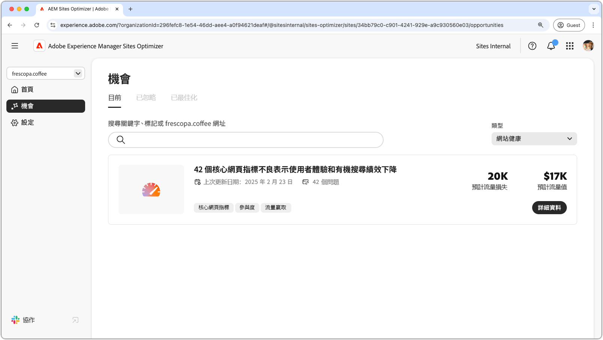

# 網站健康機會

{align="center"}

在AEM Sites Optimizer中維護網站健康對於提供快速、可靠且高效能的數位體驗至關重要。 透過找出改善機會（例如Core Web Vitals），團隊可以最佳化頁面速度、互動性和視覺穩定性，以提升使用者體驗和搜尋引擎排名。 維護良好的網站可確保更順暢的導覽、更好的參與度以及改善整體效能。 運用AEM Sites Optimizer的深入解析可持續進行監控和細化，確保網站在一段時間內保持效率和有效性。

## 機會

<!-- CARDS

* ../documentation/opportunities/core-web-vitals.md
  {title=Core web vitals}
  {image=../assets/common/card-performance.png}

-->
<!-- START CARDS HTML - DO NOT MODIFY BY HAND -->

    

        

            

                <figure class="image x-is-16by9">
                    
                </figure>
            

            

                

                    

                        <a href="../documentation/opportunities/core-web-vitals.md" target="_blank" rel="referrer" title="核心網頁生態">核心Web重要資訊</a>
                    

                    
瞭解核心的Web重要機會，以及如何使用它來改善流量獲取。

                

                <a href="../documentation/opportunities/core-web-vitals.md" target="_blank" rel="referrer" class="spectrum-Button spectrum-Button--outline spectrum-Button--primary spectrum-Button--sizeM" style="align-self: flex-start; margin-top: 1rem;">
                    進一步瞭解
                </a>
            

        

    

<!-- END CARDS HTML - DO NOT MODIFY BY HAND -->

